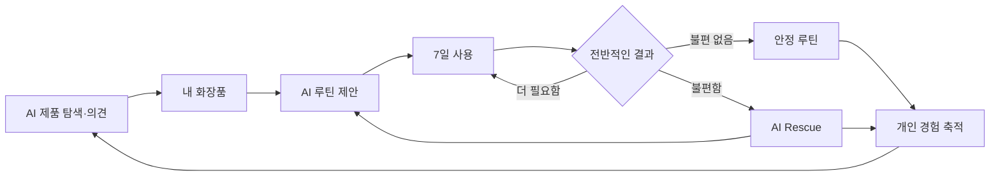

# SkinCause

> 내 화장품 경험을 기억하고, 다음 선택까지 이어주는 스킨케어 AI

**후기는 남의 경험입니다. SkinCause는 내 경험을 다음 선택의 근거로 바꿉니다.**

SkinCause는 신제품을 자주 탐색하는 사용자의 화장품 선택·루틴·사용 결과를 AI가 연결해 기억하고, 다음 제품 판단을 더 개인화하는 스킨케어 플랫폼입니다.

[프로토타입 사용하기](https://sksksksksksss.github.io/service/prototype/) · [전체 사용자 흐름](https://sksksksksksss.github.io/service/flow/) · [API 문서](https://sksksksksksss.github.io/service/api/) · [개발 작업판](https://github.com/orgs/sksksksksksss/projects/2)

## 지금 만드는 P0

외부에서 본 제품을 내 과거 기록으로 따져보고, 실제 루틴과 7일 결과를 남기며, 불편하면 AI Rescue가 다음 루틴까지 제안하는 **한 번의 학습 순환**만 먼저 만듭니다.

```text
이거 사볼까? → 내 화장품 → 현재 루틴 → 7일 결과
→ 안정 루틴 또는 AI Rescue → 다음 루틴 → 다음 제품 판단
```

처음부터 제품을 찾아주는 추천, 영수증 OCR, 범용 AI 기억, AI 루틴 배치와 알림함은 P1·P2입니다. 우선순위와 착수 조건은 [요구사항](./docs/04-requirements/README.md)에서 확인합니다.

실제 구현 순서와 GitHub Task는 [구현 우선순위와 태스크](./docs/03-delivery-plan.md)에서 한눈에 볼 수 있습니다.

## 문제

코덕은 새로운 화장품을 계속 시도합니다. 하지만 무엇을 왜 선택했고, 어떤 제품과 어떤 순서로 썼으며, 그 결과가 어땠는지는 제대로 축적되지 않습니다.

그래서 다음 제품을 고를 때도, 피부가 불편해졌을 때도 이전 경험을 쓰지 못하고 다시 후기와 감에 의존합니다.

## 전체 제품 방향

### 사기 전에는 AI와 따져봅니다

궁금한 제품을 말하면 AI가 현재 루틴, 가진 제품, 과거 사용 결과와 공식·1차 출처를 함께 살펴봅니다. “잘 맞는다”는 보장이 아니라 **지금 살 이유, 망설일 이유와 아직 모르는 것**을 대화로 설명합니다.

무엇을 살지 모르겠다면 원하는 변화를 자연어로 말합니다. AI가 필요한 조건만 더 묻고 실제 국내 제품을 최대 5개까지 찾습니다.

### 산 뒤에는 루틴과 결과를 기억합니다

제품을 등록하고 아침·저녁, 순서와 빈도를 정하면 AI가 더 나은 배치를 제안합니다. 새 루틴을 저장하면 7일 뒤 실제로 비슷하게 썼는지와 전반적인 불편 여부를 한 번 묻습니다.

- 불편이 없었다면 마지막 안정 루틴으로 저장합니다.
- 불편했다면 같은 대화에서 AI Rescue를 시작합니다.
- 더 써봐야 한다면 같은 루틴으로 7일을 더 봅니다.

### 불편할 때는 AI가 다음 행동까지 연결합니다

AI Rescue는 마지막 안정 루틴 이후 무엇이 바뀌었는지 먼저 복원합니다. 제품 공식 정보, 관련 연구, 사용 시점과 개인 기록을 찾아 **무엇부터 확인할지와 어떤 루틴으로 바꿔볼지** 제안합니다.

AI는 원인을 진단하거나 제품을 범인으로 단정하지 않습니다. 사용자가 선택한 다음 루틴만 새 버전으로 저장하고 다시 7일을 시작합니다.

## 제품의 핵심 순환



첫 질문에서는 일반 제품 정보의 비중이 큽니다. 루틴과 결과가 쌓일수록 다른 사람의 후기보다 **이 사용자가 실제로 남긴 경험**이 더 중요한 근거가 됩니다.

## AI가 강한 이유와 통제 방법

AI는 모든 피부 상태를 미리 만든 선택지에 끼워 맞추지 않습니다. 사용자의 자연어를 기억하고, 질문마다 관련된 제품·루틴·개인 기록과 외부 근거를 찾아 연결합니다.

대신 AI가 시스템 사실을 마음대로 만들 수는 없습니다.

| AI가 맡는 일 | 서버가 통제하는 일 |
| --- | --- |
| 자연어 이해와 필요한 추가 질문 | 사용자 권한과 데이터 소유권 |
| 공식·1차 출처 웹 검색 | 실제 제품 ID와 판매 버전 |
| 제품 의견·추천·루틴·Rescue 설명 | 현재·안정 루틴과 버전 차이 |
| 사용자 맥락 기억과 대화 연결 | AI 출력 schema, 출처와 상태 전이 검증 |

사용자는 **AI가 기억하는 내용**을 언제든 확인하고 수정하거나 삭제할 수 있습니다.

## 하지 않는 것

- 피부 질환, 알레르기, 원인과 응급도를 진단하지 않습니다.
- 제품의 피부 적합성·안전·효능을 보장하지 않습니다.
- 성분 하나의 연구를 완제품 효과로 확대하지 않습니다.
- 정보가 없는 것을 `없음`이라고 표현하지 않습니다.
- 가격과 인기를 추천 순서에 사용하지 않습니다.

## 제품과 구현 문서

| 순서 | 문서 | 무엇을 알 수 있나 |
| --- | --- | --- |
| 0 | [제품 브리프](./docs/01-product-brief.md) | 누구의 어떤 문제를 풀고 무엇을 검증하는가 |
| 1 | [요구사항](./docs/04-requirements/README.md) | 기능별로 나눈 의무와 이유 |
| 2 | [GitHub Feature](https://github.com/orgs/sksksksksksss/projects/2) | 모든 정상 흐름, 분기·실패와 수용 조건의 원본 |
| 3 | [OpenAPI](./docs/api/openapi.yaml) | 프론트엔드와 서버의 계약 |
| 4 | [데이터 모델](./docs/06-data-model/README.md) | 개인 경험과 AI 근거가 쌓이는 구조 |

개발을 시작할 때는 [AGENTS.md](./AGENTS.md)를 먼저 읽습니다. 제품 의미가 바뀌면 Feature 이슈와 요구사항을 먼저 고치고, API·데이터 의미가 바뀌면 OpenAPI와 데이터 모델을 같은 PR에서 함께 수정합니다.
