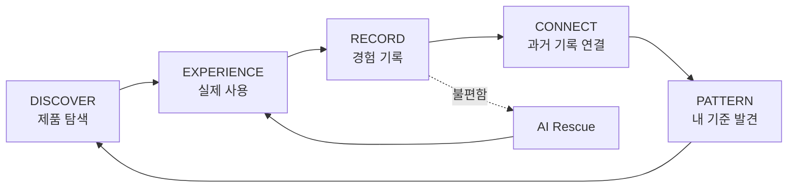

# SKN

> 써본 만큼, 나를 더 잘 알게 되는 스킨케어 경험 아카이브

SKN은 **새로운 화장품을 자주 써보는 사람**이 사용감·조합·변화·피부 반응을 제품과 루틴에 연결해 남기고, AI가 그 안에서 **반복된 취향과 패턴**을 찾아 다음 탐색에 돌려주는 개인 스킨케어 경험 아카이브다.

[프로토타입](https://skn-labs.github.io/app/prototype/) · [사용자 흐름](https://skn-labs.github.io/app/flow/) · [API](https://skn-labs.github.io/app/api/) · [작업판](https://github.com/orgs/skn-labs/projects/2)

---

## 누구를 위한 건가

타깃은 나이나 성별이 아니라 **행동**으로 정의한다. 문서에서는 이런 사람을 `코덕`이라 부른다.

- 제품을 반복해서 탐색하고 구매한다.
- 같은 카테고리 제품을 여러 개 비교해 쓴다.
- 제품 자체뿐 아니라 제형·마무리·레이어링·계절과 시간대의 차이에 관심이 있다.
- 과거 경험을 다음 선택에 쓰고 싶지만, 대부분 기억과 흩어진 메모에 남는다.

## 무슨 문제를 푸는가

코덕은 새 제품을 계속 쓰며 경험을 많이 쌓지만, 그 경험이 **그때그때의 기억과 감상으로 흩어진다.** 그래서 어떤 제품과 사용 방식에서 만족도가 높았는지 비교하기 어렵고, 다음 탐색에도 충분히 쓰지 못한다.

흔한 접근은 이걸 "문제 없는 루틴을 찾고, 문제가 생기면 원인을 좁히는 일"로 본다. 그러면 앱은 심사와 트러블 관리 중심이 되고, 코덕이 실제로 구분하는 **흡수감·밀림·답답함·조합·재사용 의향**은 대부분 버려진다. SKN은 그 반대에서 출발한다.

## 잠정 전제 — 왜 다른 앱과 다른가

> **코덕은 이미 자신에게 맞는 제품을 어느 정도 알아도, 더 나은 조합과 경험을 찾아 탐색을 계속한다. 이 탐색은 고쳐야 할 문제가 아니라 제품을 반복해 쓰는 동기다.**

대부분의 스킨케어 앱은 탐색을 "아직 정답을 못 찾은 상태"로 보고 정답을 주려 한다. SKN은 탐색 자체를 정상이자 엔진으로 본다. 그래서 SKN은 **판정하지 않고, 경험이 흩어지지 않게 연결한다.** 이 전제 하나가 아래의 거의 모든 선택(왜 안 판정하나, 왜 7일이 시험이 아닌가, 왜 성분이 아니라 패턴을 주나)을 설명한다.

## 한 바퀴



```text
제품을 탐색한다
→ 실제 제품과 루틴을 함께 기록한다
→ 사용 중 또는 7일 뒤 경험을 돌아본다
→ AI가 과거 경험과 연결해 패턴을 보여준다
→ 그 패턴을 다음 제품 탐색과 불편 대응에 다시 쓴다
```

핵심은 AI가 사용자를 대신 판정하는 것이 아니다. 사용자가 계속 경험하고, SKN이 그 경험을 잃지 않게 연결하며, 사용자가 자기 취향과 사용 패턴을 스스로 발견하게 하는 것이다.

## 5분 멘탈 모델 — 핵심 개념

기능은 결국 이 명사들 사이를 잇는 동사다.

| 개념 | 무엇인가 |
| --- | --- |
| **제품 / 내 화장품** | 카탈로그 제품과, 사용자가 실제로 가진 제품. 등록만으로 루틴은 바뀌지 않는다. |
| **루틴** | 아침/저녁·순서·빈도가 있는 실제 조합. 조합이 바뀌면 덮어쓰지 않고 새 버전을 만든다. |
| **경험** | 제품 하나 또는 루틴을 써본 기간(세션)과 그 안의 기록. 만족도·피부 불편·실제 사용 여부를 각각 분리해 남긴다. |
| **패턴** | 두 번 이상 반복된 취향. 항상 지지·반대 **원본 기록**과 함께 보여준다. |
| **대화 / Rescue** | 하나의 챗이 맥락(제품·패턴·탐색·불편)에 따라 다르게 답한다. 불편은 Rescue라는 예외 흐름으로 이어진다. |

## AI의 역할

| AI가 하는 일 | 시스템이 보장하는 일 |
| --- | --- |
| 제품·패턴 질문에 서버가 선별한 사실을 자연어로 설명한다. | 원문과 제품·루틴·시점을 연결해 보존한다. |
| 관련 과거 평가·태그와 확인된 제품 정보를 비교한다. | 다른 사용자의 기록을 섞지 않고 실제 ID와 근거 참조를 검증한다. |
| 반복된 사용 패턴과 반대 기록을 설명한다. | 근거 수, 원본 기록과 불확실성을 보존한다. |
| 불편 대화에서 필요한 질문과 다음 루틴을 제안한다. | 진단·원인 확정을 막고 사용자 승인 전 상태를 바꾸지 않는다. |

채팅 첫 화면의 추천 입력 3개는 정적으로 보여준다. 대화가 시작된 뒤에는 매 AI 답변이 맥락에 맞는 후속 입력 1~3개를 구조화해 함께 반환한다. 세부 계약은 [AI 프롬프트와 대화 계약](./docs/ai/README.md)을 따른다.

## 제품 경계 — 하지 않는 것

이 목록은 부록이 아니라 제품의 정체성이다.

- 피부 질환, 알레르기, 원인과 응급도를 진단하지 않는다.
- 개인 패턴을 피부 타입이나 영구적인 성향으로 단정하지 않는다.
- 제품의 피부 적합성·안전·효능을 보장하지 않는다.
- 7일은 안전 심사나 루틴의 합격 시험이 아니라, 기억을 한 번 돌아보는 기본 시점일 뿐이다.
- 정보가 없는 것을 `없음`이라고 표현하지 않는다.
- AI 요약은 사용자 원문을 대체하지 않는다.
- 가격·인기·제휴 수수료로 탐색 결과를 바꾸지 않는다.

## 더 읽기

| 순서 | 문서 | 답하는 질문 |
| --- | --- | --- |
| 0 | [제품 브리프](./docs/01-product-brief.md) | 왜 이 제품을 만드는가 |
| 1 | [요구사항](./docs/04-requirements/README.md) | 무엇을 반드시 지켜야 하는가 |
| 2 | [GitHub Feature](https://github.com/orgs/skn-labs/projects/2) | 각 기능의 흐름·분기·완료 조건은 무엇인가 |
| 3 | [OpenAPI](./docs/api/openapi.yaml) | 프론트와 서버의 계약은 무엇인가 |
| 4 | [데이터 모델](./docs/06-data-model/README.md) | 경험과 AI 근거를 어떻게 보존하는가 |

구현자는 [AGENTS.md](./AGENTS.md)의 작업 순서와 변경 규칙을 먼저 따른다.
