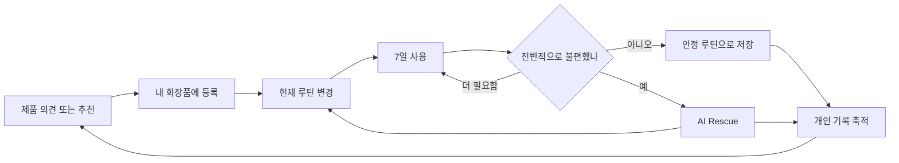

# 제품 설명

## 한 문장

SkinCause는 새 화장품을 고른 이유, 함께 쓴 루틴과 그 결과를 연결해 다음 구매와 불편 대응에 다시 쓰는 개인 화장품 기록 서비스다.

## 문제

화장품을 좋아하는 사람은 만족스러운 제품을 찾고 탐색을 끝내지 않는다. 새로운 기능, 제형, 유행 제품과 조합을 계속 시도한다. 문제는 시도 자체가 아니라 그 조건과 결과가 남지 않는다는 점이다.

- 비슷한 역할의 제품을 이미 갖고 있어도 또 산다.
- 여러 제품을 바꾸면 무엇과 불편이 관련됐는지 기억하기 어렵다.
- 문제없었던 조합도 기록되지 않아 다음 판단에 쓰이지 않는다.
- 결국 매번 후기와 기억에 의존한다.

## 해법

SkinCause는 사용자의 평소 행동을 막지 않고 세 순간에 개입한다.

1. **사기 전**: 사용자가 궁금한 한 제품 또는 원하는 변화를 말하면 현재 루틴, 가진 제품, 과거 기록과 신뢰 가능한 외부 근거를 함께 비교한다.
2. **쓴 뒤**: 제품·순서·아침/저녁·빈도로 루틴 버전을 저장하고 7일 뒤 실제로 그렇게 썼는지와 불편 여부를 한 번 묻는다.
3. **불편할 때**: 마지막 안정 루틴 이후 변경을 확인하고, AI가 가능성이 높은 확인 순서와 보수적인 다음 루틴을 제안한다.

이 결과는 AI가 기억하는 개인 맥락과 구조화된 이력으로 쌓여 다음 제품 의견, 추천, 루틴 제안과 Rescue에 다시 사용된다.

## 핵심 순환

## 왜 7일인가

7일은 피부 안전이나 효능을 판정하는 의학 기준이 아니다. 매일 기록을 요구하지 않으면서 사용자가 한 주의 아침·저녁 루틴을 경험하게 하고, 문제없었던 경험도 놓치지 않기 위한 MVP 운영 규칙이다. 문제가 생기면 7일을 기다리지 않고 바로 Rescue를 시작한다. 7일 전에 루틴을 바꾸면 지금까지의 경험을 낮은 신뢰도의 기록으로 남길 수 있고 새 루틴은 다시 7일을 시작한다.

## 제품이 하는 판단과 하지 않는 판단

| 한다 | 하지 않는다 |
| --- | --- |
| 지금 가진 제품과 기능·제형·사용 위치 비교 | 잘 맞을 확률 계산 |
| 공식 제품 정보와 관련 연구를 찾아 설명 | 성분 하나만으로 완제품 효과 단정 |
| 기록된 변경으로 확인 순서 제안 | 특정 제품을 원인이나 범인으로 확정 |
| 사용자가 선택할 다음 루틴 제안 | 진단, 처방, 응급 판정 |
| 근거 부족과 불확실성 표시 | 정보가 없음을 ‘없음’으로 표현 |

## 대상과 범위

- 국내 판매 스킨케어, 클렌징, 선케어 제품
- 새 제품을 자주 보거나 여러 제품을 함께 쓰는 사용자
- 제품명 검색과 영수증 OCR 등록
- 루틴, 7일 결과, 제품 의견, 추천, AI Rescue, 이력과 AI 기억

메이크업, 헤어, 향수, 사용량·소진 예측, 가격을 이용한 구매 판단, 의료 진단은 현재 범위에 포함하지 않는다.

## 우리가 검증할 것

1. 사용자는 제품 의견을 볼 때 일반 후기보다 자신의 루틴과 과거 경험을 연결한 설명을 가치 있게 느끼는가?
2. 매일 기록하지 않아도 7일 결과 질문에는 답하는가?
3. 문제없었던 기록과 Rescue 기록이 다음 구매 판단의 신뢰를 높이는가?
4. AI가 근거와 한계를 함께 말하고 사용자가 수정할 수 있을 때 개인 맥락을 맡길 의향이 있는가?

## 성공을 보는 지표

- 제품 의견 또는 추천에서 제품을 내 화장품이나 찜에 넣은 비율
- 새 루틴을 만든 사용자 중 7일 결과를 남긴 비율
- 결과에서 “기록대로 사용함”을 확인할 수 있는 비율
- 안정 루틴이 다음 제품 의견·추천에 실제 근거로 사용된 비율
- Rescue 제안 후 새 루틴을 저장한 비율
- AI 기억을 사용자가 수정하거나 삭제한 비율과 AI 결과 재시도율

이 수치는 제품 사용성을 비교하기 위한 운영 지표다. 피부 개선이나 안전을 입증하는 지표가 아니다.
