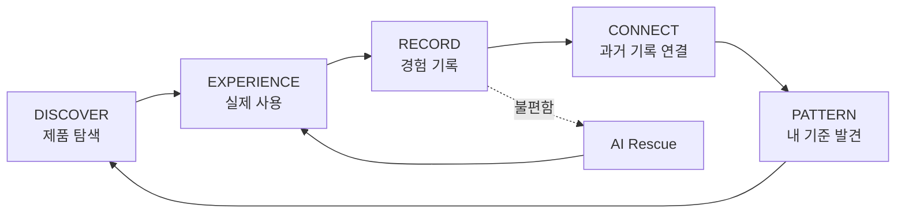

# SKN 제품 브리프

## 한 문장

SKN은 새로운 화장품을 자주 써보는 사람이 사용감·조합·변화·피부 반응을 제품과 루틴에 연결해 남기고, AI가 반복된 취향과 패턴을 찾아 다음 탐색에 돌려주는 개인 스킨케어 경험 아카이브다.

## 잠정 전제

코덕은 이미 자신에게 맞는 제품과 루틴을 어느 정도 알고 있어도 더 나은 제품·조합·사용 경험을 찾기 위해 탐색을 계속한다. 이 행동은 고쳐야 할 문제가 아니라 제품의 반복 사용 동기다.

`코덕`은 성별이나 자칭이 아니라 다음 행동으로 정의한다.

- 제품을 반복해서 탐색하거나 구매한다.
- 같은 카테고리 제품을 여러 개 비교해 쓴다.
- 제품 자체뿐 아니라 제형·마무리·레이어링·계절과 시간대의 차이에 관심이 있다.
- 과거 경험을 다음 선택에 쓰고 싶지만 대부분 기억과 메모에 흩어져 있다.

## 풀고자 하는 문제

코덕은 새로운 제품을 반복해서 사용하며 많은 경험을 쌓지만, 그 경험이 그때그때의 기억과 감상으로 흩어진다. 그래서 어떤 제품과 사용 방식에서 만족도가 높았는지 비교하기 어렵고 다음 탐색에도 충분히 쓰지 못한다.

기존 기획은 이 문제를 `문제가 없던 루틴을 찾고, 문제가 생기면 원인 후보를 좁히는 일`로 해석했다. 그 결과 제품의 중심이 7일 심사와 Rescue가 되었고, 일반적인 루틴·트러블 관리 앱과 구분하기 어려워졌다. 더 치명적인 문제는 `불편이 없음`만 좋은 데이터로 취급해 코덕이 실제로 구분하는 흡수감·밀림·답답함·조합·재사용 의향을 대부분 버렸다는 점이다.

## 제공 가치

SKN은 화장품을 단순히 써보고 지나가는 경험으로 두지 않는다.

1. 관심 있는 제품을 내 과거 경험과 비교해 탐색한다.
2. 실제로 쓴 제품과 당시 루틴을 연결한다.
3. 사용 중 또는 기본 회고 시점에 기억나는 경험을 남긴다.
4. AI가 다른 제품·루틴에서 반복된 표현과 반대 기록을 연결한다.
5. 사용자는 발견한 기준을 다음 제품 탐색과 사용 판단에 다시 쓴다.

## 핵심 경험

### Discover

사용자가 이미 궁금한 제품을 가져오거나 자신의 과거 경험을 기준으로 다음 후보를 찾는다. 결과는 `잘 맞는다`는 판정이 아니라 닮은 경험, 다른 점, 현재 조합에서 볼 점과 정보 부족이다.

### Experience

제품 하나 또는 제품 조합을 실제로 쓴다. 루틴은 제품·아침/저녁·순서·빈도를 보존해 경험이 생긴 조건을 잃지 않게 한다.

### Record

사용자는 만족·아쉬움·모름과 자유 문장으로 경험을 남긴다. 흡수감, 마무리, 밀림, 향, 조합과 피부 반응은 모두 같은 경험의 일부다. 매일 기록하거나 명시적인 실험 목표를 요구하지 않는다.

### Connect

AI는 현재 기록과 관련된 과거 기록을 검색하고, 사용자가 실제로 한 표현만 정리한다. 제품 정보, 사용자 원문, AI 해석을 구분한다.

### Discover my pattern

반복된 경험은 `가벼운 수분 세럼을 아침에 썼을 때 만족도가 높았다`처럼 구체적인 패턴 후보가 된다. 근거 건수, 연결된 원문, 반대 기록과 불확실성을 함께 보여준다. 피부 타입이나 영구적 취향으로 확정하지 않는다.

### Explore again

제품 질문과 추천에서 새로 만든 패턴을 과거 원문과 함께 사용한다. 개인 기록이 없을 때는 확인된 제품 정보만 제공하고, 기록이 쌓일수록 개인 경험의 비중이 커진다.

## 7일과 비교 기준 루틴

7일은 의학적·효능 기준도, 루틴의 합격 시험도 아니다. 사용자가 별다른 문제가 없으면 앱을 다시 열지 않을 가능성이 높아 기억을 한 번 회수하기 위한 동일한 기본 시점이다.

- 사용자는 7일 전에도 언제든 기록한다.
- 7일에는 전반적인 만족과 가장 기억나는 점을 묻는다.
- `아직 모르겠음`도 유효한 기록이며 결론을 강요하지 않는다.
- 실제 사용이 기록과 달랐다면 그 사실을 함께 남긴다.
- 불편이 없었다고 명시한 루틴은 Rescue의 변경 비교 기준으로 저장할 수 있다.
- 비교 기준 루틴은 최적·완벽·개별 제품 적합 판정이 아니다.

## AI Rescue의 위치

Rescue는 제품의 정체성이 아니라 불편 경험의 예외 흐름이다. 사용자가 기록에서 불편을 남기거나 AI 채팅에 직접 말하면 같은 대화에서 시작한다.

1. 심하거나 빠르게 악화되는지 사용자의 표현으로 확인한다.
2. 마지막 비교 기준 루틴 이후 실제 변경을 계산하고 사용자가 고친다.
3. 확인할 변경 순서와 지지·반대·불확실 근거를 보여준다.
4. 보유 제품 안에서 보수적인 다음 루틴 하나를 제안한다.
5. 사용자가 승인한 경우에만 독립된 새 루틴을 시작한다.

원인·범인·질환·알레르기를 판단하지 않는다.

## AI가 필요한 이유

코덕의 표현과 사용 조건을 완전한 enum으로 만들 수 없다. `화장 전에 밀림`, `여름 저녁엔 괜찮음`, `쫀쫀하지만 손이 안 감` 같은 문장은 정형 항목보다 원문에 더 많은 의미가 있다.

AI는 다음에만 사용한다.

- 자연어 기록에서 사용자가 말한 관찰을 구조화한다.
- 현재 질문과 관련된 개인 기록과 허용된 외부 근거를 검색한다.
- 공통점·차이·반대 기록·불확실성을 설명한다.
- 필요한 추가 질문을 최대한 적게 한다.

서버는 소유권, 제품·루틴 ID, 상태 전이, 근거 참조와 출력 schema를 검증한다. AI 원문 출력은 사용자 사실이나 최종 상태가 아니다.

## 차별성

| 기존 대안 | 주로 남는 것 | SKN이 추가로 연결하는 것 |
| --- | --- | --- |
| 쇼핑몰 후기·커뮤니티 | 다른 사람의 제품 평가 | 내가 어떤 조건에서 무엇을 느꼈는지 |
| 피부 일기 | 날짜별 피부 상태 | 제품·루틴·사용감·반복 패턴 |
| 성분 분석 앱 | 정적 성분 정보 | 내 실제 경험과 반대 기록 |
| 범용 AI 채팅 | 현재 대화의 설명 | 검증된 제품 사실과 누적된 내 원본 기록 |

차별성은 AI 문장이 아니라 `한 기록이 다른 제품을 볼 때 다시 등장하는 경험`에서 검증한다.

## P0 검증 가설

| ID | 가설 | 확인 행동 |
| --- | --- | --- |
| H-01 | 코덕은 문제 여부뿐 아니라 사용감·조합·만족을 남길 가치가 있다고 느낀다. | 첫 경험 기록 완료율과 자유 원문 작성률 |
| H-02 | 제품과 루틴이 연결된 짧은 회고는 매일 피부 일기보다 부담이 낮다. | 경험 시작 대비 7일 이내 기록률 |
| H-03 | 원본 근거가 보이는 패턴은 단순 AI 요약보다 신뢰받는다. | 패턴 근거 열람률·유용성 응답 |
| H-04 | 과거 경험이 재사용된 제품 탐색이 일반 제품 설명보다 유용하다. | 개인 근거 포함/미포함 블라인드 선택 |
| H-05 | 불편 기록에서 이어지는 Rescue 제안은 다음 행동을 쉽게 만든다. | 변경 확인·제안 이해·새 루틴 적용률 |

## 성공 기준과 중단 기준

- 사용자가 제품을 등록해도 경험 기록까지 이어지지 않으면 루틴 입력과 회고 질문을 더 줄인다.
- 패턴이 원문을 다시 보는 행동이나 다음 탐색에 쓰이지 않으면 `개인 데이터 해자`를 주장하지 않는다.
- 개인 기록이 포함된 탐색 결과가 일반 제품 설명보다 선택되지 않으면 추천 범위를 확장하지 않는다.
- Rescue가 제품 원인 판단으로 오해되면 확인 순위 표현과 기능 노출을 축소한다.

## 비즈니스 모델

초기에는 무료 B2C로 경험 순환을 검증한다. 반복 사용과 개인 기록의 가치가 확인된 뒤 소비자 구독을 먼저 검토한다. 제품 구매 제휴는 결과 순위에 영향을 주지 않고 경제적 이해관계를 명확히 표시할 수 있을 때만 보조 수익으로 사용한다.

브랜드 파일럿은 별도 동의한 참여자·별도 수집 목적·집계 결과를 전제로만 검토한다. 기존 개인 기록을 브랜드에 판매하지 않는다. 의료기관 중개, 개인화 의료광고와 에스테틱 우선 추천은 현재 범위에서 제외한다.

## 브랜드

`SKN`은 Skin에서 불필요한 요소를 덜어낸 이름이다. 수많은 제품과 정보 속에서 결국 남아야 할 것은 사용자의 피부와 경험이라는 관점을 담는다.

- Tone: Premium · Minimal · Scientific · Explorative
- Visual: 투명한 제형, 유리, 유기적 움직임과 정제된 개인 실험실
- 원칙: LAB은 시각적 은유다. 사용자에게 가설·퀘스트·성공/실패 같은 연구 절차를 강요하지 않는다.
