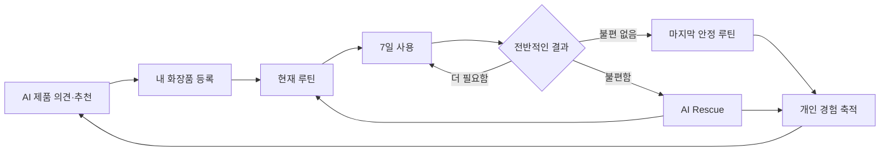
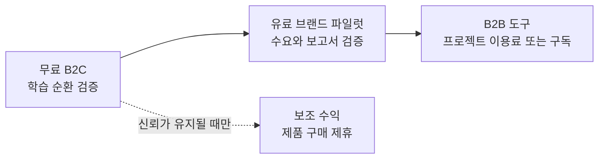

# SkinCause 제품 브리프

## 한 문장

SkinCause는 신제품을 자주 탐색하는 스킨케어 사용자가 `이거 사도 될까?`를 물을 때, 현재 루틴과 실제 사용 이력으로 살 이유·겹치는 이유·모르는 것을 설명하고 구매 후 결과까지 기억해 다음 판단을 개선하는 개인 화장품 AI다.

## 핵심 주장

SkinCause의 핵심 기능은 제품 추천, 루틴 기록, 7일 관찰과 Rescue 각각이 아니다.

> 제품을 고른 이유, 실제로 함께 쓴 루틴과 그 결과를 하나의 경험으로 연결하고, 그 경험을 다음 제품 판단에 다시 사용하는 AI 학습 순환이다.

제품 의견·추천은 순환의 입구이고, 루틴·7일 결과·Rescue는 사용 경험을 다음 판단의 근거로 바꾸는 과정이다. 제품 카탈로그와 영수증 OCR은 이 연결이 정확한 제품을 기준으로 작동하게 만드는 기반 시설이다.

## 초기 사용자

### 핵심 사용자

- 만족스러운 루틴이 있어도 새로운 제품과 조합을 계속 시험하는 사람
- 한 달에 여러 번 제품을 탐색하거나 구매 후보를 비교하는 사람
- 가진 제품이 많아 기능 중복과 과거 사용 경험을 기억하기 어려운 사람
- 문제가 생겼을 때 여러 제품을 한꺼번에 빼거나 후기 검색부터 다시 하는 사람

`코덕`은 내부 약칭으로 쓸 수 있지만 검증에서는 탐색 빈도, 보유 제품 수, 루틴 변경 빈도와 문제 대응 행동으로 사용자를 정의한다.

### 인접 사용자

스킨케어 초보자도 쉬운 설명과 루틴 제안에서 가치를 얻을 수 있다. 다만 초기 타깃을 `남성`으로 넓히지 않는다. 성별보다 경험 수준의 차이가 크기 때문이다.

`잘 모르겠어요`는 초보자 전용 기능이 아니라 모든 질문의 기본 입력이다. 사용자가 모르는 정보를 억지로 고르게 하지 않고 AI가 더 쉬운 관찰 질문을 하거나 정보 부족으로 남긴다.

## 우리가 푸는 문제

스킨케어 헤비유저는 탐색을 끝내지 않는다. 문제는 새로운 제품을 계속 사는 것이 아니라 다음 정보가 서로 연결되지 않는다는 점이다.

- 무엇을 바꾸려고 제품을 골랐는가
- 당시 어떤 제품을 어떤 순서와 빈도로 함께 썼는가
- 실제 사용이 기록과 같았는가
- 전반적으로 불편이 없었는가, 불편했는가
- 문제가 생겼을 때 무엇을 바꿨고 이후 결과는 어땠는가

이 연결이 없으면 비슷한 제품을 다시 사고, 여러 제품을 함께 바꿔 결과를 구분하지 못하며, 다음 선택도 후기와 기억에서 다시 시작한다.

현재 이 문제의 빈도·강도·지불 의향은 입증된 사실이 아니라 검증할 가정이다. 인터뷰와 행동 데이터 없이 시장의 고통이 충분히 크다고 단정하지 않는다.

## 제품의 작동 방식

### 1. 사기 전

- 궁금한 제품이 있으면 `이거 사볼까?`로 들어온다.
- 제품이 없으면 원하는 변화를 자연어로 말하고 후보를 추천받는다.
- AI는 현재 루틴, 내 화장품, 과거 결과, 사용자가 확인한 기억과 허용된 외부 근거를 연결한다.
- 결과는 잘 맞는다는 판정이 아니라 살 이유, 망설일 이유, 중복, 정보 부족과 출처다.

### 2. 산 뒤

- 제품명 검색 또는 영수증 OCR로 실제 제품 버전을 내 화장품에 넣는다.
- 사용자가 아침·저녁, 제품 순서와 빈도를 정하고 AI 추천 순서를 선택적으로 적용한다.
- 루틴을 저장하면 과거를 덮지 않는 새 버전과 DAY 1이 시작된다.

### 3. 7일 뒤

- 매일 기록을 요구하지 않는다.
- 기록과 비슷하게 사용했는지와 전반적인 불편 여부를 한 번 묻는다.
- 불편이 없으면 해당 루틴을 마지막 안정 루틴으로 저장한다.
- 더 써봐야 하면 같은 루틴으로 7일을 연장한다.

### 4. 불편할 때

- 7일을 기다리지 않고 언제든 AI Rescue를 시작한다.
- 마지막 안정 루틴 이후 실제 변경을 먼저 확인한다.
- AI가 외부 근거와 개인 기록을 조사하고 서버 규칙이 무엇부터 확인할지 정한다.
- AI는 보수적인 다음 루틴 하나를 제안하고 사용자가 적용해야 실제 루틴이 바뀐다.

## 첫 진입과 핵심 가치 순간

### 대표 진입점

`이거 사볼까?`를 대표 진입점으로 사용한다. 사용자가 이미 외부에서 발견한 제품을 가져오는 순간이 가장 설명이 적고 즉시 가치가 나오기 때문이다.

### 첫 번째 가치

> 내 현재 루틴과 가진 제품까지 보고 이 제품을 설명해준다.

첫 방문에는 일반 제품 정보와 현재 루틴의 비중이 크다. 이 단계에서도 기존 제품과의 중복, 추가되는 사용 단계와 정보 부족을 설명할 수 있어야 한다.

### 핵심 Aha Moment

> 지난번에 내가 무엇과 함께 썼고 어땠는지 기억해서 이번 답변에 다시 쓴다.

특정 화면 하나가 아니라 이전 경험이 다음 제품 의견·추천·Rescue의 근거로 다시 등장하는 순간이 SkinCause의 핵심 가치다.

## 개인 데이터가 쌓이는 구조

| 쌓이는 사실 | 다음에 쓰이는 곳 | 해석하면 안 되는 것 |
| --- | --- | --- |
| 제품을 찾은 목적과 비교 후보 | 다음 제품 의견·추천 | 구매 성공 또는 선호 확정 |
| 제품·시간대·순서·빈도의 루틴 버전 | 순서 제안, 7일 결과, Rescue | 실제 사용이 항상 같았다는 추정 |
| 실제 사용 일치와 루틴 전체 결과 | 다음 비교와 안정 기준 | 각 제품의 단독 적합성 |
| Rescue 변경·확인 순서·다음 루틴 | 반복 불편 시 보조 근거 | 원인·범인·알레르기 진단 |
| 사용자가 확인한 자연어 기억 | 모든 AI 대화의 개인 맥락 | AI가 만든 문장을 사용자 사실로 확정 |

이 데이터는 개인 맥락을 더 풍부하게 하지만 임상적 인과관계나 적합 확률을 만들지 않는다. 데이터 해자는 주장하는 것이 아니라 일반 AI와 개인 기록 기반 AI의 블라인드 비교로 검증한다.

## AI가 필요한 이유와 통제

사용자의 피부 고민·사용감·상황을 완전한 enum으로 미리 만들 수 없다. AI는 자연어를 이해하고 현재 질문에 필요한 외부 근거와 개인 기록을 연결한다.

반면 AI가 시스템 사실을 결정하지는 않는다.

| AI | 서버 |
| --- | --- |
| 자연어 해석과 필요한 추가 질문 | 인증과 사용자 기록 소유권 |
| 공식·1차 출처 검색과 근거 요약 | 실제 제품 ID·버전과 출처 검증 |
| 제품·루틴·Rescue 제안 설명 | 현재·안정 루틴 비교와 순위 계산 |
| 사용자가 확인할 기억 후보 | 사용자가 확정한 상태 전이 저장 |

## 비즈니스 모델

### 핵심 선택

주 수익 가설은 `무료 B2C로 사용 기록 순환 검증 → 유료 브랜드 파일럿 → 반복 수요가 생기면 B2B 도구`다. 제품 구매 제휴는 현재 사용자 흐름에 쉽게 붙일 수 있지만 핵심 사업모델이 아니라 신뢰를 해치지 않을 때만 운영하는 보조 수익으로 둔다.

브랜드가 원하는 데이터가 생긴다는 이유만으로 B2B 수요가 증명되는 것은 아니다. 소비자에게 가치 있는 기록이 실제로 쌓이는지와 브랜드가 그 결과에 반복해서 비용을 내는지를 별도로 검증한다.

모든 단계에서 광고비나 브랜드 계약은 개인화 결론과 추천 순서를 바꿀 수 없다.

### 1단계 · 무료 사용자 검증

무료 B2C 제품으로 핵심 순환이 실제로 끝까지 이어지는지 확인한다.

- 첫 제품 의견 완료
- 제품 등록과 현재 루틴 연결
- 7일 결과 응답
- 개인 기록을 사용한 두 번째 AI 판단
- Rescue 이후 새 루틴 적용

이 단계에서는 사용자 성장보다 `이전 경험이 다음 판단에 재사용될 때 더 유용한가`를 먼저 증명한다.

### 2단계 · 유료 브랜드 파일럿

충분한 사용자가 순환을 완료한 뒤 소규모 화장품 브랜드와 별도 사용 관찰 프로젝트를 운영한다.

기존 소비자 기록을 브랜드에 넘기지 않는다. 프로젝트마다 목적, 수집 항목, 이용 기간과 제공 결과에 별도 동의한 참여자를 새로 모집한다. 브랜드가 구매하는 것은 개인 사용자 기록이 아니라 다음 운영과 집계 결과다.

- 별도 동의를 받은 참여자 모집
- 프로젝트 제품 등록과 실제 루틴 조건 기록
- 정해진 확인 시점의 결과와 선택형 후속 질문
- 중도 이탈·실사용 불일치까지 포함한 집계 보고서
- AI가 정리한 정성 응답과 원문 추적 가능한 근거

소비자 앱의 `7일 결과`를 임상 효능 시험처럼 판매하지 않는다. 파일럿의 확인 기간과 질문은 프로젝트 목적에 맞게 별도 설계하고 표본 수, 이탈, 실제 사용 일치와 관찰 한계를 보고서에 함께 표시한다.

브랜드가 비용을 냈다는 이유로 소비자용 추천·Rescue 결과를 바꾸지 않는다. 개별 사용자 기록을 브랜드에 제공하지 않으며, 동의·가명처리·집계 기준과 재식별 위험을 별도 검토한다.

### 3단계 · B2B 제품화

같은 형태의 파일럿이 반복되고 브랜드의 재구매 의향이 확인된 뒤에만 실험 생성, 참여자 관리, 진행 현황, 집계 분석과 보고서 생성을 브랜드가 직접 사용하는 도구로 만든다.

- 프로젝트 이용료 또는 기업용 구독료
- 소비자 앱과 브랜드 프로젝트의 데이터·권한 분리
- 브랜드별 원본 데이터 접근 금지
- 보고서의 표본 수, 실제 사용 일치율과 한계 표시

브랜드 파일럿이 반복되지 않으면 B2B SaaS를 만들지 않는다.

### 보조 수익 · 제품 구매 제휴

제품 의견·추천 뒤 사용자가 실제 구매처로 이동할 때 제휴 수수료를 받을 수 있다. 개발 비용이 낮고 현재 흐름과 가깝지만, 추천 신뢰를 훼손하면 핵심 제품 전체를 약하게 만들 수 있으므로 주 수익모델로 가정하지 않는다.

필수 원칙:

- 경제적 이해관계를 결과와 구매 버튼 가까이에 명확히 표시한다.
- 제휴 여부·수수료·가격을 후보 포함과 추천 순위에 사용하지 않는다.
- 비제휴 제품도 같은 기준으로 후보가 될 수 있다.
- 광고 슬롯은 개인화 결과와 시각적으로 분리하고 `광고`라고 표시한다.
- 추천 품질과 수익 최적화를 같은 모델 목표로 두지 않는다.

제휴 표시 후 신뢰가 떨어지거나 사용자가 결과의 독립성을 의심하면 소비자 추천 화면에서 제외한다.

## 현재 수익모델에서 제외

### 피부과·의료인 중개 수수료

현재 사업모델에서 제외한다. 진료비와 연결된 소개·알선 수수료는 의료법상 환자 유인·알선 규제 위험이 크고, 예약·의료기관 검증·분쟁 대응이라는 별도 사업 운영이 필요하다. 향후 검토하더라도 의료 전문 변호사의 사전 검토 없이 실험하지 않는다. 법적 경계를 정한 근거는 [근거와 가정](./evidence/README.md)에 기록한다.

### 개인화된 피부과 광고·후기

현재 범위에서 제외한다. 의료광고는 표현과 매체에 따라 별도 규제·사전심의가 적용될 수 있고, 개인화 결과 옆의 광고는 AI 판단이 광고비에 영향받는다는 인상을 줄 수 있다. 의료기관 탐색·후기 검증은 별도 제품 가설로 분리하고, 관련 근거는 [근거와 가정](./evidence/README.md)에 둔다.

### 특정 에스테틱 우선 추천

현재 범위에서 제외한다. 제휴 업체를 개인화 결과 안에 우선 배치하지 않는다. 비의료 서비스 제휴를 검토하더라도 광고 표시와 추천 순위 독립 원칙을 그대로 적용한다.

## 우리가 검증할 가정

| ID | 가정 | 확인 방법 |
| --- | --- | --- |
| H-01 | 개인 루틴을 연결한 제품 의견이 일반 제품 설명보다 유용하다 | 일반 AI와 블라인드 비교, 후속 질문과 등록률 |
| H-02 | 매일 기록하지 않아도 DAY 7 한 번의 결과에는 답한다 | due 대비 결과 완료율 |
| H-03 | 불편 없음 기록도 다음 판단의 신뢰를 높인다 | 개인 기록 포함·미포함 결과 비교 |
| H-04 | Rescue의 변경 확인과 다음 루틴이 행동하기 쉽다 | Rescue 완료·이해도·새 루틴 적용 |
| H-05 | 사용자가 AI 기억을 확인할 수 있으면 자연어 개인화를 맡긴다 | 기억 확인·수정·삭제와 이탈 |
| H-06 | 구매 제휴 표시가 있어도 추천 신뢰와 구매 의향이 유지된다 | 제휴 표시 전후 신뢰도·클릭·이탈 |
| H-07 | 브랜드는 설문보다 실제 루틴과 결과가 연결된 보고서에 비용을 낸다 | 유료 파일럿 계약·재구매 의향 |
| H-08 | 반복 브랜드 프로젝트가 셀프서브 도구 수요로 이어진다 | 파일럿 운영 비용·반복 요청·구독 의향 |

## 성공 지표와 중단 기준

### 핵심 제품 지표

- 첫 제품 의견을 받은 사용자의 내 화장품 등록률
- 새 루틴 사용자 중 DAY 7 결과 완료율
- 30일 안에 개인 기록을 사용한 두 번째 AI 판단 비율
- 일반 AI보다 개인 기록 기반 결과를 선택한 비율
- Rescue 결과의 근거 이해도와 새 루틴 적용률

### 수익화 지표

- 제휴 표시 후 추천 신뢰도 변화와 구매처 이동률
- 브랜드 파일럿 유료 전환과 동일 브랜드 재구매
- 프로젝트당 운영 시간·참여자 완료율·보고서 사용도

### 중단 또는 축소 기준

- 사용자가 첫 가치 전에 루틴 등록에서 반복 이탈하면 초기 입력을 줄이고 추천 범위를 축소한다.
- DAY 7 결과가 충분히 회수되지 않으면 개인 데이터 순환을 해자로 주장하지 않는다.
- 개인 기록을 넣은 결과가 일반 AI보다 유용하지 않으면 장기 기억·Rescue 확장을 중단한다.
- 브랜드가 집계 보고서에 비용을 내거나 반복 구매하지 않으면 B2B 제품을 만들지 않는다.
- 제휴가 추천 신뢰를 유의미하게 훼손하면 소비자 추천 화면의 커머스 수익화를 중단한다.

## 제품이 하지 않는 것

- 피부 질환, 알레르기, 원인, 응급도와 진료과를 진단하지 않는다.
- 제품이 잘 맞을 확률, 안전과 효능을 보장하지 않는다.
- 원료 연구 하나를 완제품 효과로 확대하지 않는다.
- 정보가 없는 것을 `없음`이라고 표현하지 않는다.
- 가격·판매량·광고비·제휴 수수료로 추천 순위를 바꾸지 않는다.
- 사용자의 확인 없이 AI 기억이나 실제 루틴을 확정하지 않는다.
- 개인 기록을 광고주나 브랜드에 판매하지 않는다.

## 구현 우선순위

### P0 · 핵심 순환

- 큐레이션 제품 검색 또는 이름 직접 입력
- 현재·안정 루틴과 과거 결과를 쓰는 최소 `이거 사볼까?`
- 제품·아침/저녁·순서·빈도의 불변 루틴 버전
- 앱을 열었을 때 DAY 7 결과 요청과 마지막 안정 루틴
- 변경점 중심 AI Rescue, 확인 순위와 다음 루틴
- 사용자 승인 뒤 새 루틴 적용
- 공개 MVP의 계정·소유권·삭제·AI 실패 보존

P0의 성공은 기능별 완성도가 아니라 한 사용자의 결과가 다음 제품 의견에 실제 근거로 다시 등장하는 것으로 판단한다.

### P1 · 순환 강화

- 실제 출시판·evidence snapshot과 제품 메모
- 제품 의견 후속 채팅
- AI 루틴 순서·빈도와 제품별 설명
- 추가 7일·조기 결과, 반복 Rescue 학습
- 전체 루틴 타임라인·제품별 이력·앱 안 알림
- 범용 비동기 AI request/run/job 운영

### P2 · 탐색과 입력 편의

- 자연어로 처음부터 제품 추천
- 영수증 OCR
- 범용 자연어 온보딩과 AI 기억 CRUD
- 유사 제품·찜, 가격·판매처

메이크업, 헤어, 향수, 피부과·의료인 중개, 의료기관 후기, 사용량·소진 예측, 푸시·문자·이메일 알림과 브랜드용 셀프서브 도구는 현재 제품 범위에 포함하지 않는다.
