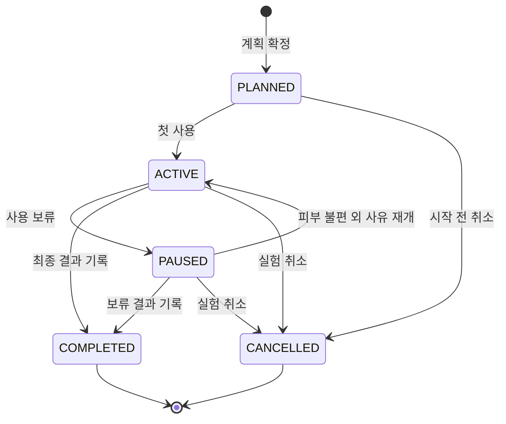

# SkinCause MVP 요구사항 명세서

## 문서의 역할

이 문서는 3주 MVP에서 반드시 성립해야 하는 제품 계약을 정의한다. 사용자 기능 전체는 [통합 기능명세서](./05-features/functional-specification.md), 기능별 상세 흐름은 GitHub Story, API 형식은 OpenAPI, 테이블과 제약은 데이터 모델에서 정한다.

요구사항의 최종 범위는 다음과 같다.

- `P0`: 핵심 실험 한 바퀴를 성립시키는 요구사항
- `P1`: 이번 MVP에 포함하며 입력 편의·설명력·브랜딩을 완성하는 요구사항
- `Pn`: 검증 이후 요구사항이며 이번 구현과 ERD에 포함하지 않음

## 목표와 성공 조건

> 사용자가 자신의 안정 루틴과 목적에 맞는 제품 후보를 선택하고, 한 제품을 계획에 따라 관찰한 뒤, 결과를 다음 실험에 재사용할 수 있어야 한다.

MVP는 다음 사실을 보여주면 성공한다.

1. 현재 루틴과 새 제품의 차이가 실제 실험 결정에 사용된다.
2. 사용자가 실제 사용·다른 제품 변경과 불편 여부·목적 체감·다음 결정을 남긴다.
3. 피부 불편이 생겨도 마지막 안정 루틴을 기준으로 확인 범위를 줄인다.
4. 완료한 경험이 두 번째 추천과 계획에 실제로 반영된다.
5. LAB 경험이 출석이 아니라 관찰과 실험 완료를 강화한다.

## 확정한 제품 정책

| 주제 | 결정 | 이유 |
| --- | --- | --- |
| 안정 루틴 | 사용자가 현재 불편이 없고 문제없이 사용 중이라고 직접 확인한 루틴만 안정 루틴이 된다. 제품별 빈도와 사용 기간·최근 변경을 함께 남긴다. | AI가 피부 상태를 판정하지 않으면서 기준의 한계를 기록한다. |
| 안정 루틴 이력 | 확정된 안정 루틴은 덮어쓰지 않고 새 버전으로 저장한다. | 과거 시점의 변경점을 정확히 복원해야 한다. |
| 추천의 의미 | 추천은 잘 맞는다고 보장하는 구매 답안이 아니라 다음에 시험할 실제 제품 후보와 순서다. | 제품 추천 가치와 비진단 원칙을 동시에 지킨다. |
| 추천 후보 수 | 한 번에 최대 3개를 보여주며 자격을 충족한 후보가 적으면 수를 채우지 않는다. | 비교 가능한 선택지를 제공하되 근거 없는 후보를 추가하지 않는다. |
| 제품 변경 | 후보마다 `추가` 또는 기존 한 제품의 `교체` 의도를 명시한다. | 무엇이 달라지는지 계산하려면 제거되는 제품을 알아야 한다. |
| 동시 실험 | 후보는 여러 개 저장할 수 있지만 진행 중인 실험은 사용자당 하나다. | 변경 원인을 구분할 수 있는 핵심 조건이다. |
| 실험 기간 | 기본 14일이며 첫 사용 전에 7~28일 안에서 바꿀 수 있다. 실제 첫 사용 시각부터 같은 기간을 다시 계산한다. | 늦게 시작해도 선택한 관찰 기간을 유지하며, 임상적 안전성·효능 기준으로 사용하지 않는다. |
| 기본 관찰 | 첫 사용, 24시간 후, 기간의 중간, 종료 시점을 기본으로 한다. 첫 사용·중간·종료에는 실제 사용과 다른 화장품 변경 여부를 확인한다. | 피부 일기를 만들지 않으면서 결과 해석에 필요한 사용 사실과 다른 변수를 남긴다. |
| 불편 기록 | 불편함이 있을 때만 평소와 크게 달랐던 생활 변화를 선택적으로 묻는다. | 일상 전체를 추적하지 않으면서 다른 변수를 드러낸다. |
| 실험 결과 | `불편 여부`, `목적 체감`, `다음 사용 결정`을 각각 저장하고 실제 기간·횟수·관찰·다른 변경으로 기록 완성도를 계산한다. | 불편하지 않음, 목적 달성 체감과 계속 사용할 결정을 서로 다른 사실로 보존한다. |
| 안정 루틴 갱신 | `불편 없음`과 `안정 루틴에 추가`를 사용자가 각각 확인한 경우에만 반영한다. | 한 번의 결과를 적합 판정으로 자동 승격하지 않는다. |
| Archive | 완료된 실험과 결과를 별도 복제하지 않고 실험 이력을 기준으로 보여준다. | 같은 사실이 서로 다르게 수정되는 문제를 막는다. |
| LAB 성장 | 실험 완료와 관찰 완성도를 분리하고, 최종 결과를 남긴 실험은 퀘스트 건너뜀과 관계없이 연구 기록으로 쌓인다. 로그인만으로 보상하지 않는다. | 정직한 건너뜀을 실패로 만들지 않으면서 기록 품질을 드러낸다. |
| 추천 책임 | 서버가 실제 카탈로그 후보와 하나의 다음 실험 우선순위를 계산한다. AI는 목적·메모·이미지 구조화, 필요한 확인 질문과 계산된 결과 설명을 담당한다. | 추천의 재현성을 지키면서 비정형 입력과 설명에서 AI의 가치를 사용한다. |
| AI 결과 | 구조화 결과와 설명은 스키마·일반 규칙으로 검증하고 사용자가 수정할 수 있게 한다. | 모델 출력을 사실이나 판정으로 취급하지 않는다. |

실험 기간과 관찰 시점은 사용 행동을 정리하기 위한 운영 기본값이다. 제품 효능이 해당 기간에 나타난다는 주장으로 노출하지 않는다.

## 행위자

- `사용자`: 자신의 루틴, 제품 후보, 관찰과 결과를 관리한다.
- `Lab Assistant`: 정해진 데이터와 규칙을 바탕으로 구조화·질문·설명을 제공한다.
- `운영자`: MVP 제품 카탈로그와 기능 분류 기준을 관리한다. 사용자 기록을 임의로 수정하지 않는다.
- `브랜드`, `전문가`: Pn 행위자로 이번 MVP 권한 모델에 포함하지 않는다.

## 기능 요구사항

### 계정과 개인정보

| ID | 우선순위 | 요구사항 | 확인 기준 |
| --- | --- | --- | --- |
| FR-AUTH-001 | P0 | 사용자는 이메일과 비밀번호로 가입·로그인하고 현재 브라우저 세션에서 로그아웃할 수 있다. | 비밀번호는 단방향 해시로만 저장한다. 서버는 30일짜리 단일 access JWT만 발급하고 프론트엔드는 이를 `sessionStorage`에 보관한다. refresh token과 인증 cookie는 사용하지 않으며 로그아웃은 저장된 토큰과 인증 상태를 삭제한다. |
| FR-AUTH-002 | P0 | 사용자는 다른 사용자의 루틴·사진·실험·관찰을 조회하거나 수정할 수 없다. | 소유자가 다른 식별자로 요청한 권한 테스트가 거부된다. |
| FR-AUTH-003 | P0 | 사용자는 자신의 계정과 SkinCause 기록 삭제를 요청할 수 있다. | 삭제 후 로그인과 기록 조회가 불가능하고 비공개 파일도 삭제된다. |

### 안정 루틴

| ID | 우선순위 | 요구사항 | 확인 기준 |
| --- | --- | --- | --- |
| FR-RTN-001 | P0 | 사용자는 아침·저녁 중 하나 이상의 루틴에 제품, 사용 순서와 빈도를 등록할 수 있다. | 매일·특정 요일·주 N회·필요할 때·잘 모르겠음을 포함한 제품 루틴을 저장하고 다시 불러온다. |
| FR-RTN-002 | P0 | 사용자는 현재 불편이 없고 현재 상태가 문제없다고 직접 확인한 뒤 안정 루틴으로 확정할 수 있다. | 불편 있음·잘 모르겠음 또는 사용자 확인이 없는 초안은 기준으로 쓰지 않는다. 입력은 잃지 않고 초안으로 보존한다. |
| FR-RTN-003 | P0 | 확정된 안정 루틴의 과거 버전과 확정 시점이 보존되어야 한다. | 이후 갱신해도 이전 실험이 참조한 버전이 바뀌지 않는다. |
| FR-RTN-004 | P0 | 같은 제품을 아침과 저녁에 모두 둘 수 있지만 같은 시간대의 순서는 중복될 수 없다. | 순서 제약을 위반한 저장 요청이 거부된다. |
| FR-RTN-005 | P0 | 안정 루틴의 정보 수준은 피부 적합도가 아니라 사용 시작·최근 변경·제품별 빈도라는 세 항목의 완성도로 표시한다. | 세 항목 중 3개를 알면 충분, 1~2개면 제한적, 모두 모르면 부족으로 재현 가능하게 계산한다. 짧은 기간 자체로 확정을 막지 않는다. |

### 제품 찾기와 등록

| ID | 우선순위 | 요구사항 | 확인 기준 |
| --- | --- | --- | --- |
| FR-PRD-001 | P0 | 사용자는 MVP 카탈로그에서 제품명 또는 브랜드명으로 제품을 찾을 수 있다. | 준비된 제품을 검색해 루틴이나 후보에 추가한다. |
| FR-PRD-002 | P1 | 제품을 찾지 못한 사용자는 브랜드·제품명·제품 종류를 직접 입력해 개인 제품 초안을 만들 수 있다. | 개인 제품이 다른 사용자의 공용 검색 결과에 노출되지 않는다. |
| FR-PRD-003 | P1 | 사용자는 전성분 사진을 올려 성분 구조화 초안을 받고 확인·수정할 수 있다. | 사용자가 확정하기 전 추출값은 비교의 확정 데이터로 사용되지 않는다. |
| FR-PRD-004 | P1 | 사용자는 바코드를 스캔해 카탈로그 제품을 찾고, 일치하지 않으면 직접 등록으로 전환할 수 있다. | 미일치 바코드가 잘못된 제품과 자동 연결되지 않는다. |
| FR-PRD-005 | P1 | 사용자는 영수증·주문 내역 이미지를 올려 제품명 후보를 추출하고 각 항목을 확인할 수 있다. | 외부 쇼핑몰 계정 연동 없이 이미지에서 확인한 항목만 등록된다. |
| FR-PRD-006 | P0 | 제품의 성분·기능 정보에는 출처와 확인 상태가 구분되어야 한다. | 운영 확인 데이터와 AI·사용자 입력 초안을 화면과 데이터에서 구분한다. |

### 제품 추천과 실험 후보

| ID | 우선순위 | 요구사항 | 확인 기준 |
| --- | --- | --- | --- |
| FR-REC-001 | P0 | 사용자는 피부 고민, 이번 사용 목적과 `추가`·`교체` 의도를 입력할 수 있다. | 추천 요청에 안정 루틴, 목적과 변경 의도가 포함된다. |
| FR-REC-002 | P0 | 서비스는 현재 안정 루틴과 목적을 기준으로 최대 3개의 실제 제품 후보와 하나의 다음 실험 우선순위를 제안한다. | 같은 목적이라도 안정 루틴이 다르면 기능 중복·변수 수와 우선순위 이유가 달라진다. |
| FR-REC-003 | P0 | 추천마다 목적과의 관련성, 현재 루틴과의 관계와 관찰할 이유를 보여준다. | 제품 인기나 일반 평가만으로 된 추천 이유가 표시되지 않는다. |
| FR-REC-004 | P0 | 사용자는 추천 제품과 직접 찾은 관심 제품을 동일한 실험 후보 목록에 저장할 수 있다. | 후보의 유입 경로와 변경 의도가 보존된다. |
| FR-REC-005 | P0 | 완료된 개인 실험이 있으면 관련성과 기록 완성도를 함께 확인해 다음 실험 우선순위와 관찰 항목에 반영한다. | 두 번째 추천에서 관련 개인 경험, 실제 기간·횟수·다른 변경과 반영 이유를 확인할 수 있다. |
| FR-REC-006 | P1 | 서비스는 추천의 지지 근거, 반대 근거, 부족한 정보와 데이터 확인 상태를 함께 보여준다. | 불확실한 후보가 확정적인 표현으로 표시되지 않는다. |
| FR-REC-007 | P0 | 추천 가능한 후보가 없으면 이유와 직접 제품 찾기 경로를 제공한다. | 결과 수를 채우기 위한 임의 후보를 만들지 않는다. |

### 루틴 비교와 실험 설계

| ID | 우선순위 | 요구사항 | 확인 기준 |
| --- | --- | --- | --- |
| FR-CMP-001 | P0 | 후보 제품을 안정 루틴에 추가하거나 기존 한 제품과 교체했을 때 달라지는 제품을 보여준다. | 추가·유지·제거되는 제품이 변경 의도와 일치한다. |
| FR-CMP-002 | P0 | 새로 추가되는 주요 기능, 기존과 겹치는 기능과 주의해 관찰할 변화를 선별해 보여준다. | 전성분 전체 나열이 핵심 비교 결과를 대신하지 않는다. |
| FR-CMP-003 | P0 | 여러 후보는 같은 안정 루틴과 각각 독립적으로 비교한다. | 한 후보의 변경 결과가 다른 후보 비교에 섞이지 않는다. |
| FR-EXP-001 | P0 | 추천·검색으로 저장한 여러 후보가 있으면 서비스는 동일한 서버 결정표로 하나의 다음 실험 우선순위를 근거와 함께 제안한다. | 목적 관련성, 불필요한 중복·변수 수, 정보 확인, 개인 이력과 안정 정렬이 적용되고 같은 입력·정책에서 재현된다. |
| FR-EXP-002 | P0 | 사용자는 한 번에 하나의 실험만 계획·진행·보류 상태로 둘 수 있다. | 기존 실험을 끝내거나 취소하기 전 새 실험 시작이 차단된다. |
| FR-EXP-003 | P0 | 실험 계획에는 적용할 시간대와 순서, 기간, 예상 일정, 관찰 시점과 항목이 포함된다. | 첫 사용 전에는 계획을 수정할 수 있고 첫 사용 시 실제 시작 기준으로 일정이 다시 계산된다. |
| FR-EXP-004 | P0 | 사용자는 계획을 시작·보류·재개·취소할 수 있고 모든 전환 시점이 남아야 한다. | 허용되지 않은 상태 전환은 거부되고 이력이 보존된다. |
| FR-EXP-005 | P1 | 보류한 제품은 피부가 안정되었다고 사용자가 확인한 뒤 별도 재시험으로 연결할 수 있다. | 이전 실험을 덮어쓰지 않고 연결된 새 실험이 만들어진다. |

### 관찰 퀘스트

| ID | 우선순위 | 요구사항 | 확인 기준 |
| --- | --- | --- | --- |
| FR-OBS-001 | P0 | 시스템은 첫 사용·24시간 후·중간·종료 관찰 퀘스트를 계획에 맞게 생성한다. | 사용자 조정 기간에 맞춰 중간과 종료 시점이 다시 계산된다. |
| FR-OBS-002 | P0 | 사용자는 `변화 없음`, `편안함/개선`, `불편함`, `잘 모르겠음`과 짧은 메모로 관찰을 남길 수 있다. | 선택값과 기록 시점이 실험에 연결되어 저장된다. |
| FR-OBS-003 | P0 | 사용자는 예정 시점이 아니어도 피부 불편이나 제품 중단·재사용을 기록할 수 있다. | 기록 종류에 맞는 퀘스트 또는 상태 이력이 생성된다. |
| FR-OBS-004 | P0 | 불편함을 선택한 경우에만 불편 유형·정도와 평소와 크게 달랐던 일을 선택적으로 기록한다. | 생활 변화 질문이 모든 일반 관찰에 반복되지 않는다. |
| FR-OBS-005 | P0 | 사용자는 앱 안에서 오늘 해야 할 퀘스트와 놓친 퀘스트를 확인한다. | 예정·기한 경과 상태가 구분되고 완료 후 알림이 사라진다. |
| FR-OBS-006 | P1 | 사용자가 허용하면 브라우저 알림으로 관찰 시점을 안내받을 수 있다. | 권한을 거부해도 인앱 퀘스트는 정상 동작한다. |
| FR-OBS-007 | P0 | 첫 사용·중간·종료 관찰에서는 실제 사용 여부와 실험 제품 외의 화장품 변경 여부를 확인한다. | 다른 변경이 있으면 제품·시점을 사건으로 남기고 기록 완성도를 낮추되 실험을 자동 폐기하지 않는다. |
| FR-OBS-008 | P0 | 완료 후 인지한 변화는 원래 결과를 수정하지 않고 후속 관찰로 연결할 수 있다. | 불편 후속 관찰은 안전 안내와 Rescue를 만들 수 있지만 완료 상태와 기존 결과는 유지된다. |

### Rescue와 안전 행동

| ID | 우선순위 | 요구사항 | 확인 기준 |
| --- | --- | --- | --- |
| FR-RSC-001 | P0 | 불편함이 기록되면 Rescue가 시작되고 마지막 안정 루틴 이후의 제품 변경을 복원한다. | 비교에 사용한 안정 루틴 버전과 변경 시점을 확인할 수 있다. |
| FR-RSC-002 | P0 | 제품을 `최근 추가·교체`, `함께 변경`, `변경 기록 없음`, `정보 부족`으로 구분한다. | 분류가 사전에 정의된 일반 규칙과 기록된 사실에 따라 재현되며 안전 제품이나 원인으로 표현되지 않는다. |
| FR-RSC-003 | P0 | 사실 분류와 별도로 확인 순서·추가 관찰·재시험 선택지와 이유를 표시한다. | 기록상 변경 없음이 계속 사용 또는 안전 권고로 표현되지 않는다. |
| FR-RSC-004 | P0 | 동시 변경, 생활 변화 또는 누락된 기록이 있으면 판단 확신을 낮추고 부족한 정보를 표시한다. | 반대 정보가 있는데 높은 확신의 단정이 표시되지 않는다. |
| FR-RSC-005 | P0 | 심한 불편·악화·확산 또는 도움 필요를 선택하면 일반 제품별 행동 제안을 중단하고 사용 중단과 전문가 확인 안내를 우선한다. | 안전 안내 확인 뒤에는 판단 문구 없이 변경 이력만 제공한다. |

### 실험 결과와 Beauty Archive

| ID | 우선순위 | 요구사항 | 확인 기준 |
| --- | --- | --- | --- |
| FR-ARC-001 | P0 | 사용자는 실험을 완료할 때 불편 여부·목적 체감·다음 사용 결정을 각각 선택한다. Rescue가 있었다면 기존 안정 루틴 제품을 모두 계속 사용·일부 중단·모두 중단·잘 모르겠음으로 함께 기록한다. | 세 결과와 실제 기간·횟수·관찰 완료·다른 변경 여부·기존 루틴 사용 상태가 함께 저장된다. |
| FR-ARC-002 | P0 | `불편 없음`과 `안정 루틴에 추가`를 모두 확인한 경우에만 새 안정 루틴에 반영된다. | 반영 전후 안정 루틴 버전과 변경 제품을 확인할 수 있다. |
| FR-ARC-003 | P0 | 사용자는 완료했거나 취소한 실험을 Beauty Archive에서 시간순으로 확인할 수 있다. `보류`·`재시험`을 다음 결정으로 선택해 완료한 기록도 포함한다. | 목록과 상세에서 당시 안정 루틴, 제품, 기간·횟수·기록 완성도와 세 결과를 본다. 현재 열린 PAUSED 실험은 현재 실험에서 관리한다. |
| FR-ARC-004 | P0 | 과거 결과를 다음 추천, 비교와 관찰 항목에 개인 근거로 다시 사용한다. | 사용된 과거 실험으로 이동할 수 있다. |
| FR-ARC-005 | P1 | 같은 제품·성분·기능·제품군에서 같은 불편 또는 목적 체감이 두 번 이상 반복되면 횟수·반대 사례·기록 완성도를 포함해 `반복 관찰`로 보여준다. | 한 번의 사례를 반복으로, 두 번의 반복을 원인이나 적합성으로 표시하지 않는다. |
| FR-ARC-006 | P1 | 사용자는 안정 루틴 버전과 제품 사용 이력을 시간순으로 시각화할 수 있다. | 각 변화가 원래 실험과 결과에 연결된다. |

### LAB 게임 경험

| ID | 우선순위 | 요구사항 | 확인 기준 |
| --- | --- | --- | --- |
| FR-LAB-001 | P0 | 현재 실험의 완료 상태와 필수 퀘스트 관찰 완성도를 분리해 보여준다. | 건너뛴 퀘스트가 있어도 최종 결과를 남기면 완료되며, 관찰 완성도는 실제 완료 수/전체 수로 남는다. |
| FR-LAB-002 | P0 | 필수 결과까지 기록한 실험 하나가 연구실에 하나의 완료 연구 기록으로 추가된다. | 완료 요청을 다시 보내거나 연구실 화면에 다시 들어가도 기록이 중복 생성되지 않는다. |
| FR-LAB-003 | P0 | 보상은 로그인·앱 체류가 아니라 유효한 관찰과 실험 완료에만 연결된다. | 출석만으로 연구실이 성장하지 않는다. |
| FR-LAB-004 | P1 | 명시된 조건을 충족하면 캐릭터 표현·배지·연구실 장식이 해금된다. | 해금 조건과 획득 근거를 사용자가 확인할 수 있다. |

## MVP 검증 지표

지표는 별도 행동 추적 SDK가 아니라 아래 도메인 기록의 확정 시각과 상태로 계산한다. 내부 테스트 계정과 삭제 진행 계정은 분모에서 제외한다.

| 지표 | 분모 | 분자 | 확인하는 것 |
| --- | --- | --- | --- |
| 안정 루틴 등록 완료율 | 가입 후 루틴 작성을 시작한 사용자 | 안정 루틴 버전을 하나 이상 확정한 사용자 | 첫 기준 입력을 끝낼 수 있는가 |
| 실험 시작률 | 유효한 후보 비교를 확인한 사용자 | 첫 사용을 기록해 실험을 ACTIVE로 만든 사용자 | 비교가 실제 행동으로 이어지는가 |
| 필수 관찰 수행률 | 첫 사용 후 완료 또는 건너뛴 필수 퀘스트 수 | 관찰이 저장된 필수 퀘스트 수 | 필요한 시점에 기록하는가. 취소 실험의 취소 퀘스트는 제외한다 |
| 최종 결과 기록률 | 첫 사용을 기록한 실험 | 세 결과를 저장해 COMPLETED가 된 실험 | 실험을 판단 가능한 형태로 닫는가 |
| 동시 변경률 | 첫 사용을 기록한 실험 | 실험 제품 외 화장품 변경 사건이 하나 이상 있는 실험 | 한 변수 원칙에 가까워지는가 |
| 안정 루틴 전체 포기 방지율 | Rescue가 있고 기존 루틴 사용 상태를 `잘 모르겠음`이 아닌 값으로 저장한 완료 실험 | 기존 루틴을 모두 계속 사용하거나 일부만 중단한 실험 | 기존 루틴 전체를 함께 포기하지 않는 행동이 일어나는가 |
| 다음 실험 재시작률 | 첫 실험을 완료한 사용자 | 완료 후 30일 안에 두 번째 실험을 ACTIVE로 만든 사용자 | 경험이 다음 선택으로 이어지는가 |

해커톤 MVP는 작은 표본이므로 목표 수치를 사실처럼 미리 정하지 않는다. 첫 사용자 테스트 전에 표본 수와 관찰 기간을 정하고, 결과와 함께 원자료 건수를 표시한다.

## 비기능 요구사항

| ID | 분야 | 우선순위 | 요구사항과 검증 기준 |
| --- | --- | --- | --- |
| NFR-SAF-001 | 안전 | P0 | 진단, 치료 보장, 특정 제품·성분의 원인 확정 표현을 금지하고 고정 안전 문구 테스트를 통과한다. |
| NFR-SAF-002 | 안전 | P0 | AI가 실패하거나 위험한 형식으로 응답해도 일반 규칙 기반 결과 또는 재시도 경로를 제공한다. |
| NFR-SEC-001 | 권한 | P0 | 모든 개인 API는 access JWT의 서명·30일 만료와 `app_user`의 존재·삭제 잠금, 데이터 소유권을 서버에서 검증한다. 프론트 식별자만 신뢰하지 않는다. |
| NFR-SEC-002 | 비밀 | P0 | API 키와 서비스 역할 키를 클라이언트 번들·로그·저장소에 포함하지 않는다. access JWT도 로그·오류·분석 이벤트에 기록하지 않는다. |
| NFR-PRV-001 | AI 최소수집 | P0 | 작업 전 목적과 전송 범위를 보여준다. 요청한 메모·이미지 또는 추천 설명에 필요한 목적 코드·확인 기능·관련 실험 구조화 결과만 전송하며 이메일·사용자 ID·인증정보·무관한 기록과 원본 자유 문장은 제외한다. 사용자가 AI 설명을 원하지 않으면 같은 서버 결과와 고정 설명을 제공하고 요청·응답 원문을 영구 저장하지 않는다. |
| NFR-PRV-002 | 이미지 | P1 | 전성분·구매 이미지 원본은 비공개이며 사용자 확인 후 즉시 삭제하고, 미완료여도 업로드 7일 뒤 자동 삭제한다. |
| NFR-PRV-003 | 삭제 | P0 | 계정 삭제 시 운영 데이터와 파일을 삭제하며 백업 사본은 공급자 보존 주기 안에서 최대 30일 후 제거된다. |
| NFR-AI-001 | 추적성 | P0 | AI 작업 종류, 모델, 프롬프트 버전, 스키마 버전과 성공 여부를 남기되 숨겨진 추론 과정은 저장하지 않는다. |
| NFR-AI-002 | 검증 | P0 | AI 구조화 응답은 JSON Schema·허용 ID·근거 참조·금지 표현 검사를 통과해야 저장된다. 자연어 의미를 완전 검증한다고 주장하지 않고 제한된 출력 구조와 실패 시 고정 설명을 사용한다. |
| NFR-REL-001 | 복구 | P0 | 네트워크·AI 처리 실패 시 입력을 잃지 않고 다시 시도하거나 직접 입력으로 전환할 수 있다. |
| NFR-PERF-001 | 응답성 | P1 | MVP 기준 데이터와 동시 사용자 20명의 점검에서 AI를 제외한 핵심 API p95가 2초 이내다. 이는 서비스 용량 보장이 아닌 회귀 기준이다. |
| NFR-PERF-002 | AI 처리 | P1 | AI 처리는 진행 상태를 즉시 보여주고 30초 안에 끝나지 않으면 취소·재시도·직접 입력 경로를 제공한다. |
| NFR-ACC-001 | 접근성 | P1 | 핵심 흐름은 키보드로 수행할 수 있고 텍스트·주요 컨트롤은 WCAG AA 명암 기준을 만족한다. |
| NFR-COMP-001 | 호환성 | P1 | 최신 두 개 주요 버전의 Chrome·Safari와 360px 이상 모바일 화면에서 핵심 흐름을 수행한다. |
| NFR-OBS-001 | 측정 | P0 | 저장된 루틴·추천·실험·관찰·Rescue 기록으로 시작률, 관찰 수행률, 완료율과 다음 실험 시작 여부를 계산할 수 있다. |
| NFR-OPS-001 | 배포 | P0 | `main`의 합의된 검사를 통과한 버전이 실제 URL에 배포되고 이전 정상 버전으로 되돌릴 수 있다. |

## Rescue 분류 규칙

Rescue의 분류는 AI가 임의로 정하지 않는다. 서버가 기록된 변화로 분류하고 AI는 그 근거를 설명한다.

| 화면 분류 | 적용 조건 | 기본 다음 행동 |
| --- | --- | --- |
| 최근 추가·교체 | 안정 루틴 이후 현재 실험으로 새로 추가하거나 교체한 제품 | 먼저 사용 여부를 확인할 변경으로 표시한다. |
| 함께 변경 | 안정 루틴 이후 함께 바뀌었지만 시점·사용 기록이 불완전한 제품 | 실험 제품과 분리해 판단할 수 없음을 표시한다. |
| 변경 기록 없음 | 마지막 안정 루틴에 포함되어 사용 방식의 새 변경 기록이 없는 제품 | 안전·유지 권고가 아니라 기준 이후 기록상 바뀌지 않았음을 표시한다. |
| 정보 부족 | 기준 루틴이 없거나 여러 변경·생활 변화·누락 정보 때문에 위 조건을 재현할 수 없음 | 부족한 정보와 전문가 확인이 필요한 조건을 표시한다. |

어떤 분류도 원인 확률·안전성·계속 사용 권고를 뜻하지 않는다. 심한 불편, 넓게 퍼지거나 악화되는 변화 또는 사용자의 도움 요청이 있으면 일반 제품별 행동 제안을 중단하고 사용 중단과 전문가 확인을 우선한다.

## 실험 상태 규칙

- `PLANNED`, `ACTIVE`, `PAUSED` 중 하나가 존재하면 다른 실험을 시작할 수 없다.
- 완료 후 다시 시험하는 경우 기존 실험을 되돌리지 않고 `parent_experiment_id`로 연결된 새 실험을 만든다.
- 상태를 직접 덮어쓰지 않고 전환 시점을 이력으로 남긴다.

## MVP 제외 범위

- 피부 사진을 이용한 질환·상태 자동 판정
- 특정 제품·성분의 의학적 원인 판정
- 실제 사용자 집단의 코호트 추천
- 전체 화장품 시장을 포괄하는 제품 카탈로그
- 쇼핑몰 계정·결제·커머스 연동
- 브랜드 실험 운영과 보고서
- 전문가 상담과 진료
- 네이티브 모바일 앱

## 요구사항 변경 규칙

1. 요구사항의 추가·삭제·P0/P1/Pn 변경은 PM이 결정한다.
2. 변경 시 GitHub Story, OpenAPI, 데이터 모델과 검증 항목을 함께 확인한다.
3. GitHub Story와 Sub-task에 연결되지 않은 P0·P1 요구사항은 구현 준비가 끝난 것으로 보지 않는다.
4. 근거가 정해지지 않은 정책은 AI나 개발자가 임의로 채우지 않고 명세에 결정 항목으로 올린다.
