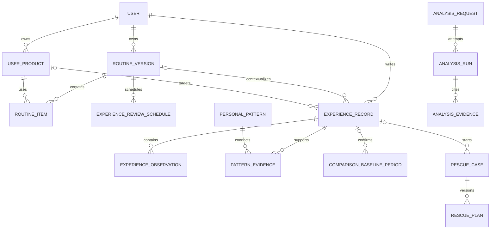

# 데이터 모델과 사전

SQLite 단일 API 인스턴스를 기준으로 한다. 실제 DDL은 Flyway migration이 원본이며 [DBML](./schema.dbml)은 사람이 읽는 관계 계약이다.

## 핵심 원칙

1. 개인 자식 행은 `user_id`와 부모 ID의 복합 FK로 같은 사용자 소유권을 보장한다.
2. 사용자 원문과 AI 구조화·패턴을 분리한다. AI 결과가 원문을 덮지 않는다.
3. 루틴 버전은 한 번의 실제 사용기간이며 ACTIVE 이후 수정하지 않는다.
4. 회고 due는 일정일 뿐 결과가 아니다. 7일 미응답을 만족·불편 없음으로 추정하지 않는다.
5. 전반적 인상, 불편 여부, 실제 사용 일치와 다음 행동을 서로 다른 필드로 저장한다.
6. 패턴은 여러 경험을 참조하는 AI 해석이며 원본 근거·반대 근거·실행 버전을 가진다.
7. AI 제안과 실제 적용 상태를 분리하고 적용 직전 기준 버전을 다시 확인한다.
8. 외부 근거는 URL이 아니라 확인 당시 snapshot을 참조한다.
9. SQLite JSON은 `TEXT + json_valid() + schema_version`을 쓰며 핵심 상태를 JSON에만 두지 않는다.

## P0 핵심 관계

## 엔터티 사전

### 계정·제품

| 테이블 | 의미 | 불변식 |
| --- | --- | --- |
| `app_user` | 계정과 시간대 | 정규화 이메일 유일, 전역 AI lock 없음 |
| `idempotency_record` | 한 번만 반영할 쓰기 재시도 | 사용자·operation·key 유일 |
| `product_version` | 같은 처방·용량·포장·시장의 출시판 | 검증 상태와 판매 상태 분리 |
| `user_product` | 사용자가 보유·사용한 제품 | 카탈로그 미확인 제품도 입력 이름으로 존재 가능 |
| `evidence_snapshot` | 확인 당시 외부 원문 | URL, 확인 시각, content hash 보존 |

### 루틴·경험

| 테이블 | 의미 | 불변식 |
| --- | --- | --- |
| `routine_version` | 한 번의 실제 사용기간의 제품 조합 | 사용자당 ACTIVE 하나, 과거 재활성화 금지 |
| `routine_item` | 제품·아침/저녁·순서·빈도 | 같은 사용자의 `user_product`만 참조 |
| `experience_review_schedule` | 기본 회고 due | SCHEDULED·COMPLETED·CANCELLED·MISSED, 결과의 원본이 아님 |
| `experience_record` | 사용자가 남긴 경험 원본 | 제품 또는 루틴 중 하나 이상과 연결, 원문 불변 revision |
| `experience_observation` | AI가 원문에서 추출한 관찰 | 사용자 표현 span과 schema/model 추적, 원문에 없는 사실 금지 |
| `comparison_baseline_period` | Rescue 변경 비교에 쓰는 루틴 기간 | 실제 사용 일치와 불편 없음이 명시된 경험만 승격 가능 |

`experience_record`의 주요 축은 다음과 같다.

| 축 | 값 | 의미 |
| --- | --- | --- |
| `sentiment` | `LIKED`, `DISAPPOINTED`, `UNSURE` | 전반적 개인 인상 |
| `discomfort` | `NONE_REPORTED`, `REPORTED`, `UNKNOWN` | 불편 관찰 여부 |
| `adherence` | `MATCHED`, `PARTIAL`, `MISMATCHED`, `UNKNOWN` | 기록된 사용 맥락과 실제 사용 일치 |
| `source` | `IN_USE`, `DAY_7_REVIEW`, `PRODUCT_NOTE`, `RESCUE` | 기록이 생긴 진입점 |

`LIKED + REPORTED`와 `DISAPPOINTED + NONE_REPORTED`를 모두 허용한다. 만족과 불편은 같은 축이 아니다.

### 개인 패턴

| 테이블 | 의미 | 불변식 |
| --- | --- | --- |
| `personal_pattern` | AI가 여러 경험을 연결한 해석 revision | 상태·분석 run·근거 수·문구·불확실성 저장 |
| `pattern_evidence` | 패턴과 경험의 관계 | `SUPPORT`, `OPPOSE`, `UNCERTAIN` 중 하나 |
| `pattern_feedback` | 사용자의 관련성 피드백 | 패턴 revision과 사용자당 하나의 최신 피드백 |

P0에서는 서로 다른 experience record 2건 이상이 연결돼야 패턴 후보를 노출한다. 같은 제품 반복과 서로 다른 제품 반복을 구분한다. 근거 한 건은 `experience_observation`으로만 표시한다.

원문이 수정·삭제되거나 사용자가 `관련 없음`을 표시하면 현재 패턴을 덮어쓰지 않고 새 revision을 계산한다. 과거 revision과 analysis run은 감사 이력으로 남긴다.

### Rescue

| 테이블 | 의미 | 불변식 |
| --- | --- | --- |
| `rescue_case` | 불편 경험에서 시작한 한 대화 | 시작 경험·ACTIVE·비교 기준을 snapshot으로 고정 |
| `rescue_message` | 순서가 보존된 채팅 메시지 | assistant는 생성 analysis run 참조 |
| `rescue_safety_event` | 순위와 제안을 멈춘 안전 경계 | 사용자 메시지·규칙/모델 버전·조치 보존 |
| `rescue_plan` | 버전화된 다음 루틴 제안 | 기준 ACTIVE가 같을 때만 적용 |
| `rescue_change` | plan의 순서 있는 구조 변경 | case가 아니라 plan을 참조 |

사용자 승인 시 짧은 트랜잭션에서 기준 ACTIVE를 비교하고 새 루틴을 만든다. AI 호출 중 사용자 쓰기 lock이나 DB 쓰기 트랜잭션을 유지하지 않는다.

### AI 실행과 근거

| 테이블 | 의미 | 불변식 |
| --- | --- | --- |
| `analysis_request` | 하나의 논리적 AI 요청 | 입력 snapshot·hash·schema와 채택 run 보존 |
| `analysis_run` | 모델 호출 한 번 | 모델·prompt·출력·검증 오류·token 불변 보존 |
| `conversation` | 제품·패턴·Rescue를 잇는 공통 채팅 | kind는 맥락이며 UI는 하나 |
| `analysis_evidence` | AI 주장과 정확히 한 근거 연결 | 외부 snapshot 또는 개인 experience/pattern/rescue 중 하나 |
| `ai_job` | 실행 queue와 worker lease | 분석 내용의 원본이 아님 |

권위 순서는 `사용자 원문 → 검증된 구조화/AI proposal → 사용자가 확정한 상태`다. AI 원본 출력은 사용자 사실이 아니다.

## DB 제약

### 부분 유니크

- 사용자당 ACTIVE routine 하나
- 사용자당 열린 comparison baseline period 하나
- 사용자당 열린 Rescue case 하나
- Rescue case당 APPLIED plan 하나
- 사용자·job type·input hash당 열린 AI job 하나

### CHECK와 trigger

- 모든 상태·역할·주요 type은 허용 값만 저장한다.
- 순서·근거 수·token은 음수가 아니다.
- 필수 JSON은 `json_valid()`를 통과한다.
- `experience_record`는 제품 또는 루틴 중 하나 이상을 가진다.
- 패턴 근거는 같은 사용자 experience만 참조한다.
- ACTIVE 이후 routine 핵심 필드와 item의 UPDATE·DELETE를 거절한다.
- 회고 schedule 완료와 experience 생성은 멱등하게 연결한다.
- 비교 기준 승격 조건과 Rescue plan 기준 루틴을 전용 서비스와 trigger가 함께 검증한다.

## 인덱스

- 사용자별 ACTIVE routine과 버전 이력
- 사용자별 최신 experience와 제품·루틴별 experience
- due가 지난 review schedule
- 사용자별 현재 pattern과 pattern evidence
- 사용자별 열린 Rescue case
- worker의 QUEUED·만료 RUNNING job
- 제품별 최신 evidence snapshot

## 시간과 삭제

- 실제 시점은 UTC ISO 8601, 사용자에게 보여주는 지역 날짜는 `YYYY-MM-DD`, 시간대는 IANA 이름을 쓴다.
- 7일 due는 루틴 활성화 당시 시간대로 계산하고 이후 시간대 변경으로 소급 수정하지 않는다.
- 계정 영구 삭제는 모든 개인 경험·패턴·대화·AI 실행과 원본 객체를 제거한다.
- 제품 카탈로그와 외부 근거는 개인 기록이 참조할 수 있어 상태와 snapshot으로 보존한다.
