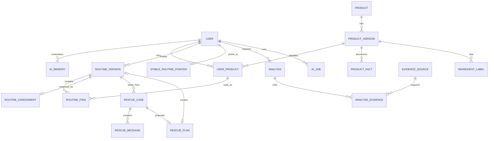
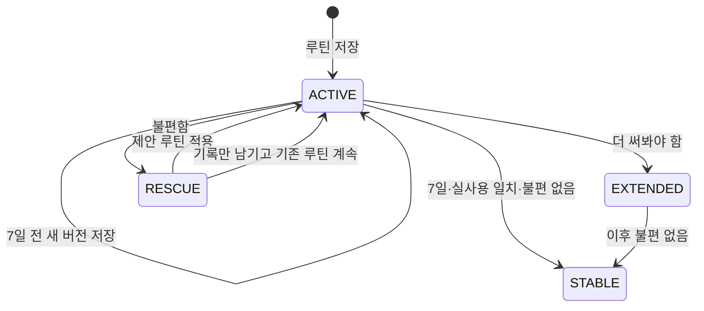

# 데이터 모델과 사전

SQLite 단일 API 인스턴스를 기준으로 한다. 실제 DDL은 Flyway migration이 원본이며 [DBML](./schema.dbml)은 사람이 관계를 이해하기 위한 계약이다.

## 핵심 관계

## 엔터티 사전

### 사용자와 개인화

| 테이블 | 의미 | 중요한 규칙 |
| --- | --- | --- |
| `app_user` | 계정, 시간대와 현재 포인터 | 개인 행의 소유권 기준이다. |
| `ai_memory` | AI가 사용할 자연어 개인 맥락 | 원문·현재 요약·출처를 저장하고 삭제 시 AI 입력에서 제외한다. |
| `notification` | 앱 안 알림 | 읽음은 사용 결과가 아니다. `dedupe_key`가 중복을 막는다. |

### 제품 카탈로그

| 테이블 | 의미 | 중요한 규칙 |
| --- | --- | --- |
| `brand` | 정규화 브랜드 | 한국어 표시명과 공식 사이트를 가진다. |
| `product` | 제품군의 안정 ID | 제품명 변경·리뉴얼과 무관한 그룹이다. |
| `product_version` | 특정 시기·용량·포장의 판매 버전 | `VERIFIED`, `UNCERTAIN`, `RETIRED`. AI 판단에는 VERIFIED만 쓴다. |
| `product_fact` | 공식 사용법·표시 주장·제형 같은 원문 사실 | 값, 출처, 확인 시각, 적용 버전을 함께 저장한다. |
| `ingredient_label` | 버전별 표시 전성분 원문 | 원문과 표시 순서를 보존한다. 성분 단독으로 완제품 효과를 만들지 않는다. |
| `ingredient` | INCI/국문명 별칭 연결용 최소 사전 | 이름 동일성만 구조화하고 피부 효과 enum은 두지 않는다. |
| `evidence_source` | 제조사·정부·공식 DB·원 논문 원문 | URL, 기관, 제목, 날짜, 출처 종류와 확인 시각을 가진다. |
| `price_snapshot` | 참고 가격·판매처 | 분석 입력에서 제외한다. |
| `catalog_review_request` | 미일치 제품 검수 요청 | 해커톤에서는 접수 상태까지만 제공한다. |

### 내 화장품과 루틴

| 테이블 | 의미 | 중요한 규칙 |
| --- | --- | --- |
| `user_product` | 사용자가 가진 한 제품 | 등록 시 `UNUSED`. 제품 버전 불확실도 허용한다. |
| `product_memo` | 제품별 현재 메모와 이력 | 사용자가 요청한 AI 작업에만 포함한다. |
| `wishlist_item` | 구매 전 찜 | 내 화장품과 별도다. 등록하면 연결 ID를 남긴다. |
| `routine_version` | 특정 시점의 루틴 스냅샷 | 과거 행을 수정하지 않는다. 변경마다 새 `version_no`를 만든다. |
| `routine_item` | 아침/저녁 제품, 순서와 빈도 | 클렌징을 포함한다. 같은 시간대 순서는 유일하다. |
| `stable_routine_pointer` | 사용자의 마지막 안정 루틴 | 7일 결과 `NO_DISCOMFORT`이고 실제 사용 일치일 때만 이동한다. |
| `routine_assessment` | 7일 round 또는 조기 결과 | 결과 범위는 루틴 전체다. `EARLY`는 낮은 신뢰도고, 연장하면 같은 루틴에 다음 round를 추가한다. |

### Rescue와 AI

| 테이블 | 의미 | 중요한 규칙 |
| --- | --- | --- |
| `rescue_case` | 한 번의 불편 대화 | 시작 루틴, 안정 기준, 안전 경계와 최종 행동을 가진다. |
| `rescue_message` | 순서가 보존된 사용자·AI 메시지 | UI가 이전 메시지를 지우지 않는다. |
| `rescue_change` | 안정 기준과 시작 루틴의 확인된 차이 | 제품·순서·빈도, 사용자 정정 여부를 저장한다. |
| `rescue_plan` | AI가 제안하고 서버가 검증한 다음 루틴 | 적용 시 새 routine_version ID를 연결한다. |
| `analysis` | 제품 의견·추천·루틴·Rescue 결과 | 입력 스냅샷, 모델, prompt version, 결과 JSON과 검증 상태를 가진다. |
| `analysis_evidence` | 분석 주장과 출처/개인 기록 연결 | 근거 종류와 지지·반대·불확실 관계를 저장한다. |
| `ai_job` | 비동기 AI 실행과 재시도 | 사용자·작업 종류·입력 해시로 열린 중복 작업을 막는다. |

### 영수증

| 테이블 | 의미 | 중요한 규칙 |
| --- | --- | --- |
| `receipt_upload` | 원본 객체 키와 OCR 상태 | MVP에서는 영구 보관하고 계정 삭제 시 삭제한다. |
| `receipt_item` | OCR 한 줄과 연결 후보 | 사용자가 확정한 제품만 user_product를 만든다. |

## 루틴 상태 전이

`STABLE`은 루틴 버전의 의료적 안전 상태가 아니다. 사용자가 해당 7일 동안 전반적 불편이 없었다고 말한 개인 기록이다.

## 주요 제약

- 모든 개인 테이블은 `user_id`를 직접 가지거나 소유권이 명확한 부모 FK를 가진다.
- SQLite 연결마다 `PRAGMA foreign_keys = ON`을 실행한다.
- `routine_version(user_id, version_no)`와 `routine_item(routine_version_id, period, position)`는 유일하다.
- 사용자당 `is_current = 1`인 루틴은 하나다. partial unique index로 보장한다.
- 사용자당 stable pointer는 하나다.
- 한 루틴 버전의 FINAL assessment는 round별 하나다. FINAL round는 1부터 증가하고 EARLY는 round 0으로 하나만 둔다.
- AI job의 상태는 `QUEUED`, `RUNNING`, `SUCCEEDED`, `FAILED`만 사용한다.
- DB 쓰기 트랜잭션 안에서 OpenAI·웹·Object Storage 응답을 기다리지 않는다.

## 삭제

계정 삭제는 새 쓰기를 잠근 뒤 개인 행, 영수증 원본과 연결 객체를 영구 삭제한다. MVP에서는 복구 기간과 백업 보존 기능을 제공하지 않는다. 삭제 과정의 실패는 job 상태로 재시도하지만 사용 화면에서는 삭제 요청이 완료되기 전까지 상태를 보여준다.

## 시간

- API 시각은 offset이 있는 ISO 8601로 주고 DB에는 UTC를 저장한다.
- 7일의 날짜 계산은 루틴 생성 당시 사용자의 IANA 시간대를 사용한다.
- 이미 정한 DAY 7 시각은 이후 시간대 변경으로 소급 변경하지 않는다.
