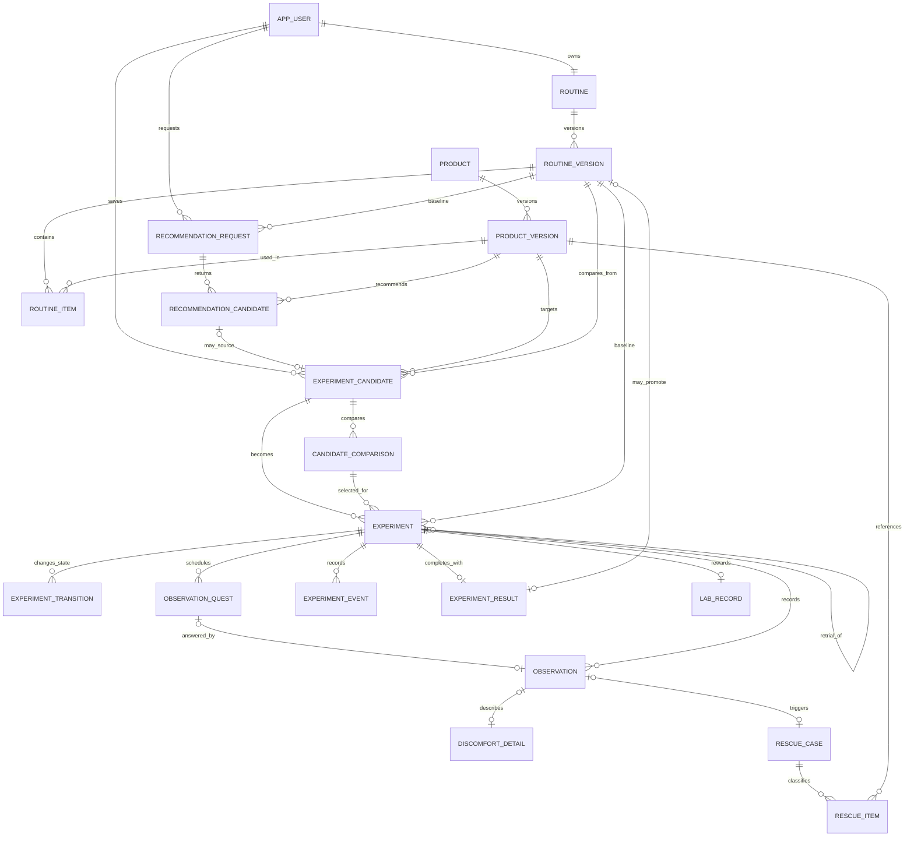
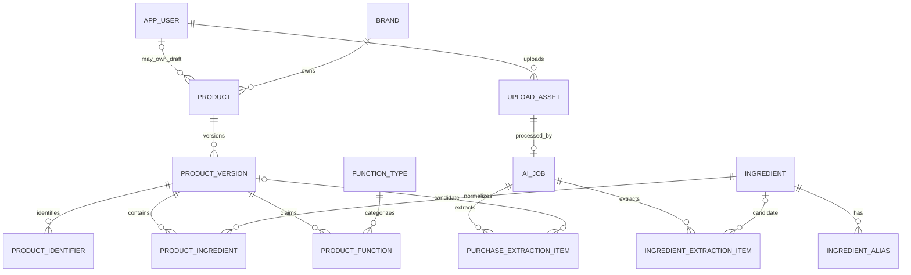
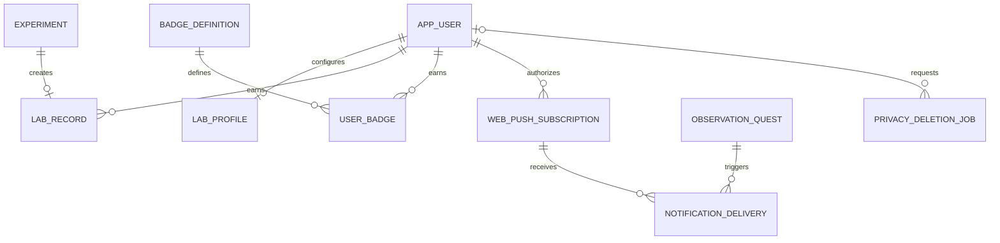

# SkinCause MVP 데이터 모델

## 한눈에 보기

SkinCause의 데이터 모델은 현재 상태만 저장하면 안 된다. 사용자가 어느 안정 루틴에서 어떤 제품을 어떤 계획으로 시험했고, 언제 무엇을 관찰했는지를 나중에도 같은 방식으로 복원해야 한다.

설계의 중심은 다섯 가지다.

1. 안정 루틴과 제품 정보는 확정 후 덮어쓰지 않고 버전으로 남긴다.
2. 제품 후보, 비교안과 실제 실험을 구분한다.
3. 실험 상태와 사용 변화는 현재값뿐 아니라 전환 시점을 남긴다.
4. Rescue와 AI 설명은 당시 입력·규칙·버전의 결과 스냅샷을 보존한다.
5. Beauty Archive는 완료 실험을 복제한 테이블이 아니라 원본 이력을 조회한 결과다.

필드의 세부 정의와 제약은 [데이터 사전](./data-dictionary.md)을 따른다.

## 범위

- ERD에는 P0·P1만 포함한다.
- 브랜드 실험, 코호트, 전문가 공유는 Pn이므로 테이블을 미리 만들지 않는다.
- Supabase Auth의 내부 테이블은 직접 참조하지 않고 `app_user.id`에 인증 subject UUID를 사용한다.
- 분석 이벤트는 PostHog에 저장하며 운영 PostgreSQL의 핵심 도메인 모델에 복제하지 않는다.

## 핵심 관계



## 제품 데이터와 AI 구조화



## LAB·알림·삭제



## 핵심 설계 결정

### 1. 안정 루틴은 버전이다

`routine`은 사용자 루틴의 정체성이고, `routine_version`은 특정 시점의 확정된 내용이다. `routine.current_stable_version_id`가 현재 기준점을 가리킨다.

- 확정된 버전의 `routine_item`은 수정하지 않는다.
- 편집은 새 초안 버전을 만들고 사용자 확인 후 현재 포인터를 바꾼다.
- 실험은 포인터가 아니라 당시 `routine_version.id`를 직접 참조한다.
- 실험 결과로 새 안정 루틴을 만들면 `experiment_result.resulting_routine_version_id`가 새 버전을 가리킨다.

이 구조가 없으면 과거 Rescue를 열었을 때 현재 루틴으로 비교하는 오류가 생긴다.

### 2. 제품도 버전으로 참조한다

제품명·성분·기능 정보는 나중에 수정될 수 있다. 후보와 실험이 `product.id`만 참조하면 과거 판단 근거가 바뀐다.

- `product`는 동일 제품의 정체성과 소유 범위를 나타낸다.
- `product_version`은 그 시점의 이름, 종류와 확인 상태를 나타낸다.
- 루틴, 후보, 실험과 Rescue는 `product_version_id`를 참조한다.
- 공용 데이터 수정은 새 버전을 만들고 최신 포인터만 바꾼다.

사용자 초안은 `product.owner_user_id`가 있으며 운영 확인 전 다른 사용자에게 노출하거나 추천하지 않는다.

### 3. 추천·후보·실험은 다른 상태다

- `recommendation_candidate`: 특정 추천 요청이 반환한 순위와 근거
- `experiment_candidate`: 사용자가 보관하기로 선택한 제품과 변경 의도
- `candidate_comparison`: 안정 루틴과 후보의 계산 결과
- `experiment`: 사용자가 실제로 시작한 한 번의 사용 과정

추천 결과를 바로 실험으로 만들지 않는다. 사용자가 직접 찾은 제품도 추천 없이 후보와 실험이 될 수 있다.

### 4. 한 사용자당 열린 실험은 하나다

애플리케이션 검사만으로는 동시 요청에서 두 실험이 생길 수 있다. PostgreSQL 부분 유일 인덱스로 다음 상태의 실험을 사용자당 하나로 제한한다.

```sql
create unique index uq_one_open_experiment_per_user
on experiment (user_id)
where status in ('PLANNED', 'ACTIVE', 'PAUSED');
```

후보는 여러 개 저장할 수 있다. 재시험은 새 실험이며 `parent_experiment_id`로 연결한다.

### 5. 상태 이력은 별도 기록한다

`experiment.status`는 빠른 현재 조회용이고, `experiment_transition`은 변경 이력의 원본이다.

- 상태 변경은 한 트랜잭션에서 현재 상태와 전환 행을 함께 저장한다.
- 허용된 전환만 서버 도메인 규칙으로 처리한다.
- 첫 사용, 중단, 재사용과 계획 이탈은 `experiment_event`에 별도로 남긴다.
- 일시 보류 후 일정 이동은 이전 퀘스트를 덮어쓰지 않고 변경 전·후 예정 시각을 감사 필드에 남긴다.

### 6. 관찰과 퀘스트를 분리한다

퀘스트는 시스템이 요청한 관찰이고 관찰은 사용자가 실제로 남긴 기록이다.

- 예정 밖 변화는 퀘스트 없이 관찰할 수 있다.
- 건너뛴 퀘스트에는 관찰이 없으며 skip 상태와 이유만 남는다.
- 퀘스트 하나에는 관찰 하나만 연결할 수 있다.
- 관찰 시각과 입력 시각을 분리해 늦게 기록한 경우를 알 수 있다.

### 7. Rescue는 계산 결과 스냅샷이다

Rescue 분류는 언제든 다시 계산할 수 있지만, 사용자가 당시 본 결과를 보존해야 한다.

`rescue_case`는 기준 루틴, 정책 버전, 근거 강도와 안전 우선 여부를 저장한다. `rescue_item`은 제품별 분류와 계산에 사용한 사실을 저장한다. AI 설명은 분류를 바꾸지 않고 구조화된 설명만 덧붙인다.

### 8. Archive 테이블은 만들지 않는다

Beauty Archive는 `experiment`, `experiment_result`, `observation`, `rescue_case`, `routine_version`을 조회한 읽기 화면이다. 별도 Archive 행을 복제하면 실험 결과와 Archive가 서로 다르게 수정될 수 있다.

필요하면 읽기 성능을 위한 SQL view 또는 materialized view를 만들 수 있지만 원본 데이터는 위 테이블이다.

### 9. 개인 패턴은 원인이 아니다

P1 개인 패턴은 완료 실험을 집계한 SQL view로 계산한다. 최소 두 사례, 전체 관련 사례 수와 반대 사례를 함께 반환한다.

추천 결과에 사용한 패턴은 `recommendation_candidate.evidence_snapshot`에 당시 수치와 참조 실험 ID를 저장한다. 이후 기록이 늘어나도 과거 추천 설명이 몰래 바뀌지 않는다.

### 10. LAB 보상은 중복될 수 없다

`lab_record.experiment_id`에 유일 제약을 둔다. 실험 결과를 다시 제출하거나 네트워크 재시도가 발생해도 한 실험은 연구실에 한 번만 추가된다. 배지는 `user_id + badge_definition_id` 유일 제약으로 한 번만 해금한다.

## 트랜잭션 경계

다음 작업은 일부만 성공하면 데이터 의미가 깨지므로 하나의 데이터베이스 트랜잭션으로 처리한다.

| 작업 | 함께 성공해야 하는 변경 |
| --- | --- |
| 안정 루틴 확정 | 새 버전 확정 + 현재 안정 버전 포인터 변경 |
| 실험 계획 확정 | 실험 생성 + 초기 상태 이력 + 필수 퀘스트 초안 생성 |
| 첫 사용 | ACTIVE 전환 + 실제 시작 시각 + 퀘스트 예정 시각 확정 + 관찰 저장 |
| 불편 관찰 | 관찰·상세 저장 + Rescue case/item 생성 + 필요 시 PAUSED 전환 |
| 실험 완료 | 결과 저장 + COMPLETED 전환 + LAB record 생성 |
| 안정 루틴 반영 | 새 루틴 버전·항목 생성 + 결과 연결 + 현재 포인터 변경 |

외부 AI·알림 호출을 데이터베이스 트랜잭션 안에서 기다리지 않는다. 작업 행을 먼저 저장하고 비동기로 처리하며 재시도해도 같은 결과가 중복 생성되지 않게 한다.

## 삭제와 보존

### 사용자 계정 삭제

1. 사용자 쓰기를 잠그고 `privacy_deletion_job`을 만든다.
2. 비공개 업로드와 알림 구독을 삭제한다.
3. 사용자 소유 도메인 데이터를 외래키 순서에 따라 삭제한다.
4. 사용자 초안 제품과 AI 작업을 삭제한다.
5. 인증 계정을 삭제한다.
6. 삭제 작업에는 비식별 상태와 완료 시각만 최대 30일 보존한다.

공용 제품 데이터와 집계된 비식별 분석 수치는 남을 수 있지만 개인과 다시 연결할 수 없어야 한다.

### 이미지

- 객체는 항상 비공개 버킷에 둔다.
- 구조화 결과를 사용자가 확정하면 즉시 삭제 예약한다.
- 확정하지 않아도 `delete_after = uploaded_at + 7일`을 넘기지 않는다.
- 데이터베이스 행과 객체 삭제가 모두 성공해야 `DELETED`로 표시한다.

### 운영 데이터

- 실험·루틴 기록은 사용자가 삭제하기 전까지 개인 Archive를 위해 보존한다.
- 애플리케이션 로그에는 민감 원문을 남기지 않으며 운영 보존 기간은 30일을 기본으로 한다.
- AI 구조화 출력은 사용자가 확정한 도메인 데이터로 전환한 뒤 최소 정보만 남긴다.

## 동시성과 무결성

- 수정 가능한 집계·상태 행에는 낙관적 잠금 `version`을 둔다.
- 안정 루틴 버전 번호는 `routine_id + version_no`로 유일하다.
- 시간대 안의 제품 순서와 제품 중복을 DB 제약으로 막는다.
- 실험 상태 전환은 현재 상태 조건부 update로 경쟁 요청을 막는다.
- 실험 완료, 안정 루틴 승격과 보상 생성은 idempotency key를 사용한다.
- 모든 개인 FK 조회는 소유자 연결을 확인한다. UUID가 노출되어도 다른 사용자 데이터가 반환되지 않아야 한다.

## 데이터 모델 완료 기준

- 요구사항의 모든 저장·이력·삭제 동작이 특정 엔터티와 연결된다.
- 과거 실험을 열어 당시 루틴·제품·추천 근거를 그대로 복원할 수 있다.
- 두 개의 열린 실험, 중복 퀘스트 응답과 중복 LAB 보상을 DB가 막는다.
- 사용자 A의 모든 개인 엔터티에 사용자 A 소유 경로가 존재한다.
- 계정 삭제 순서와 외래키 정책이 서로 충돌하지 않는다.
- Pn 기능을 위한 사용되지 않는 테이블이 없다.
