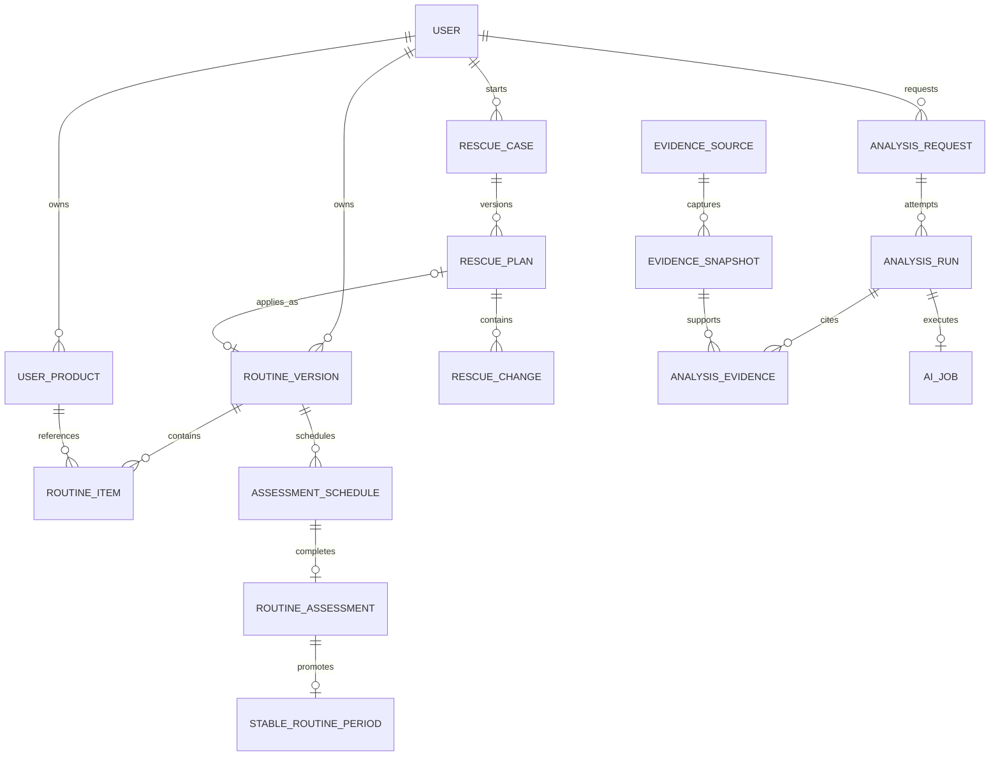

# 데이터 모델과 사전

SQLite 단일 API 인스턴스를 기준으로 한다. 실제 DDL은 SQLite용 Flyway migration이 원본이며 [DBML](./schema.dbml)은 사람이 관계를 이해하기 위한 계약이다. 리뷰 반영 여부는 [데이터 모델 리뷰 결정](./review-decisions.md)에 기록한다.

## 설계 원칙

1. 개인 데이터는 ID 존재뿐 아니라 같은 사용자 소유인지 복합 FK로 검사한다.
2. 현재 루틴, 평가 due, 마지막 안정 루틴은 각각 한 종류의 행만 권위로 삼는다.
3. 실제 사용을 시작한 루틴과 AI 원본 출력은 수정하지 않고 새 버전·새 실행으로 이어간다.
4. AI 제안과 실제 적용 상태를 분리하고, 적용 시 기준 버전이 바뀌었는지 다시 확인한다.
5. 외부 근거는 URL이 아니라 확인 당시 snapshot을 참조한다.
6. SQLite JSON은 `TEXT + json_valid() + schema_version`으로 저장한다. 권한·상태·루틴 item 같은 핵심 상태를 JSON에만 두지 않는다.

## 구현 우선순위

DBML은 P0~P2의 논리적 상한을 보여준다. 이것이 모든 테이블을 첫 migration에 만들라는 뜻은 아니다.

- **P0 migration:** 계정·멱등성, 최소 제품·내 화장품, 루틴·schedule·assessment·stable period, Rescue message·plan·change·safety event, 최소 analysis request·run.
- **P1 migration:** evidence snapshot·제품 사실·전성분, product memo, conversation, ai job lease, notification과 전체 이력 지원.
- **P2 migration:** AI memory, receipt OCR, wishlist·가격과 추천 확장에만 필요한 구조.

P1·P2 테이블은 해당 요구사항이 `Ready`가 될 때 별도 Flyway migration으로 추가한다. P0 코드가 아직 없는 P1·P2 테이블에 의존하지 않게 한다.

## 핵심 관계



## 사용자 소유권

### 규칙

개인 자식 테이블에는 `user_id`를 명시하고 부모의 `(id, user_id)`를 함께 참조한다. 중복 `user_id`는 조회 편의를 위한 비정규화가 아니라 DB가 교차 사용자 연결을 거절하기 위한 무결성 키다.

예:

```text
routine_item(routine_version_id, user_id)
  → routine_version(id, user_id)

routine_item(user_product_id, user_id)
  → user_product(id, user_id)
```

따라서 사용자 A의 루틴에 사용자 B의 제품을 넣는 행은 애플리케이션 버그가 있어도 저장되지 않는다. 복합 FK는 API 권한 검사를 대신하지 않는다. 모든 조회와 변경은 인증 사용자 조건을 함께 사용하고 다른 사용자의 ID는 존재하지 않는 것처럼 처리한다.

### 직접 `user_id`를 갖는 개인 테이블

`ai_memory`, `idempotency_record`, `user_product`, `product_memo`, `wishlist_item`, `routine_version`, `routine_item`, `routine_assessment_schedule`, `routine_assessment`, `stable_routine_period`, `rescue_case`, `rescue_message`, `rescue_safety_event`, `rescue_plan`, `rescue_change`, `analysis_request`, `analysis_run`, `conversation`, `conversation_message`, `analysis_evidence`, `ai_job`, `notification`, `receipt_upload`, `receipt_item`, `catalog_review_request`.

## 엔터티 사전

### 사용자와 개인화

| 테이블 | 의미 | 중요한 규칙 |
| --- | --- | --- |
| `app_user` | 계정과 시간대 | 이메일은 trim·소문자 정규화 후 유일하다. 현재 루틴 포인터와 전역 쓰기 잠금을 저장하지 않는다. |
| `ai_memory` | 사용자가 확인한 자연어 개인 맥락 | 원문·요약·출처 행을 추적한다. 삭제 후 모든 새 AI 입력에서 제외한다. |
| `idempotency_record` | 사용자·operation 범위의 쓰기 재시도 계약 | 같은 key와 request hash는 최초 결과를 재사용하고 다른 hash면 충돌한다. 만료 전까지 보존한다. |
| `notification` | 평가 일정 또는 AI job의 앱 안 전달 상태 | 평가 due의 원본이 아니다. schedule 또는 job 정확히 하나를 참조한다. `(user_id, dedupe_key)`가 중복을 막는다. |

### 제품 카탈로그와 근거

| 테이블 | 의미 | 중요한 규칙 |
| --- | --- | --- |
| `brand` | 정규화 브랜드 | 한국어 표시명과 공식 사이트를 가진다. |
| `product` | 이름이 유지되는 제품군 | `(brand_id, canonical_name)`이 유일하다. |
| `product_version` | 처방·용량·포장·시장 조건이 같은 하나의 출시판 | 정보 검증 상태와 판매 수명주기를 분리한다. AI 제품 사실에는 `VERIFIED`만 쓴다. |
| `product_fact` | 공식 사용법·표시 주장·제형·주의 원문 | 근거 자체를 한 컬럼에 두지 않고 여러 `product_fact_evidence`와 연결한다. |
| `evidence_source` | URL과 기관의 정체성 | URL 내용이 바뀌어도 같은 출처를 식별한다. |
| `evidence_snapshot` | 특정 시점에 확인한 제목·내용 hash·최소 인용 | 제품 사실, 전성분과 AI 분석이 재현 가능한 시점 근거로 참조한다. |
| `ingredient_list` | 한 snapshot에서 얻은 전성분 목록 원문과 추출 실행 | 제품 버전에 서로 다른 목록이 있을 수 있다. 상태와 추출 schema를 보존한다. |
| `ingredient_list_item` | 목록 안 표시 성분과 순서 | `(ingredient_list_id, display_order)`가 유일하다. 사전 매핑 실패 시에도 원문은 남긴다. |
| `ingredient` | INCI·국문명 동일성용 최소 사전 | 피부 영향 enum이나 완제품 효능을 저장하지 않는다. |
| `price_snapshot` | 통화가 명시된 참고 가격 | 음수를 허용하지 않고 의견·추천 순위 입력에서 제외한다. |
| `catalog_review_request` | 제품 미일치 검수 요청과 해결 결과 | 관련 내 화장품·영수증 행과 해결한 제품 버전을 선택적으로 추적한다. |

`product_version`은 MVP에서 formula와 SKU를 따로 나누지 않는다. 50 ml와 100 ml, 처방 변경, 포장 구분 중 하나라도 사용자가 실제 제품을 식별하는 데 중요하면 서로 다른 출시판이다. 실제 카탈로그 운영에서 중복이 문제가 되기 전까지 이 단위를 유지한다.

검증 상태:

- `UNVERIFIED`: 버전·공식 정보가 충분히 확인되지 않음
- `VERIFIED`: 허용된 근거와 검수로 출시판이 확인됨
- `CONFLICTED`: 공식 출처 간 버전·표시 정보가 충돌함

판매 상태:

- `ACTIVE`: 현재 판매 확인
- `DISCONTINUED`: 판매 종료 확인
- `UNKNOWN`: 판매 여부 미확인

`VERIFIED + DISCONTINUED`를 동시에 표현할 수 있다. 단종 제품도 과거 개인 기록과 당시 분석 근거로 계속 조회한다.

### 내 화장품과 루틴

| 테이블 | 의미 | 중요한 규칙 |
| --- | --- | --- |
| `user_product` | 사용자가 가진 한 제품 | 카탈로그 버전이 없어도 입력 이름으로 등록할 수 있다. 미사용·현재·안정 묶음은 저장 상태가 아니라 루틴 포함 관계로 계산한다. |
| `product_memo` | 제품 메모 revision | 최신 한 건만 열어 두고 이전 메모와 교체 관계를 보존한다. 사용자가 허용한 AI 요청에만 포함한다. |
| `wishlist_item` | 구매 전 찜의 생성·제거·전환 이력 | 활성 행만 사용자·제품당 하나다. 전환 후 다시 찜할 수 있다. |
| `routine_version` | 한 번의 실제 사용기간을 나타내는 불변 루틴 | 과거 루틴으로 돌아가도 새 버전으로 복사한다. ACTIVE는 사용자당 하나다. |
| `routine_item` | 아침/저녁 제품, 순서와 빈도 | 같은 사용자의 제품만 참조한다. 위치는 1부터 연속이며 클렌징도 포함한다. |

#### 루틴 상태

```text
DRAFT → ACTIVE → SUPERSEDED
   └───────→ CANCELLED
```

- `DRAFT`: 같은 짧은 저장 트랜잭션 안에서 item을 구성하는 상태다.
- `ACTIVE`: 사용자가 지금 쓴다고 확정한 유일한 루틴이다.
- `SUPERSEDED`: 새 ACTIVE가 생겨 종료된 과거 루틴이다.
- `CANCELLED`: 활성화 전에 취소됐거나 운영상 무효화된 draft다.

`ACTIVE` 이후에는 routine item과 시작 기준을 수정·삭제하지 않는다. 루틴 변경은 기존 ACTIVE를 SUPERSEDED로 바꾸고 이를 `based_on_routine_version_id`로 참조하는 새 버전을 만든다. Rescue 적용도 같은 규칙을 사용한다.

현재 루틴 API의 `currentRoutineId`와 `isCurrent`는 `status=ACTIVE`에서 파생한다. DB에는 별도 포인터나 boolean을 두지 않는다.

#### 빈도

`frequency_mode`는 다음 네 값만 저장한다.

| 값 | 구조화 필드 | 표시 원문 |
| --- | --- | --- |
| `DAILY` | 추가 값 없음 | 선택 |
| `DAYS_PER_WEEK` | `frequency_days_per_week=1..6` | 선택 |
| `AS_NEEDED` | 추가 값 없음 | 선택 |
| `CUSTOM` | 없음 | `frequency_text` 필수 |

서버 비교는 구조화 필드를 사용하고 사용자에게는 원문을 함께 보여준다. AI가 자유 문장을 임의로 다른 빈도로 확정하지 않는다.

### 7일 평가와 안정 이력

| 테이블 | 의미 | 중요한 규칙 |
| --- | --- | --- |
| `routine_assessment_schedule` | 한 번의 예정된 결과 질문 | due·연장·취소·완료의 단일 원본이다. 최초 sequence는 1이고 연장마다 증가한다. |
| `routine_assessment` | 사용자가 실제로 제출한 조기 또는 예정 평가 | 실제 사용 일치, 관찰 결과, 다음 결정을 분리해 저장한다. 원본 행에 알고리즘 weight를 저장하지 않는다. |
| `stable_routine_period` | 어떤 루틴이 마지막 안정 기준이었던 기간 | 열린 기간은 사용자당 하나다. 새 승격 시 기존 기간을 종료하고 새 행을 만든다. |

평가 의미는 세 축으로 나눈다.

| 축 | 값 | 질문 |
| --- | --- | --- |
| `adherence` | `MATCHED`, `PARTIAL`, `MISMATCHED`, `UNKNOWN` | 기록과 실제 사용이 얼마나 같았나 |
| `outcome` | `NO_DISCOMFORT`, `DISCOMFORT`, `UNKNOWN` | 전반적으로 어떤 관찰이 있었나 |
| `decision` | `COMPLETE`, `EXTEND`, `UPDATE_ROUTINE`, `START_RESCUE`, `RECORD_ONLY` | 다음에 무엇을 하기로 했나 |

P0의 `아직 모르겠음`은 `outcome=UNKNOWN + decision=RECORD_ONLY`로 결과만 남긴다. P1에서 사용자가 `7일 더 보기`까지 선택하면 `outcome=UNKNOWN + decision=EXTEND`로 저장하고 새 schedule을 만든다. 안정 승격은 `SCHEDULED_REVIEW + MATCHED + NO_DISCOMFORT + COMPLETE`이고 schedule과 assessment가 같은 사용자·같은 routine이어야 한다.

`confidence_weight`는 저장하지 않는다. 개인 근거를 분석할 때 assessment kind, 사용 일치와 경과를 알고리즘 버전과 함께 해석한다.

### Rescue

| 테이블 | 의미 | 중요한 규칙 |
| --- | --- | --- |
| `rescue_case` | 한 번의 불편 대화 | 시작 당시 ACTIVE와 열린 stable routine을 고정한다. 사용자당 열린 case는 하나다. |
| `rescue_message` | 순서가 보존된 사용자·AI 메시지 | assistant 메시지는 생성한 analysis run을 추적한다. |
| `rescue_safety_event` | 제품 순위·계획 생성을 멈춘 안전 경계 사건 | 사용자 메시지, 경계 코드, 탐지 방식·버전과 수행 조치를 원본으로 남긴다. |
| `rescue_plan` | case 안에서 버전화된 검증 제안 | 생성 run, 기준 루틴, plan schema, 확인·적용 루틴을 추적한다. |
| `rescue_change` | 특정 plan의 순서 있는 구조화 변경 | case가 아니라 plan을 참조해 재생성된 계획끼리 섞이지 않는다. |

plan 적용은 다음 짧은 트랜잭션에서 처리한다.

1. `plan.status=CONFIRMED`인지 확인한다.
2. 현재 `ACTIVE` 루틴 ID가 `base_routine_version_id`와 같은지 확인한다.
3. 다르면 plan을 `STALE`로 바꾸고 적용하지 않는다.
4. 같으면 새 DRAFT와 item을 만들고 검증한다.
5. 기존 ACTIVE를 SUPERSEDED, 새 routine을 ACTIVE, plan을 APPLIED로 함께 커밋한다.

AI 호출 중에는 사용자 쓰기를 잠그지 않는다.

### AI 분석과 작업

| 테이블 | 의미 | 중요한 규칙 |
| --- | --- | --- |
| `analysis_request` | 사용자가 요청한 하나의 논리적 분석 | 입력 snapshot·hash·schema와 최종 채택 run을 가진다. |
| `analysis_run` | 모델 호출 한 번의 불변 실행 기록 | attempt, 모델, prompt, 원본 출력, 검증 오류, token과 시각을 보존한다. |
| `conversation` | 제품 의견·추천·제품 질문의 이어지는 대화 | 최초 analysis request를 기준으로 같은 사용자 후속 질문을 묶는다. Rescue 대화와는 상태 규칙이 달라 분리한다. |
| `conversation_message` | 제품 대화의 순서 있는 사용자·AI 메시지 | assistant 메시지는 실제 생성한 analysis run을 참조한다. |
| `analysis_evidence` | run의 주장과 정확히 한 종류의 근거 연결 | 외부 snapshot, routine assessment, Rescue 또는 AI 기억 중 하나만 참조한다. |
| `ai_job` | 실행 대기열과 worker lease | 분석 내용의 원본이 아니다. 만료된 RUNNING lease를 다른 worker가 다시 claim할 수 있다. |

`analysis_request.selected_run_id`는 같은 request에 속하고 검증에 성공한 run만 가리킨다. 실패 run도 덮어쓰지 않는다.

AI 결과의 권위 순서는 다음과 같다.

1. `analysis_run.output_json`: 수정하지 않는 모델 원본 envelope
2. `rescue_plan.plan_json` 등 기능별 proposal: 서버 검증을 거친 제안
3. `routine_version`·`routine_item`: 사용자가 적용한 실제 상태

각 단계는 이전 단계 ID와 schema version을 참조한다.

worker는 `QUEUED` 중 `available_at <= now`인 job을 짧은 트랜잭션에서 claim한다. `locked_until`이 지난 RUNNING job은 재회수할 수 있다. heartbeat는 외부 호출의 생존 확인에만 사용하며 사용자 데이터 잠금이 아니다.

### 영수증

| 테이블 | 의미 | 중요한 규칙 |
| --- | --- | --- |
| `receipt_upload` | 원본 객체와 OCR job 상태 | OCR job은 같은 사용자의 job만 참조한다. 계정 삭제 시 객체도 삭제한다. |
| `receipt_item` | 영수증 한 줄, 후보 snapshot과 사용자 확정 | `(receipt_upload_id, line_no)`가 유일하다. 생성된 내 화장품도 같은 사용자여야 한다. |

## DB 제약과 trigger

### partial unique index

- 사용자당 `ACTIVE` routine 최대 하나
- 사용자당 `ended_at IS NULL` stable period 최대 하나
- 사용자당 열린 Rescue case 최대 하나
- Rescue case당 `APPLIED` plan 최대 하나
- 사용자·job type·input hash당 열린 AI job 최대 하나
- 사용자·제품당 활성 wishlist 최대 하나
- 내 화장품당 superseded되지 않은 memo 최대 하나

정확한 SQL 예시는 [리뷰 결정](./review-decisions.md)에 둔다.

### CHECK

- 모든 상태·역할·시간대·주요 type은 허용 값만 저장한다.
- `position`, `line_no`, `sequence_no`, 가격과 token은 음수가 아니다.
- `DAYS_PER_WEEK`는 1~6이고 `CUSTOM`은 표시 원문이 필요하다.
- nullable JSON은 `NULL OR json_valid(value)`, 필수 JSON은 `json_valid(value)`다.
- `analysis_evidence`는 외부 snapshot과 세 개인 근거 FK 중 정확히 하나만 가진다.
- notification은 assessment schedule과 AI job 중 type에 맞는 하나만 가진다.
- 완료·취소·적용 상태는 대응 시각 필드와 함께 존재한다.

### trigger와 전용 쓰기 서비스

- ACTIVE 이후 routine 핵심 필드와 item의 UPDATE·DELETE 거절
- 새 ACTIVE 전환과 이전 ACTIVE 종료의 원자적 처리
- schedule 완료와 assessment 생성의 1:1 처리
- 안정 승격 조건과 같은 사용자·routine 검증
- Rescue plan의 허용 상태 전이와 기준 루틴 일치 검증

trigger는 도메인 서비스를 대신하지 않는다. 서비스가 이해 가능한 오류 코드를 만들고 trigger는 우회 쓰기로도 데이터가 깨지지 않는 마지막 방어선이다.

## 인덱스 원칙

SQLite도 FK 자식 인덱스를 자동 생성하지 않는다. 모든 복합 FK의 자식 컬럼 순서와 다음 조회에 맞는 인덱스를 migration에 둔다.

- 사용자별 활성 내 화장품과 최신 등록
- 사용자별 ACTIVE routine과 버전 이력
- due가 지난 SCHEDULED assessment
- 사용자별 열린 Rescue case
- worker의 QUEUED·만료 RUNNING job claim
- 사용자별 analysis request 최신순
- 제품별 최신 가격과 카탈로그 근거
- 아직 보내지 않은 notification

## 삭제 정책

| 범위 | 정책 |
| --- | --- |
| 사용자 개인 데이터 | 계정 삭제 job이 자식 행과 영수증 객체를 명시적 순서로 영구 삭제한다. 새 개인 쓰기는 계정 삭제 상태로 거절한다. |
| 카탈로그·근거 | 개인 기록에서 참조될 수 있으므로 물리 삭제를 기본으로 하지 않는다. 상태나 교체 snapshot으로 보존한다. |
| 루틴·평가·AI run | 개별 화면 삭제로 과거 사실을 끊지 않는다. 계정 영구 삭제에서만 제거한다. |
| FK 기본 | 의미 없이 자식이 사라지지 않도록 `RESTRICT`를 기본으로 하고, 계정 삭제 전용 경로만 명시적 순서 또는 필요한 `CASCADE`를 사용한다. |

## 시간

- 실제 시점은 UTC ISO 8601 문자열로 저장하고 API에는 offset이 있는 ISO 8601로 제공한다.
- 지역 날짜는 `YYYY-MM-DD` 문자열로 저장한다.
- 7일 계산은 루틴 활성화 당시 사용자의 IANA 시간대를 사용한다.
- 이미 생성된 schedule의 `due_at`은 이후 시간대 변경으로 소급 수정하지 않는다.
