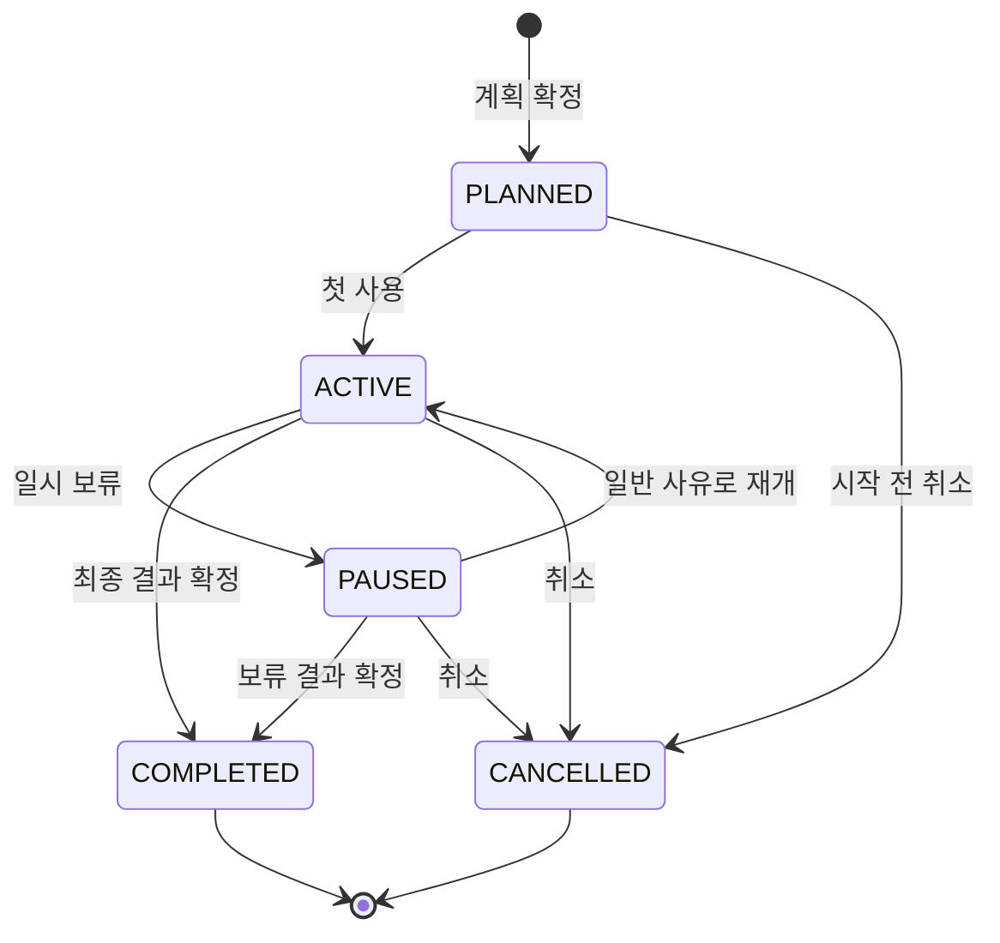

# 제품 규칙

## 이 문서의 역할

이 문서는 여러 Story와 화면이 함께 지켜야 하는 제품 규칙을 정의한다. 화면 배치나 API 필드는 정하지 않는다. Story별 상세 흐름은 [GitHub Story Map](./story-map.md)에서 해당 이슈를 열어 확인한다.

## 용어

| 용어 | 의미 |
| --- | --- |
| 안정 루틴 | 사용자가 현재 문제없이 쓰고 있다고 직접 확인한 제품 조합·순서·사용 빈도의 한 버전. 사용 기간과 최근 변경 여부를 함께 보존 |
| 추천 제품 | 운영 확인된 실제 카탈로그에서 현재 안정 루틴과 목적을 기준으로 고른 다음 실험 후보 |
| 실험 후보 | 추천 또는 직접 탐색으로 저장했지만 아직 실제 사용을 시작하지 않은 제품 |
| 추가(ADD) | 안정 루틴은 유지하고 새 제품 하나를 정한 위치에 더하는 변경 |
| 교체(REPLACE) | 안정 루틴의 특정 제품 하나를 빼고 새 제품 하나를 넣는 변경 |
| 비교안 | 후보 하나를 안정 루틴에 추가·교체했을 때의 가상 루틴과 차이 |
| 실험 | 비교안 하나를 선택해 실제로 제품을 사용하는 한 번의 과정 |
| 관찰 퀘스트 | 판단에 필요한 시점에 서비스가 요청하는 짧은 상태 확인 |
| 관찰 | 퀘스트 또는 예정 밖 순간에 사용자가 실제로 남긴 기록 |
| 기록 완성도 | 실제 사용 기간·사용 횟수·필수 관찰·다른 제품 변경 여부가 얼마나 남았는지 나타내는 근거 품질. 피부 적합 확률이 아님 |
| Rescue | 불편함이 있을 때 마지막 안정 루틴 이후의 변경 사실을 복원하고 확인 순서를 안내하는 흐름 |
| Beauty Archive | 완료 결과(보류 포함)와 취소한 실험의 원본 이력을 다시 보는 화면. 현재 PAUSED인 열린 실험은 현재 실험에서 관리 |
| LAB | 관찰과 실험 완료를 진행도·연구 기록·성장으로 보여주는 경험 |
| Lab Assistant | 기록 구조화와 설명을 맡는 AI. 진단이나 최종 결정을 하지 않음 |

### 안정 루틴 확정과 정보 수준

- `현재 불편 없음`과 `이 루틴을 기준으로 사용`을 사용자가 모두 확인해야 초안을 안정 루틴으로 확정한다.
- 현재 불편이 있거나 잘 모르겠다면 초안은 보존하되 안정 루틴으로 확정하지 않는다. 서비스가 상태를 대신 판정하지 않는다.
- 정보 수준은 현재 루틴 사용 시작, 최근 제품 변경, 모든 제품의 사용 빈도라는 세 항목의 입력 완성도로 계산한다. 세 항목을 모두 알면 `충분`, 하나 또는 두 항목만 알면 `제한적`, 모두 모르면 `부족`이다.
- 짧은 사용 기간 자체를 임의의 기준으로 탈락시키지 않는다. 실제 기간과 최근 변경 시점을 그대로 보여주고 사용자가 기준으로 삼을지 판단한다.

## 변하지 않는 원칙

1. 안정 루틴은 AI가 아니라 사용자가 확정한다. 현재 불편이 없다고 답한 경우에만 확정하며, 사용 기간·최근 변경·빈도 정보가 부족한 것은 저장을 막지 않고 근거 수준에 반영한다.
2. 확정한 안정 루틴과 제품 정보는 덮어쓰지 않고 버전으로 남긴다.
3. 추천은 실제 제품의 **다음 실험 후보**이며 피부 적합도나 구매 성공을 보장하지 않는다.
4. 후보는 여러 개 저장할 수 있지만 열린 실험은 사용자당 하나만 둔다.
5. 후보 저장 당시 비교는 보존하되, 실험 시작 전에는 현재 안정 루틴으로 다시 비교하고 그 최신 비교안을 기준으로 고정한다.
6. 확인되지 않은 제품·성분·기능 정보는 `없음`이 아니라 `정보 부족`이다.
7. 불편함의 원인을 제품이나 성분으로 확정하지 않는다.
8. Rescue 분류, 사용자 권한과 실험 상태는 일반 코드가 결정한다. AI가 값을 바꾸지 않는다.
9. 최종 결과와 안정 루틴 반영 여부는 사용자가 각각 결정한다.
10. 개인 경험은 관련성을 먼저 확인하고 기록 완성도와 함께 쓰며, 한 번의 기록을 패턴이나 원인으로 부르지 않는다.
11. LAB은 출석이나 체류 시간이 아니라 유효한 관찰과 실험 완료를 보상한다.
12. AI가 실패해도 사용자는 직접 입력과 규칙 기반 결과로 핵심 흐름을 끝낼 수 있어야 한다.

## 제품 추천

추천은 현재 루틴의 빈 기능을 기계적으로 채우는 기능도, 인기 제품 목록도 아니다. 사용자가 고른 목적과 변경 의도 안에서 **무엇을 다음에 시험하면 변화가 분명한지** 돕는다.

### 추천 입력

- 현재 안정 루틴 버전
- 이번 사용 목적
- `추가` 또는 `교체` 의도
- 교체할 경우 대상 제품
- 사용자가 확인한 선택 조건
- 관련된 과거 개인 실험 결과

### 추천과 실험 우선순위 규칙

사용자에게는 구매 적합도와 실험 순서처럼 보이는 서로 다른 순위를 두 번 보여주지 않는다. 추천 제품과 직접 저장한 제품을 모두 같은 **다음 실험 우선순위**로 계산한다.

1. 서버가 운영 확인된 실제 카탈로그에서 목적과 제품군이 맞고 금지 조건이 없는 제품 ID만 고른다.
2. 서버가 제품별로 기능 출처·확인 상태, 현재 루틴에서 추가·중복·소실되는 기능과 관련 개인 경험을 계산한다.
3. 다음 순서로 비교한다.
   1. 사용자가 고른 목적과 확인된 기능이 관련되는가
   2. 목적과 무관한 기능 중복과 함께 바뀌는 요소가 적은가
   3. 제품·기능 정보가 운영 확인되어 비교를 재현할 수 있는가
   4. 관련 개인 경험이 지지·반대 중 어느 방향인가. 같은 제품 기록을 먼저 보고, 사용 목적과 연결된 확인 성분·기능, 제품군 순으로 범위를 넓힌다. 사용 기간·횟수·필수 관찰·다른 변경 여부가 부족하거나 결과가 충돌하면 영향도를 낮춘다
   5. 위 근거가 같으면 운영 확인 수준, 제품명과 제품 버전 ID 순으로 안정 정렬한다
4. 최대 3개까지 보여주며 적격 후보가 적으면 수를 채우지 않는다.
5. AI는 순위와 제품 ID를 바꾸지 않고, 사용자의 목적 문장을 구조화하거나 계산된 차이·개인 근거·반대 근거·정보 부족을 설명한다.

불편했던 제품도 자동으로 영구 제외하지 않는다. 다시 시험할 수 있지만 이전 결과와 기록 완성도를 반대 근거로 드러낸다. 최종 후보·순위·적용 규칙 버전은 서버가 저장하며, AI가 실패해도 같은 순위와 고정 설명을 제공한다.

## 추가와 교체

| 항목 | 추가(ADD) | 교체(REPLACE) |
| --- | --- | --- |
| 기준 루틴 | 그대로 유지 | 교체 대상 한 제품만 제거 |
| 새 제품 | 사용자가 정한 시간대·순서에 추가 | 기본은 제거된 제품의 위치에 추가하고 사용자가 최종 순서를 확인 |
| 필수 입력 | 적용 시간대와 순서 | 교체 대상, 적용 시간대와 순서 |
| 비교 결과 | 추가·유지 제품, 새 기능과 중복 기능 | 추가·제거·유지 제품, 새 기능·중복과 사라질 수 있는 기능 |

가상 비교는 안정 루틴 원본을 수정하지 않는다. 교체 대상이 현재 안정 루틴에 없거나 안정 루틴이 바뀌었으면 사용자의 확인 없이 다른 대상으로 바꾸지 않고 다시 비교한다.

## 한 번에 하나의 열린 실험

`PLANNED`, `ACTIVE`, `PAUSED`는 모두 열린 실험이다. 이 중 하나가 있으면 새 실험을 계획하거나 시작할 수 없다.

- 실험 후보는 여러 개 저장할 수 있다.
- 첫 사용·중간·종료 관찰에서 실험 제품 외의 화장품 변경 여부를 확인한다.
- 다른 제품도 실제로 바꿨다면 그 사실과 시점을 기록하고 비교·Rescue·최종 결과의 기록 완성도를 낮춘다. 실험 자체를 자동 폐기하지 않는다.
- 다음 사용 결정을 `HOLD` 또는 `RETRY`로 남긴 제품을 다시 시험할 때는 기존 실험을 되돌리지 않고 연결된 새 실험을 만든다.
- 실험 제품과 기준 안정 루틴은 첫 사용 후 바꿀 수 없다.

## 실험 상태

| 상태 | 의미 | 허용되는 다음 행동 |
| --- | --- | --- |
| PLANNED | 비교안과 계획은 확정했지만 아직 쓰지 않음 | 첫 사용, 계획 수정, 취소 |
| ACTIVE | 첫 사용을 기록하고 실험 중 | 관찰, 일시 보류, 결과 확정, 취소 |
| PAUSED | 사용을 잠시 멈춤 | 일반 사유 재개, 결과 확정, 취소 |
| COMPLETED | 사용자가 최종 결과를 확정함 | Archive 조회, 새 실험·재시험 |
| CANCELLED | 결과 확정 없이 실험을 끝냄 | Archive 조회, 새 실험 |

불편함 때문에 멈춘 실험은 같은 실험으로 다시 이어 붙이지 않는다. 먼저 결과를 남기고, 사용자가 다시 안정됐다고 확인한 뒤 재시험을 새 실험으로 만든다. 여행이나 제품 분실처럼 피부 불편과 무관한 보류만 같은 실험으로 재개할 수 있다.

## 관찰

- 매일 일기를 요구하지 않는다.
- 기본 퀘스트는 첫 사용, 24시간 후 초기 확인, 중간 확인, 최종 확인이다.
- 현재 문서의 `24시간`, 기본 `14일`, 조정 가능한 `7~28일`은 MVP 운영 기본값이다. 효능·안전성을 판정하는 임상 기준으로 설명하지 않는다.
- 계획에서 선택하는 핵심 값은 달력의 고정 종료일이 아니라 `duration_days`다. 첫 사용의 실제 관찰 시각을 시작점으로 초기·중간·종료 퀘스트와 예상 종료를 자동 재계산하고 바뀐 일정을 즉시 보여준다.
- 첫 사용 전에는 기간을 바꿀 수 있지만, 첫 사용 후에는 기준 제품·루틴과 기간을 변경하지 않는다.
- 예정 밖 불편, 제품 중단과 재사용도 언제든 기록할 수 있다.
- 퀘스트와 실제 관찰은 구분한다. 놓친 퀘스트를 뒤늦게 쓸 때 실제 관찰 시점과 입력 시점을 따로 남긴다.
- 일반 관찰에는 생활환경을 계속 묻지 않는다. 불편함이 있을 때만 평소와 크게 달랐던 일을 선택적으로 묻는다.
- 첫 사용·중간·종료 관찰에는 실제 사용 여부와 실험 제품 외의 화장품 변경 여부를 묻는다. 변경이 있으면 제품과 시점을 사건으로 남긴다.
- 불편 유형은 사용자의 경험 기록이지 질환 분류가 아니다.
- 최종 기한이 지났다고 실험을 자동 완료하지 않는다. 결과는 사용자가 확정한다.
- 완료된 실험 뒤에 인지한 변화는 원래 결과를 수정하지 않고 `후속 관찰`로 연결한다. 불편함이면 안전 안내와 Rescue 변경 이력을 만들 수 있지만 완료 상태를 되돌리거나 자동 보류하지 않는다.

## Rescue

Rescue의 목표는 범인을 고르는 것이 아니라 마지막 안정 루틴 이후의 확인 범위를 줄이는 것이다.

### 안전 우선

사용자가 `심함`, `넓게 퍼지거나 악화`, `도움 필요` 중 하나를 선택하면 일반 제품별 행동 제안을 중단하고 선택적 화장품 사용 중단과 전문가 확인 안내를 먼저 보여준다. 사용자가 확인한 뒤에는 판단 문구 없이 당시 변경 사실만 볼 수 있다. 이는 진단이나 응급 판정이 아니다.

### 결정표

| 기록된 사실 | 화면 분류 | 기본 다음 행동 |
| --- | --- | --- |
| 현재 실험에서 안정 루틴 이후 새로 추가하거나 교체한 제품 | 최근 추가·교체 | 먼저 사용 여부를 확인할 변경으로 표시 |
| 안정 루틴 이후 함께 바뀌었지만 시점·사용 기록이 불완전한 제품 | 함께 변경 | 실험 제품과 분리해 판단할 수 없다고 표시 |
| 안정 루틴에 있었고 사용 방식의 새 변경 기록이 없는 제품 | 변경 기록 없음 | 안전 제품이나 유지 권고가 아니라 기준 이후 기록상 바뀌지 않았다고 표시 |
| 기준 루틴이 없거나 여러 변경·생활 변화·누락으로 분류를 재현할 수 없음 | 정보 부족 | 확인할 정보와 전문가 확인이 필요한 조건을 표시 |

한 제품에는 한 Rescue 시점에 하나의 사실 분류만 부여한다. 어떤 분류도 원인 확률·안전성·계속 사용 권고를 뜻하지 않는다. 동시 변경, 생활 변화나 누락 정보가 있으면 근거 강도를 낮추고 부족한 정보를 함께 보여준다.

## 결과와 안정 루틴 갱신

최종 결과는 하나의 성공·실패 값이 아니라 서로 다른 세 축으로 저장한다.

| 축 | 선택값 | 의미 |
| --- | --- | --- |
| 사용 중 불편 | 불편 없음·불편 있음·잘 모르겠음 | 이번 사용 중 사용자가 느낀 불편 여부 |
| 목적 체감 | 도움이 됨·변화 없음·잘 모르겠음 | 사용자가 고른 목적에 대한 주관적 체감. 효능 판정이 아님 |
| 다음 결정 | 안정 루틴에 추가·사용 중단·보류·재시험 | 사용자가 선택한 다음 행동 |

- `안정 루틴에 추가`는 불편 없음과 사용자의 명시적 동의가 모두 있어야 한다.
- 결과에는 실제 시작·종료, 사용 횟수, 필수 관찰 완료·건너뜀, 다른 제품 변경 여부로 계산한 기록 완성도를 함께 저장한다.
- Rescue가 있었으면 완료할 때 기존 안정 루틴 제품을 모두 계속 사용·일부 중단·모두 중단·잘 모르겠음 중 하나로 남긴다. 서비스가 제품별 안전성이나 중단 이유를 추정하지 않는다.
- 결과 기록 수준은 임상적 신뢰도가 아니라 계획 대비 사용·입력 완성도다. 계획한 기간을 채우고 필수 관찰 4개 완료·모든 구간 사용 횟수 확인·다른 제품 변경 없음이면 `충분`이다. 필수 관찰 2개 이상과 한 번 이상의 확인된 사용 횟수가 있지만 기간·관찰·횟수·다른 변경 조건 중 하나라도 부족하면 `제한적`, 그보다 적으면 `부족`으로 계산한다.
- 기간이 짧거나 다른 변경이 있어도 결과 저장을 막지 않지만 다음 추천에서 같은 무게로 취급하지 않는다.
- 서비스와 AI는 세 결과를 대신 선택하거나 의학적 효능·원인으로 해석하지 않는다. 새 안정 루틴을 만들더라도 이전 버전과 당시 실험은 그대로 남긴다.

## Archive와 다음 추천

- Archive는 별도 복사본을 만들지 않고 실험·관찰·Rescue·결과 이력을 조회한다.
- 추천에 개인 경험을 쓸 때 원래 실험으로 돌아갈 수 있어야 한다.
- 동일 제품의 결과가 서로 다르면 최신 결과 하나만 정답으로 쓰지 않는다.
- 동일 제품의 개인 경험은 먼저 보여줄 수 있지만 사용 기간·횟수·관찰 완성도·다른 변경 여부를 함께 표시한다.
- 개인 반복 관찰은 같은 제품·성분·기능·제품군에서 같은 방향의 **불편 또는 목적 체감**이 두 번 이상 있을 때만 후보로 표시한다.
- 반복 관찰에는 전체 관련 실험 수, 같은 방향 결과 수, 반대 사례와 각 기록 완성도를 함께 표시한다.
- 두 번의 반복도 원인이나 미래 적합도를 뜻하지 않으므로 `패턴`보다 `반복 관찰`로 표현한다.

## LAB

- 관찰 완성도는 `완료한 필수 퀘스트 수 / 생성된 필수 퀘스트 수`다. 취소된 실험에는 최종 완성도를 만들지 않는다.
- 건너뛴 퀘스트와 선택 기록은 필수 진행도 완료로 세지 않는다.
- 결과를 먼저 확정하면 남은 필수 퀘스트는 `결과를 먼저 기록함` 사유로 건너뛴 상태가 되어 완성도 분모에는 남는다.
- 실험 완료 여부와 관찰 완성도는 분리한다. 퀘스트를 건너뛰었어도 최종 결과를 확정하면 실험은 완료된다.
- 최종 결과까지 확정해야 실험 완료 연구가 하나 생기며, 연구 기록에는 관찰 완성도를 함께 표시한다.
- 불편 여부, 목적 체감과 다음 사용 결정의 방향에 관계없이 최종 결과를 확정한 실험은 완료한 연구로 동일하게 인정한다.
- 같은 실험에서 보상과 연구 기록을 중복 생성하지 않는다.
- 로그인, 알림 클릭과 화면 체류에는 보상을 주지 않는다.

## AI·일반 코드·사용자 책임

| 결정 또는 작업 | 일반 코드 | AI | 사용자 |
| --- | --- | --- | --- |
| 안정 루틴 버전 저장과 이력 | 입력 검증·버전 생성 | 관여하지 않음 | 문제없이 쓰는 기준을 확정 |
| 목적 입력 | 확인된 기능 분류와 연결 | 자유 문장을 분류 후보로 구조화 | 목적을 선택·수정·확정 |
| 추천 제품 자격과 순위 | 실제 카탈로그 후보·목적 관련성·기능 변화·정보 확인·개인 근거를 버전이 있는 규칙으로 계산 | 목적 문장을 구조화하고 계산된 우선순위와 근거를 설명 | 후보를 선택하거나 직접 탐색 |
| 추가·교체 차이 | 제품·기능 변화 계산 | 중요한 변화 설명 | 변경 의도와 교체 대상 확정 |
| 실험과 퀘스트 상태 | 허용 전환과 시점 계산 | 관찰 항목 설명 | 시작·보류·결과를 선택 |
| 자연어·이미지 입력 | 출력 스키마와 확인 상태 검증 | 전성분 사진·짧은 메모를 구조화 | 결과를 확인·수정·확정 |
| Rescue | 변경점 복원, 사실 분류와 안전 우선 결정 | 근거·반대 근거·부족한 정보 설명 | 경험과 누락 정보를 기록하고 확인 순서 선택 |
| 최종 결과·루틴 갱신 | 불편·목적 체감·다음 결정과 기록 완성도 저장, 새 버전 생성 | 대신 결정하지 않음 | 세 결과와 반영 여부를 확정 |
| 개인 경험 재사용 | 관련 실험과 반대 사례 조회 | 사용자에게 이해되는 설명 생성 | 근거를 보고 다음 후보 선택 |

## AI 실패 대안

AI 결과는 없어도 핵심 흐름이 끝나야 한다.

AI 작업을 요청하기 전에는 전송 목적과 데이터 범위를 작업 단위로 보여준다. 메모·전성분·구매 이미지 원문은 사용자가 해당 구조화를 요청한 경우에만 AI 공급자에게 보낸다. 추천 설명에는 이름·이메일·사용자 ID 대신 목적 코드, 확인된 루틴 기능, 관련 과거 실험의 구조화 결과와 기록 완성도만 전달한다. 무관한 실험, 인증정보와 원본 자유 문장은 함께 보내지 않는다. 사용자가 AI 설명을 원하지 않으면 같은 서버 순위와 고정 설명으로 완료한다. 요청·응답 원문은 애플리케이션 로그나 `ai_job`에 영구 저장하지 않고, 검증된 구조화 결과와 작업 버전·상태만 남긴다.

| AI 작업 | 실패했을 때 |
| --- | --- |
| 목적 문장 분류 | 통제된 목적 목록에서 사용자가 직접 선택 |
| 전성분 사진 구조화 | 사진을 다시 올리거나 성분·제품을 직접 입력 |
| 구매 이미지 제품 추출 | 카탈로그 검색 또는 직접 등록 |
| 짧은 메모 구조화 | 사용자가 고른 구조화 선택값만 저장 |
| 목적 구조화·추천 설명 | 통제된 목적을 사용자가 직접 고르고 서버 순위와 고정 템플릿으로 설명 |
| Rescue 설명 | 서버 분류와 다음 행동을 고정 템플릿으로 표시 |

AI의 설명 출력은 서버가 전달한 제품 ID·기능 코드·과거 실험 ID만 참조할 수 있다. 서버는 ID·스키마·근거 참조와 금지 표현을 검증할 수 있지만 자연어의 모든 의미와 오해 가능성을 완전하게 판정한다고 주장하지 않는다. 설명은 제한된 구조와 문장 템플릿을 사용하고 통과하지 못하면 표시하지 않는다. 추천 순위, Rescue 사실 분류, 실험 상태와 사용자 권한은 AI 출력 대상이 아니다.

## 제품 경계

- 피부질환 진단, 치료 조언과 치료 효과 판정은 하지 않는다.
- 특정 제품이나 성분을 불편함의 의학적 원인으로 단정하지 않는다.
- 제품 추천을 `잘 맞을 제품` 또는 구매 성공 보장으로 표현하지 않는다.
- 피부 사진으로 상태를 자동 판정하지 않는다.
- Pn의 코호트 추천, 브랜드 실험과 전문가 공유 정책을 MVP에 미리 가정하지 않는다.
- 아직 근거가 합의되지 않은 임상적 기간·중단 기준과 법무·동의 정책을 AI나 구현자가 임의로 만들지 않는다.
