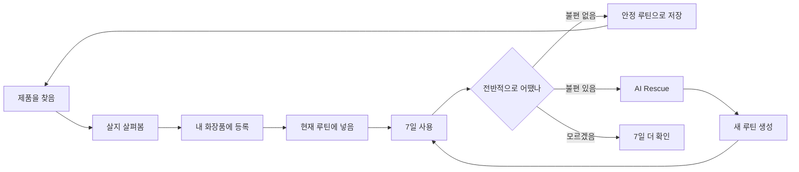
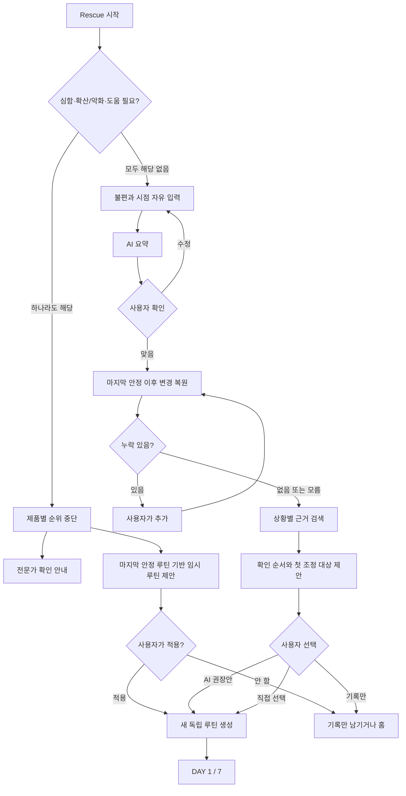

# SkinCause 제품 전체 설명

> 기준 화면: `prototype/index.html`
>
> 목적: SkinCause를 처음 보는 사람도 제품 전체를 이해하게 한다.
>
> 문장 원칙: 짧게 쓴다. 어려운 말을 피한다. 모르는 것은 모른다고 쓴다.
>
> 결정 원칙: 이 문서와 예전 명세가 다르면 현재 프로토타입을 먼저 따른다. `[Q.번호]`가 있는 곳은 아직 제품 결정이 끝나지 않은 곳이다.

---

## 0. 진짜 짧게 설명

사람은 화장품을 계속 산다.

여러 개를 같이 쓴다.

괜찮았던 것도 잊는다.

문제가 생기면 무엇이 달라졌는지 기억하지 못한다.

그래서 또 후기와 감으로 고른다.

SkinCause는 이 과정을 기억한다.

- 사기 전에는 지금 이 제품을 볼 이유를 알려준다.
- 뭘 살지 모르면 후보를 찾아준다.
- 산 제품과 실제 루틴을 기록한다.
- 같은 루틴을 7일 쓴 뒤 불편이 있었는지 묻는다.
- 불편이 없으면 그 루틴을 기준으로 남긴다.
- 불편이 있으면 AI와 대화하며 무엇을 먼저 바꿀지 정한다.
- 새 루틴을 만든다.
- 다음 구매와 다음 문제 해결에 이 기록을 다시 쓴다.

한 줄로 말하면 이렇다.

> SkinCause는 화장품을 계속 즐기되, 매번 처음부터 다시 판단하지 않게 해주는 서비스다.

---

## 1. 우리가 보는 문제

코덕은 제품 하나를 찾고 탐색을 끝내지 않는다.

이미 괜찮은 루틴이 있어도 새 제품을 본다.

새 기능을 본다.

새 제형을 본다.

유행 제품도 본다.

문제는 새 제품을 쓰는 일이 아니다.

문제는 사용 조건과 결과가 남지 않는 일이다.

그래서 이런 일이 반복된다.

- 여러 제품을 비슷한 때 바꾼다.
- 무엇 때문에 달라졌는지 모른다.
- 불편해지면 잘 쓰던 제품까지 모두 뺀다.
- 전에 괜찮았던 조합을 기억하지 못한다.
- 전에 불편했던 상황도 다음 구매에 쓰지 못한다.
- 또 후기와 감으로 산다.

우리가 푸는 문제는 이것이다.

> 화장품 탐색은 계속되는데, 경험은 쌓이지 않는다.

---

## 2. 우리가 하는 일

우리는 새 화장품을 그만 사라고 하지 않는다.

처음부터 제품 하나씩만 바르라고 강제하지 않는다.

사용자는 원하는 대로 산다.

원하는 대로 함께 쓴다.

우리는 그 전후를 기록한다.

그리고 나중에 쓴다.



---

## 3. 우리가 하지 않는 일

다음은 하지 않는다.

- 피부 질환을 진단하지 않는다.
- 특정 제품이 문제의 범인이라고 단정하지 않는다.
- 특정 성분 하나로 완제품의 결과를 단정하지 않는다.
- 이 제품이 사용자에게 잘 맞는다고 보장하지 않는다.
- 안전 확률을 만들지 않는다.
- 적합 확률을 만들지 않는다.
- 성분 위험 점수를 만들지 않는다.
- 인기순을 개인 추천처럼 보여주지 않는다.
- 카탈로그에 없는 제품을 AI가 지어내지 않는다.
- 사용자가 사기만 한 제품을 실제 사용 경험으로 취급하지 않는다.
- 여러 제품을 함께 쓴 결과를 제품 하나의 결과로 쪼개지 않는다.
- 안정 루틴을 의학적으로 안전한 루틴이라고 부르지 않는다.

---

## 4. 누구를 위한 제품인가

현재 프로토타입이 상정하는 사용자는 이렇다.

- 화장품을 자주 본다.
- 새 제품을 계속 시도한다.
- 여러 제품을 함께 쓸 수 있다.
- 현재 쓰는 제품 조합이 있다.
- 제품을 살 때 내 상황과 비교하고 싶다.
- 문제가 생기면 최근 무엇을 바꿨는지 되짚고 싶다.
- 매일 피부 일기를 쓰고 싶지는 않다.

현재 프로토타입은 스킨케어를 중심으로 한다.

클렌징 제품도 루틴에 들어간다.

선케어도 루틴에 들어간다.

> [Q.01] MVP 제품 범위를 어디까지로 고정할까요? 권장안은 `클렌징·스킨케어·선케어`까지만 포함하고, 색조·헤어·바디·의약품은 제외하는 것입니다. 답: 동의해요.

> [Q.02] 첫 출시 지역과 언어를 한국·한국어로 고정할까요? 제품 버전과 규제 출처가 시장마다 달라서 범위를 정해야 합니다. 권장안은 한국 판매 제품만 시작하는 것입니다. 답:오직 한국제품만.

---

## 5. 가장 중요한 말

### 5.1 내 화장품

내가 가지고 있는 제품 목록이다.

세 칸으로 나눈다.

1. 현재 루틴
2. 마지막 안정 루틴
3. 미사용 화장품

별도 상태를 많이 만들지 않는다.

`사용 중`, `보류`, `확인 대기`, `소진` 같은 칸을 계속 늘리지 않는다.

### 5.2 현재 루틴

지금 실제로 쓰는 조합이다.

다음이 모두 들어간다.

- 제품
- 아침 또는 저녁
- 바르는 순서
- 사용하는 빈도
- 클렌징 제품

현재 루틴은 하나다.

수정하면 새 버전이 생긴다.

예전 버전은 지우지 않는다.

### 5.3 안정 루틴

사용자가 7일 뒤 이렇게 답한 루틴이다.

`불편함 없었어요.`

이것은 안전 판정이 아니다.

이것은 제품 하나의 적합 판정도 아니다.

이 조합을 이 기간에 썼을 때 사용자가 불편을 보고하지 않았다는 뜻이다.

가장 최근 안정 루틴 하나를 `마지막 안정 루틴`으로 쓴다.

이 루틴은 다음 두 곳에서 중요하다.

- 새 제품을 살 때 현재 상황과 비교하는 기준
- 불편해졌을 때 무엇이 달라졌는지 찾는 기준

### 5.4 루틴 버전

루틴을 저장할 때마다 생기는 번호다.

예:

- v3: 불편함이 없었던 조합
- v4: 세럼 두 개를 추가한 조합
- v5: Rescue에서 세럼 하나를 뺀 조합

v5가 생겨도 v4는 남는다.

나중에 `v3에서 v4로 무엇이 바뀌었나`를 볼 수 있다.

### 5.5 7일 확인

새 루틴을 저장하면 시작한다.

매일 기록하지 않는다.

7일이 지나면 한 번 묻는다.

`지난 7일 동안 이 루틴은 전반적으로 어땠나요?`

7일은 임상 기준이 아니다.

사용자의 기억이 너무 흐려지기 전에 결과를 받기 위한 제품 규칙이다.

현재 프로토타입은 실제 사용 횟수를 세지 않는다.

달력 기준 7일을 센다.

### 5.6 Rescue

피부가 불편해졌을 때 쓰는 AI 대화다.

진단하지 않는다.

마지막 안정 루틴과 현재 루틴을 비교한다.

최근 바뀐 제품·순서·빈도를 찾는다.

무엇을 먼저 바꾸면 결과를 가장 분명하게 볼 수 있는지 제안한다.

사용자가 동의하면 새 루틴을 만든다.

### 5.7 제품 의견

이미 보고 있는 제품이 있을 때 쓴다.

질문은 이것이다.

`이거 사볼까?`

서비스는 좋다거나 나쁘다고 말하지 않는다.

현재 사용자에게 지금 이 제품을 더 살펴볼 이유가 있는지 말한다.

### 5.8 제품 추천

아직 제품을 정하지 않았을 때 쓴다.

사용자가 상황을 자연어로 말한다.

AI가 그 말을 다시 정리한다.

사용자가 맞다고 확인한다.

그다음 실제 제품 후보를 최대 3개 보여준다.

### 5.9 개인 기록

사용자가 남긴 사실이다.

예:

- 루틴 v3을 7일 썼다.
- 전반적인 불편이 없었다.
- v4에서 아쿠아 세럼과 앰플을 추가했다.
- v4에서는 따가움과 붉어짐을 말했다.
- Rescue에서 아쿠아 세럼을 먼저 빼기로 했다.

이 기록은 다음 구매와 다음 Rescue에 다시 들어간다.

---

## 6. 제품 전체 구조

하단 메뉴는 세 개다.

1. 홈
2. 제품 찾기
3. 내 화장품

내 정보는 홈 오른쪽 위에서 연다.

알림도 홈 오른쪽 위에서 연다.

### 홈

지금 가장 중요한 행동을 보여준다.

- 루틴 7일이 진행 중이면 남은 날을 보여준다.
- 7일이 끝났으면 결과 남기기를 보여준다.
- 안정 루틴을 쓰는 중이면 제품 살펴보기를 먼저 보여준다.
- 언제든 `불편함이 생겼어요`로 Rescue를 열 수 있다.
- 현재 루틴과 루틴 기록으로 들어갈 수 있다.

### 제품 찾기

구매 전 기능이 모여 있다.

- 이 제품, 지금 사볼까?
- 뭘 살지 모르겠어요.
- 찜한 제품
- 최근 살펴본 제품

### 내 화장품

보유 제품과 실제 루틴이 모여 있다.

- 현재 루틴
- 마지막 안정 루틴
- 미사용 화장품
- 새 화장품 추가

---

## 7. 계정과 첫 시작

### 7.1 로그인

이메일과 비밀번호로 로그인한다.

로그인하면 내 화장품·루틴·기록을 이어서 본다.

비밀번호 재설정 경로가 있다.

### 7.2 회원가입

현재 프로토타입은 다음만 받는다.

- 이메일
- 비밀번호
- 닉네임
- 필수 약관 동의

가입 뒤 현재 루틴을 만들면 개인화가 시작된다.

하지만 현재 프로토타입에는 실제 첫 루틴 온보딩 화면이 없다.

여기는 꼭 정해야 한다.

> [Q.03] 가입 직후 가장 먼저 무엇을 시킬까요? 권장안은 `현재 루틴 만들기` 하나만 크게 보여주고, 제품은 검색으로 추가하게 하는 것입니다. 제품 찾기는 건너뛴 사용자도 쓸 수 있게 둡니다. 답:  개인화를 위한 온보딩 질문, 이어서 현재 제품 만들기. 너말대로.

> [Q.04] 첫 루틴을 만들기 위한 최소 조건은 무엇일까요? 권장안은 제품 1개 이상, 아침 또는 저녁 하나 이상, 순서, 빈도입니다. 빈 루틴도 허용할지 답해주세요. 답: 그냥 제품 하나만 있으면 루틴으로 할수잇게 합시다. 빈도 상관없이

> [Q.05] 처음부터 개인화를 위해 따로 받을 질문이 필요합니다. 권장 질문은 세 개입니다. `요즘 화장품에서 가장 신경 쓰이는 점`, `싫었던 사용감`, `직접 알고 있는 회피 성분이나 조건`. 모두 자연어 입력과 건너뛰기를 허용할까요? 답: ㅇㅇ 자연어 입력받기. 건너뛰기. 그리고 문항은 좀 더. ㅗ민해보세요 우리 목적에 맞는게 무엇일지.

> [Q.06] 가입 시 이미 불편한 상태인 사용자는 안정 루틴이 없습니다. 권장안은 현재 루틴을 먼저 기록하고 바로 Rescue를 열되, 비교 기준이 없다고 분명히 말하는 것입니다. 이대로 갈까요? 답: ㅇㅇ 

### 7.3 온보딩 데이터의 성격

피부 상태를 거대한 고정 목록으로 만들지 않는다.

사용자는 평소 말로 적는다.

예:

`세안 뒤 볼이 오래 당겨요. 무거운 건 싫어요. 가끔 따가워요.`

AI는 이 말을 현재 질문에 필요한 맥락으로 정리한다.

사용자가 확인한다.

원문도 남긴다.

AI 요약만 남기지 않는다.

---

## 8. 새 화장품 추가

등록 방법은 두 개다.

1. 제품명 검색
2. 영수증 촬영

다음은 받지 않는다.

- 바코드
- 전성분 사진
- 사용자가 직접 입력한 제품 기능

이유는 간단하다.

사용자에게 필요한 것은 정확한 제품 이름과 버전을 고르는 일이다.

전성분과 공식 정보는 서비스 카탈로그에 있어야 한다.

### 8.1 제품명 검색

1. 사용자가 제품명 또는 브랜드를 적는다.
2. 서버가 카탈로그를 검색한다.
3. 후보를 보여준다.
4. 사용자가 정확한 제품을 고른다.
5. 용량·옵션을 확인한다.
6. 미사용 화장품 또는 현재 루틴 추가를 고른다.

카탈로그에 없으면 제품 확인 요청을 보낸다.

AI가 임시 제품을 만들어 추천에 쓰지 않는다.

### 8.2 영수증 촬영

1. 사용자가 영수증 한 장을 찍는다.
2. AI는 제품명·브랜드·옵션 후보만 읽는다.
3. 금액과 결제 정보는 제품 등록에 쓰지 않는다.
4. 서버가 후보를 카탈로그와 연결한다.
5. 사용자가 등록할 제품을 고른다.
6. 정확한 제품 버전을 확인한다.
7. 내 화장품에 넣는다.

AI가 영수증에서 읽었다고 바로 제품을 확정하지 않는다.

### 8.3 등록 뒤 위치

기본값은 미사용 화장품이다.

샀다고 현재 루틴에 자동으로 넣지 않는다.

사용자가 `현재 루틴에 추가`를 골라야 루틴 편집으로 이어진다.

현재 루틴 편집 중에도 새 화장품을 등록할 수 있다.

등록을 끝내면 원래 열어둔 아침 또는 저녁 제품 추가 화면으로 돌아간다.

> [Q.07] 제품 확인 화면에서 `미사용 화장품`과 `현재 루틴에 추가`를 계속 직접 고르게 할까요? 권장안은 기본값을 미사용으로 두고 현재 루틴 추가만 명시적으로 고르게 하는 것입니다. 답: 권장대로 

> [Q.08] 한 영수증에서 여러 제품을 등록한 뒤 일부만 현재 루틴에 넣고 싶을 수 있습니다. 권장안은 모두 미사용으로 등록한 뒤 루틴 편집에서 고르게 하는 것입니다. 이대로 갈까요? 답: 권장대로

> [Q.09] 카탈로그에 없는 제품 확인 요청의 완료 시간과 사용자 통지를 정해야 합니다. 해커톤 MVP에서는 `요청 접수`까지만 보여주고 실제 운영 처리 화면은 제외해도 될까요? 답: 네네

> [Q.10] 영수증 원본 보존 규칙을 확정해야 합니다. 권장안은 제품 확인이 끝나면 즉시 삭제하고, 중단·실패 원본은 24시간 안에 삭제하는 것입니다. 답: 걍 해커톤이니깐 그딴거 없이 영구 저장합시다

---

## 9. 내 화장품

### 9.1 현재 루틴

지금 실제로 쓰는 제품이 보인다.

제품을 누르면 제품 상세로 간다.

7일 확인 중이면 진행 상태가 보인다.

7일이 끝났으면 제품 목록 안에서도 `결과 남기기`를 누를 수 있다.

### 9.2 마지막 안정 루틴

마지막으로 불편함이 없었다고 확인한 조합이 보인다.

현재 루틴과 같을 수도 있다.

현재 루틴보다 예전 버전일 수도 있다.

### 9.3 미사용 화장품

가지고 있지만 현재 루틴에는 없는 제품이다.

다음이 들어간다.

- 아직 안 쓴 제품
- 현재 루틴에서 뺀 제품
- Rescue에서 제외한 제품

별도 `보류 중` 칸은 만들지 않는다.

제품을 누르면 제품 상세로 간다.

> [Q.11] 소진하거나 버린 제품도 미사용 화장품에 계속 둘까요? 권장안은 목록을 복잡하게 만들지 않기 위해 `내 화장품에서 제거`하고 과거 기록에서만 남기는 것입니다. 답: ㅇㅇ 제거기능잇으면 그만임

> [Q.12] 같은 제품을 두 통 가진 수량 정보가 필요한가요? 현재 프로토타입은 수량을 쓰지 않습니다. 해커톤 MVP에서는 제외하는 것을 권장합니다. 답: ㄴㄴ 수량 같이 얼마나 쓸수잇는지느 ㄴ우리가 책임질게아님.

---

## 10. 현재 루틴 만들기와 바꾸기

루틴에는 아침과 저녁이 있다.

각 제품에는 다음이 있다.

- 제품 ID
- 시간대
- 순서 번호
- 빈도

클렌징도 포함한다.

저녁에는 1차 클렌징과 2차 클렌징이 들어갈 수 있다.

### 10.1 편집

사용자는 다음을 할 수 있다.

- 제품 추가
- 제품 제거
- 위아래로 순서 변경
- 빈도 변경
- AI 추천 순서 적용

빈도 선택지는 현재 이렇다.

- 매일
- 주 5–6회
- 주 3–4회
- 주 1–2회
- 필요할 때

### 10.2 새 제품 추가

내 화장품에 있는 제품을 고른다.

선택한 제품은 우선 마지막 단계에 들어간다.

사용자가 순서를 바꿀 수 있다.

내 화장품에 없으면 `새 화장품 추가`로 갔다가 돌아온다.

### 10.3 저장

저장하면 이전 루틴을 수정하지 않는다.

새 루틴 버전을 만든다.

새 7일 확인을 시작한다.

AI 루틴 분석도 새 버전으로 다시 만든다.

### 10.4 7일이 끝나기 전에 바꾸는 경우

서비스는 이유를 꼬치꼬치 묻지 않는다.

대신 지금까지 결과를 짧게 묻는다.

- 불편함 없었어요
- 불편함 있었어요
- 잘 모르겠어요
- 기록 없이 저장

`불편함 없었어요`를 골라도 안정 루틴으로 올리지 않는다.

7일을 채우지 않았기 때문이다.

부분 기록으로만 남긴다.

그 뒤 새 루틴을 저장한다.

새 7일을 시작한다.

`불편함 있었어요`를 고르면 루틴을 바꾸기 전에 Rescue로 간다.

> [Q.13] 루틴의 제품은 그대로고 순서나 빈도만 바뀌어도 새 버전과 새 7일을 시작할까요? 프로토타입은 모두 새로 시작합니다. 권장안도 같습니다. 답: 당연하죠.

> [Q.14] 사용자가 7일 전에 바꾸면서 `기록 없이 저장`을 고르면 이전 루틴 결과는 영원히 비어 있습니다. 나중에 다시 묻지 않는 것으로 확정할까요? 권장안은 다시 묻지 않는 것입니다. 답: 네네

> [Q.15] `필요할 때` 제품은 실제 사용 여부를 알 수 없습니다. 현재는 7일 전체 결과에 그냥 포함됩니다. 권장안은 사용자가 결과를 남길 때 “기록과 비슷하게 사용했나요?” 한 문장으로만 확인하는 것입니다. 더 자세히 물을까요? 답: ㅇㅇ 가볍게 묻도록해요 

---

## 11. AI 순서 추천

버튼 이름은 `AI 추천 순서로 배치하기`다.

AI는 현재 제품을 빼지 않는다.

새 제품을 더하지 않는다.

순서만 본다.

AI가 보는 것은 다음이다.

- 정확한 제품 버전
- 제조사의 공식 사용법
- 클렌징 여부
- 제품 제형 정보
- 아침 또는 저녁
- 현재 순서
- 사용 빈도
- 사용자가 전에 확인한 실제 제형 정보가 있으면 그 정보

AI는 추천 순서를 편집안에 넣는다.

바로 저장하지 않는다.

사용자가 확인하고 저장한다.

저장하면 새 루틴 버전이 생긴다.

확인할 수 없는 제형 차이는 모른다고 말한다.

> [Q.16] AI 순서 추천이 제품의 사용 빈도까지 바꿔도 될까요? 현재 프로토타입은 순서만 바꿉니다. 권장안은 MVP에서 순서만 다루는 것입니다. 답: 빈도도 바꿔야죠,.

> [Q.17] 공식 사용법이 서로 충돌하거나 제형 정보가 없으면 어떻게 할까요? 권장안은 자동 적용을 막고, 확인이 필요한 두 제품만 사용자에게 묻는 것입니다. 답:ㅇㅇ 그건 ai규칙(프롬프트)에 박을 부분이겟네요.

---

## 12. 루틴이 저장될 때 AI가 하는 일

루틴이 바뀔 때마다 AI 분석을 다시 돌린다.

분석은 루틴 버전에 붙는다.

이전 분석을 덮어쓰지 않는다.

각 제품에 대해 네 가지를 만든다.

1. 위치
2. 앞뒤 제품과의 관계
3. 연결할 수 있는 개인 기록
4. 아직 모르는 것

예:

- 위치: 저녁 3단계
- 관계: 클렌저 다음, 앰플 전
- 개인 기록: 마지막 안정 루틴에는 없었음
- 모름: 실제 흡수감, 함께 발랐을 때 반응

이 분석은 궁합 판정이 아니다.

제품의 역할을 확정하는 것도 아니다.

현재 루틴 안에서 어디에 있고 무엇과 붙어 있는지 설명하는 것이다.

### 분석 상태

현재 루틴 버전과 분석 버전이 같아야 최신이다.

다르면 사용자에게 예전 분석이라고 보여야 한다.

> [Q.18] 루틴 저장 직후 AI 분석이 늦거나 실패하면 어떻게 보일까요? 권장안은 루틴 저장은 성공시키고 `AI 분석 중` 또는 `분석 실패·다시 시도`를 별도로 보여주는 것입니다. 이전 버전 분석을 새 루틴에 붙이면 안 됩니다. 답: 분석결과나올떄까지 저장 됏다고보여주면안됨. 분석중 인 ux 유지해야함 유저가 좀. 불편하더라도. 단, 실패시엔 저장은 해줘야함. 단, 화면 상단에 다시시도 버튼이잇어야겟죠? 자연스레.

> [Q.19] AI 분석을 언제 다시 갱신할까요? 권장안은 루틴 변경, 제품 카탈로그 버전 변경, 사용자가 직접 다시 분석 요청한 때입니다. 자동 만료 기간도 둘까요? 답: 권장대로 

---

## 13. 제품 상세

제품 상세는 제품이 현재 루틴에 있는지에 따라 달라진다.

### 13.1 현재 루틴에 있는 제품

보여주는 것:

- 제품명
- 브랜드
- 제품 종류
- 정확한 카탈로그 버전
- 현재 루틴의 아침·저녁 위치
- 현재 빈도
- 앞뒤 제품
- 마지막 안정 루틴 포함 여부
- 이 제품과 연결된 루틴 기록
- 아직 모르는 정보
- 표시 전성분 원문이 있는지
- AI 성분 근거 대화
- 제품 기록 타임라인

사용자가 할 수 있는 것:

- 루틴 속 이 제품에 대해 AI에게 질문
- 전체 순서 보기
- AI 순서 추천 보기
- 현재 루틴 바꾸기
- 현재 루틴에서 빼기
- 내 화장품에서 삭제

### 13.2 미사용 제품

보여주는 것:

- 현재 루틴에 넣는다면 예상되는 위치
- 어떤 현재 제품과 비교해야 하는지
- 직접 사용 경험이 아직 없다는 사실
- 공식 사용법
- 표시 전성분 원문
- 상황별 성분 근거

사용자가 할 수 있는 것:

- AI에게 질문
- 현재 루틴에 넣어보기
- 삭제

### 13.3 제품 삭제

내 화장품에서는 사라진다.

과거 루틴과 과거 결과에서는 사라지지 않는다.

기록은 당시 제품 버전을 계속 가리킨다.

> [Q.20] 사용자가 제품 상세에 짧은 개인 메모를 남길 수 있어야 하나요? 지금 프로토타입에는 없습니다. 해커톤 MVP에서는 제외하는 것을 권장합니다. 답: 간단히 넣읍시다. 메모가 ai의 인풋이 될수잇음.

> [Q.21] 제품 단위 기록 화면에 `이 제품이 들어간 모든 루틴`을 전부 보여줄까요? 현재 프로토타입은 짧은 타임라인만 보여줍니다. 권장안은 루틴 기록으로 연결만 하는 것입니다. 답: 권장대로.

---

## 14. 성분 근거 AI

제품 상세에서 연다.

성분 28개를 한꺼번에 위험 등급으로 보여주지 않는다.

사용자가 지금 궁금한 것을 말한다.

예:

- 당김과 관련된 근거를 찾아줘.
- 따가움과 관련해 무엇을 알 수 있어?
- 무엇을 확인했어?

AI는 이 순서로 답한다.

1. 정확한 제품 버전을 고정한다.
2. 그 버전의 표시 전성분 원문을 불러온다.
3. 사용자 질문을 현재 맥락으로 본다.
4. 질문과 관련된 성분만 고른다.
5. 신뢰할 출처를 검색한다.
6. 찾은 내용과 찾지 못한 내용을 나눈다.
7. 성분의 일반 역할과 완제품 결과를 구분한다.
8. 출처와 검색 시각을 남긴다.

AI는 이렇게 말할 수 있다.

`글리세린은 수분 유지 맥락에서 다뤄지는 성분이다.`

AI는 이렇게 말하면 안 된다.

`이 제품은 당신의 속건조를 해결한다.`

AI는 이렇게 말할 수 있다.

`성분표만으로 따가움을 예측할 수 없다.`

AI는 이렇게 말하면 안 된다.

`이 성분이 따가움의 원인이다.`

> [Q.22] 성분 근거 검색에서 허용할 출처를 확정해야 합니다. 권장 순서는 `제조사 공식 정보 → 정부·규제기관 → 원문 논문·공식 성분 데이터베이스`입니다. 쇼핑몰 후기·블로그·커뮤니티는 근거에서 제외할까요? 답:ㅇㅇ

> [Q.23] 논문을 쓸 때 사람 대상 완제품 연구와 원료 연구를 구분해 표시할까요? 권장안은 반드시 구분하는 것입니다. 답: 권장대로 [Q.24] 사용자에게 출처 원문 링크를 모두 열어줄까요? 권장안은 제목·기관·발행일·사용한 문장 요약·원문 링크를 보여주는 것입니다. 답: 권장대로

---

## 15. 이거 사볼까

트리거는 이미 가진 제품이 아니다.

사용자가 밖에서 제품을 보고 궁금해진 순간이다.

`이거 사볼까?`

### 15.1 흐름

1. 사용자가 제품명으로 검색한다.
2. 정확한 제품 버전을 고른다.
3. AI가 지금 사용자의 말을 확인한다.
4. 현재 루틴을 읽는다.
5. 내 화장품을 읽는다.
6. 과거 루틴 결과를 읽는다.
7. 제품 공식 정보와 표시 전성분을 읽는다.
8. 현재 질문에 필요한 외부 근거를 찾는다.
9. 살펴볼 이유, 망설일 이유, 모르는 것을 나눈다.
10. 사용자는 AI에게 더 묻는다.
11. 사용자는 찜하거나, 샀다고 등록하거나, 비슷한 제품을 본다.

### 15.2 결과 구조

첫 문장은 짧다.

예:

`비교해볼 이유는 있어요.`

그 아래는 세 덩어리다.

#### 살펴볼 이유

사용자의 말과 제품 근거가 어디에서 닿는지 보여준다.

예:

`세안 뒤 당김이라는 말과 연결해 볼 공식 설명과 성분 자료가 있다.`

#### 망설일 이유

현재 루틴과 겹치거나 새 단계가 늘어나는 사실을 보여준다.

예:

`현재 세럼과 일부 역할이 겹칠 수 있다.`

#### 모르는 것

근거로 답할 수 없는 것을 보여준다.

예:

`실제 사용감, 따가움 여부, 향 정보 일부는 모른다.`

### 15.3 AI 대화

제품 의견 뒤에도 대화를 이어갈 수 있다.

기본 질문 버튼이 있다.

- 내 당김과 무슨 관련이야?
- 근거 출처가 어디야?
- 현재 세럼과 뭐가 달라?
- 아직 모르는 것은 뭐야?
- 사면 루틴 어디에 넣어?

사용자는 자유롭게 물어볼 수도 있다.

AI는 같은 제품 버전과 같은 사용자 맥락을 유지한다.

질문에 새 근거가 필요하면 다시 찾는다.

### 15.4 구매 뒤

`샀어요`를 누르면 내 화장품 등록으로 간다.

바로 현재 루틴을 바꾸지 않는다.

등록 뒤 사용자가 현재 루틴에 넣을지 고른다.

> [Q.25] 제품 의견의 첫 결론 문구를 몇 단계로 고정할까요? 권장안은 `살펴볼 이유 있음`, `새로 살 이유가 적음`, `확인 후 판단`, `정보 부족` 네 단계입니다. 피부 상태를 enum으로 만들자는 뜻은 아닙니다. 화면 결론의 강도만 통제합니다. 답: ㅇㅇ 네개로 구분한건 좋은데, 좀 단어만 너가 권장대로 바꿔주세요. 지금은 뭐하자는거지? 싶네

> [Q.26] 가격과 현재 판매 여부도 `이거 사볼까` 판단에 넣을까요? 현재 프로토타입은 넣지 않습니다. 해커톤 MVP에서는 제외하는 것을 권장합니다. 답: 권장대로.

---

## 16. 비슷한 제품 더 보기

제품 의견 화면에서 연다.

일반 챗봇으로 보내지 않는다.

바로 제품 목록을 보여준다.

비슷함의 기준은 현재 프로토타입에서 세 가지다.

- 현재 루틴에 들어갈 위치
- 제조사가 말하는 사용 목적
- 제형 설명

사용자 맥락도 함께 본다.

예:

- 무거운 마무리는 싫다.
- 세안 뒤 당김을 살펴보고 싶다.

각 후보는 비슷한 점과 다른 점을 함께 보여준다.

이미 가진 제품이면 그 사실도 보여준다.

인기순이 아니다.

잘 맞을 확률 순서도 아니다.

> [Q.27] 비슷한 제품 목록에 이미 보유한 제품도 넣을까요? 프로토타입은 넣고 `이미 있어 새로 살 이유가 낮음`을 보여줍니다. 권장안도 같습니다. 답:  보유한제품이면 그냥 보유중 마크만 달고 disable 해두면됨.

> [Q.28] 비슷한 제품은 몇 개까지 보여줄까요? 권장안은 해커톤 MVP에서 최대 3개입니다. 답: 5개.

---

## 17. 제품 추천받기

아직 제품을 고르지 못한 사용자가 쓴다.

고정된 피부 고민 목록부터 누르게 하지 않는다.

자연어로 시작한다.

### 17.1 흐름

1. AI가 무엇을 찾는지 편하게 말해달라고 한다.
2. 사용자가 현재 느낌, 원하는 변화, 싫은 사용감을 섞어 말한다.
3. AI가 이 말을 짧게 정리한다.
4. 사용자가 맞는지 확인한다.
5. 틀리면 다시 말한다.
6. 맞으면 실제 카탈로그를 검색한다.
7. 제품마다 필요한 외부 근거를 찾는다.
8. 최대 3개를 보여준다.
9. 사용자가 후보를 누른다.
10. 해당 제품의 `이거 사볼까` 상세로 간다.

### 17.2 AI가 이해하는 맥락

예:

사용자 원문:

`세안 뒤 볼이 오래 당겨요. 무거운 건 싫어요. 가끔 따가워서 조심하고 싶어요.`

AI 정리:

- 직접 느낀 것: 세안 뒤 볼 당김
- 원하는 것: 당김과 관련해 살펴볼 제품
- 사용감 선호: 가벼운 마무리
- 특별히 확인할 불확실성: 따가움

이것은 진단 코드가 아니다.

이번 추천에 쓸 읽기 쉬운 구조다.

사용자 확인 전에는 확정하지 않는다.

### 17.3 후보를 고를 때 쓰는 데이터

#### 사용자가 방금 말한 것

- 현재 느끼는 점
- 원하는 변화
- 싫은 사용감
- 확인하고 싶은 불확실성

#### 현재 루틴

- 제품
- 아침·저녁
- 순서
- 빈도
- 클렌징 포함 여부

#### 내 화장품

- 이미 가진 제품
- 현재 안 쓰는 제품
- 같은 단계에 넣을 수 있는 제품

#### 과거 경험

- 안정 루틴
- 불편이 있었던 루틴
- Rescue에서 바꾼 내용
- 여러 제품을 함께 썼다는 범위

#### 제품 카탈로그

- 정확한 제품 버전
- 공식 사용법
- 공식 설명
- 표시 전성분 원문
- 제품 종류와 제형
- 데이터가 최신인지

#### 외부 근거

- 현재 질문과 관련된 공식 자료
- 규제기관 자료
- 원문 연구
- 출처의 한계

### 17.4 후보 순서의 뜻

1번이 더 잘 맞는다는 뜻이 아니다.

1번이 안전하다는 뜻도 아니다.

현재 사용자에게 왜 살펴볼 만한지 가장 분명하게 설명할 수 있다는 뜻이다.

AI는 다음을 함께 본다.

- 사용자의 말과 공식 제품 정보가 직접 닿는가
- 현재 루틴에 넣었을 때 새로 생기는 가치가 있는가
- 이미 가진 제품과 너무 겹치지 않는가
- 과거 개인 기록과 비교할 수 있는가
- 모르는 정보가 너무 크지 않은가
- 출처가 충분한가

이 항목은 피부 상태 전체를 enum으로 만들기 위한 것이 아니다.

AI가 현재 문맥을 읽을 때 지켜야 하는 판단 질문이다.

### 17.5 후보가 없을 때

억지로 세 개를 채우지 않는다.

이유를 말한다.

예:

- 정확한 제품 버전이 부족하다.
- 관련 근거가 너무 약하다.
- 이미 가진 제품과 차이를 설명하기 어렵다.

사용자는 조건을 다시 말하거나 제품을 직접 검색한다.

> [Q.29] 추천 결과의 최대 후보는 3개로 확정할까요? 최소 개수는 두지 않고 0개도 허용하는 것을 권장합니다. 답:  0~5개

> [Q.30] 브랜드 제외, 가격대, 향 회피 같은 조건은 추천 대화에서 필요할 때 AI가 묻게 할까요, 별도 설정으로 둘까요? 권장안은 첫 대화에서 필요한 것만 한 번 더 묻고, 사용자가 원하면 내 정보에 저장하는 것입니다. 답: ㅇㅇ ai에게 위임해야할 부분임. 

---

## 18. 추천과 제품 의견이 믿을 만한 이유

AI에게 그냥 `좋은 제품 찾아줘`라고 하지 않는다.

먼저 사실을 고정한다.

- 사용자가 고른 정확한 제품
- 사용자가 확인한 말
- 현재 루틴 버전
- 마지막 안정 루틴 버전
- 과거 결과 기록
- 공식 제품 정보
- 표시 전성분 원문
- 실제 출처

그다음 AI가 현재 질문에 맞춰 근거를 찾는다.

서버는 다음을 검사한다.

- 결과의 모든 제품이 카탈로그에 있는가
- 제품 버전이 정확한가
- 인용한 출처가 실제로 있는가
- AI 문장과 출처가 연결되는가
- 모르는 정보를 지어내지 않았는가
- 금지된 진단·안전·적합 표현이 없는가
- 사용자 데이터 범위를 넘지 않았는가

검사를 통과하지 못하면 AI 문장을 그대로 보여주지 않는다.

가능하면 다시 만든다.

그래도 실패하면 고정 문구와 확인된 사실만 보여준다.

중요한 점은 이것이다.

> AI는 문맥을 읽는다. DB는 사실을 고정한다. 서버는 경계를 지킨다. 사용자는 마지막 행동을 정한다.

> [Q.31] 현재 프로토타입은 AI가 후보와 Rescue 첫 조정 대상을 정한 것처럼 보입니다. 구현 권장안은 `AI가 근거를 붙인 제안을 만들고, 서버가 카탈로그·출처·금지 표현·허용 행동을 검증한 뒤 노출`하는 것입니다. 최종 순서까지 서버의 고정 규칙으로 재정렬할지, 검증된 AI 순서를 그대로 쓸지 결정이 필요합니다. 답: ㅇㅇ 신뢰성높이기 위한 장치겠네요.

---

## 19. 7일 결과 남기기

### 19.1 시작 조건

현재 루틴을 새 버전으로 저장하면 시작한다.

Rescue가 만든 새 루틴도 똑같이 시작한다.

처음 만든 루틴도 똑같이 시작한다.

### 19.2 진행 중

홈에 `현재 루틴 확인 중`이 보인다.

오늘이 몇 일째인지 보인다.

남은 날이 보인다.

매일 할 일은 없다.

언제든 다음을 할 수 있다.

- 불편함이 생겼어요
- 루틴 바꾸기

### 19.3 7일 완료

홈과 현재 루틴과 내 화장품에서 `결과 남기기`를 누를 수 있다.

AI 대화가 열린다.

이전 대화는 버튼을 누를 때마다 사라지지 않는다.

메신저처럼 아래로 이어진다.

AI는 다음을 보여준다.

- 확인한 기간
- 마지막 안정 루틴
- 현재 루틴
- 두 루틴의 차이
- 추가된 제품
- 이 결과가 루틴 전체에 대한 것이라는 설명

그다음 묻는다.

`지난 7일 동안 기록한 제품·순서·빈도와 비슷하게 사용했을 때, 전반적으로 어땠나요?`

### 19.4 답변: 불편함 없었어요

현재 루틴 전체에 `불편함 보고 없음` 결과를 저장한다.

현재 루틴을 새 마지막 안정 루틴으로 저장한다.

이전 안정 루틴은 기록으로 남는다.

새로운 변화가 생길 때까지 7일 확인을 다시 돌리지 않는다.

홈은 구매 전 가치로 바뀐다.

- 제품 살펴보기
- 추천받기
- 새 화장품 추가

### 19.5 답변: 불편함 있었어요

같은 대화 안에서 Rescue로 이어진다.

이전 대화가 지워지지 않는다.

새 페이지처럼 처음부터 보이지 않는다.

### 19.6 답변: 조금 더 써볼게요

현재 루틴은 그대로다.

마지막 안정 루틴도 그대로다.

현재 루틴을 안정 루틴으로 올리지 않는다.

같은 루틴으로 새 7일을 시작한다.

### 19.7 나중에 하기

결과를 남기지 않는다.

현재 루틴은 그대로다.

마지막 안정 루틴도 그대로다.

나중에 다시 결과를 남길 수 있다.

> [Q.32] 7일이 지난 뒤 결과를 며칠까지 받을까요? 권장안은 만료시키지 않고 계속 받을 수 있게 하되, 답변 시 실제 기억 범위가 불확실하면 `정확히 기억나지 않음`으로 남기는 것입니다. 답: 권장대로

> [Q.33] 사용자가 기록한 루틴과 실제 사용이 달랐을 때 기준이 필요합니다. 권장안은 제품 하나 이상을 거의 쓰지 않았거나 새 제품을 따로 더 썼다면 안정 루틴으로 올리지 않고, 실제 루틴을 고친 뒤 새 7일을 시작하는 것입니다. 구체적인 문턱을 정할까요? 답: 권장대로

> [Q.34] 결과는 아침과 저녁을 합쳐 한 번만 묻습니다. 아침은 괜찮고 저녁만 불편한 경우가 있습니다. 권장안은 첫 질문은 한 번만 하고, 불편함을 고른 뒤 Rescue 대화에서 시간대를 받는 것입니다. 답: ㅇㅇ ai에게 위임하는거임 이것도.

> [Q.35] 알림은 7일째 언제 보낼까요? 권장안은 사용자가 정한 시간 1회, 미응답 시 다음 날 1회만 보내는 것입니다. 답: 그냥 딱 7일 되는 날 자정에 보내 . 

---

## 20. 안정 루틴을 쓰는 동안의 홈

안정 루틴을 쓰는 사용자는 루틴 관련 할 일이 없다.

그래서 홈의 큰 자리를 7일 진행 카드로 채우지 않는다.

다음 탐색을 돕는다.

- 궁금한 제품 살펴보기
- 제품 추천받기
- 새 화장품 추가

불편함이 생기면 언제든 Rescue를 열 수 있다.

이때도 마지막 안정 루틴은 비교 기준으로 쓴다.

---

## 21. AI Rescue

Rescue는 핵심 기능이다.

화면 전체가 하나의 채팅이다.

버튼을 눌러도 앞 대화가 지워지지 않는다.

AI 말과 사용자 답이 아래로 계속 붙는다.

단계 번호와 진행률 막대는 보여주지 않는다.

### 21.1 들어오는 곳

세 곳에서 들어온다.

1. 홈의 `불편함이 생겼어요`
2. 7일 결과에서 `불편함 있었어요`
3. 7일 전에 루틴을 바꾸며 `불편함 있었어요`

### 21.2 전체 흐름



### 21.3 첫 안전 확인

AI가 먼저 묻는다.

- 불편이 많이 심하거나 견디기 어렵나요?
- 넓게 퍼지거나 빠르게 악화되나요?
- 전문가의 도움이 필요하다고 느끼나요?

하나라도 해당하면 일반 제품 분석을 멈춘다.

특정 제품 순위를 만들지 않는다.

전문가 확인을 먼저 안내한다.

마지막 안정 루틴이 있으면 최근 변경을 모두 뺀 임시 루틴을 제안할 수 있다.

사용자가 동의해야 적용한다.

> [Q.36] 안전 신호가 있고 마지막 안정 루틴도 없으면 무엇을 보여줄까요? 권장안은 제품별 루틴을 만들지 않고 `선택적 화장품 사용 중단을 고려하고 전문가에게 확인`이라는 일반 안내와 변경 사실만 보여주는 것입니다. 답: ㄴㄴ 최소한의 개인데이터있잖아. 너가말한대로 ~하고 확인해보세요는 무책임함. 그런거원하지않음.

> [Q.37] 안전 안내의 법률·의학 검토가 필요합니다. 국내 출시 기준으로 응급 연락처나 특정 진료과까지 안내할까요, 아니면 `신속히 전문가 확인`까지만 말할까요? 답: 확인 제안까지만

### 21.4 불편 입력

안전 신호가 없으면 사용자가 평소 말로 적는다.

예:

`어제 저녁부터 볼이 따갑고 빨개졌어요.`

AI가 다음만 정리한다.

- 사용자가 직접 쓴 표현
- 시작 시점
- 시간대가 있으면 시간대
- 최근 변경과 비교할 필요

진단명을 만들지 않는다.

원인을 만들지 않는다.

사용자가 요약을 확인한다.

틀리면 다시 쓴다.

### 21.5 변경 복원

서비스는 마지막 안정 루틴과 현재 루틴을 비교한다.

다음을 찾는다.

- 새로 추가한 제품
- 뺀 제품
- 다시 쓰기 시작한 제품
- 순서 변경
- 빈도 변경
- 아침·저녁 변경

AI는 찾은 변경을 시간순으로 보여준다.

사용자에게 이것이 전부인지 묻는다.

사용자는 다음 중 하나를 고른다.

- 네, 이게 전부예요.
- 빠진 변경이 있어요.
- 잘 기억나지 않아요.

빠진 변경은 자연어로 추가한다.

시점을 모르면 `모름`으로 남긴다.

### 21.6 근거 검색

변경을 확인한 뒤 AI가 검색한다.

사용하는 것:

- 사용자가 확인한 불편 표현
- 시작 시점
- 마지막 안정 루틴
- 현재 루틴
- 두 루틴의 차이
- 정확한 제품 버전
- 공식 제품 정보
- 표시 전성분 원문
- 현재 질문과 관련된 외부 근거
- 과거 개인 기록

찾을 수 없는 것:

- 실제 원인
- 개인 반응 확률
- 대부분의 실제 성분 농도
- 루틴 밖 생활 변화 전체

이 한계를 화면에 같이 보여준다.

### 21.7 확인 순서

AI는 제품 원인 확률을 만들지 않는다.

대신 무엇부터 빼면 다음 결과를 가장 분명하게 볼 수 있는지 순서를 만든다.

주로 보는 것은 다음이다.

- 마지막 안정 루틴 이후 실제로 바뀌었는가
- 불편이 시작되기 전에 바뀌었는가
- 사용 시점이 확인됐는가
- 여러 제품과 같이 바뀌었는가
- 과거에 같은 제품 또는 같은 조합 기록이 있는가
- 제품 정보와 근거가 얼마나 확인됐는가
- 하나만 바꿨을 때 비교가 단순해지는가

1순위는 범인 1순위가 아니다.

첫 조정 대상으로 가장 설명하기 쉽다는 뜻이다.

### 21.8 AI 권장 새 루틴

AI는 첫 조정 대상 하나를 뺀 아침·저녁 전체 루틴을 보여준다.

제품과 순서를 모두 보여준다.

사용자는 세 가지 중 하나를 고른다.

1. AI 권장 루틴으로 전환
2. 뺄 제품 직접 선택
3. 기록만 남기기

AI가 자동으로 바꾸지 않는다.

사용자가 선택해야 바뀐다.

### 21.9 사용자가 권장안을 적용한 경우

- 선택한 제품은 미사용 화장품으로 이동한다.
- 새 현재 루틴 버전을 만든다.
- 이전 루틴은 그대로 남긴다.
- 새 루틴 AI 분석을 만든다.
- 새 독립 7일을 시작한다.
- 홈은 `Rescue 후 새 루틴`이라고 출처를 보여준다.

이 새 루틴도 일반 루틴과 같다.

7일 뒤 불편이 없으면 안정 루틴이 된다.

그 전에 다시 불편하면 새 Rescue를 시작한다.

이전 Rescue를 이어서 수정하지 않는다.

### 21.10 사용자가 기록만 남긴 경우

Rescue 대화와 확인한 변경은 기록한다.

현재 루틴은 바꾸지 않는다.

홈으로 간다.

> [Q.38] 기록만 남긴 뒤 같은 루틴의 7일 확인은 계속 진행할까요? 권장안은 계속 진행하되 홈에 `Rescue 기록 있음·루틴 변경 없음`을 표시하는 것입니다. 현재 프로토타입에는 이 표시가 없습니다. 답:ㅇㅇ

> [Q.39] 첫 조정 대상 하나를 뺀 뒤에도 불편하면 새 Rescue가 열립니다. 이때 이전 Rescue의 2순위를 자동으로 올릴까요? 권장안은 새 루틴 자체를 기준으로 다시 분석하되 이전 순위와 결과를 참고 근거로만 쓰는 것입니다. 답: 권장대로

> [Q.40] Rescue가 개인 데이터의 핵심 해자가 되려면 나중에 `빼고 나서 어땠는지`도 연결돼야 합니다. 현재는 새 루틴의 7일 결과로 간접 연결됩니다. 별도 1·3일 회복 질문 없이 이 방식만 쓸까요? 권장안은 MVP에서 새 루틴 7일 하나로 통일하는 것입니다. 답:권장대로

---

## 22. 루틴 기록

루틴 기록은 제품 목록이 아니다.

변화의 흐름이다.

최근 버전부터 보여준다.

각 버전에 다음이 보인다.

- 버전 번호
- 시작일
- 종료일
- 현재·안정·Rescue 상태
- 무엇이 바뀌었는지
- 아침 제품
- 저녁 제품
- 결과
- 이전 버전

### 22.1 버전 상세

하나의 버전을 열면 다음이 보인다.

- 그 버전의 결과
- 아침 전체 순서
- 저녁 전체 순서
- 빈도
- 이 버전이 만들어진 이유
- 이전 버전과 비교
- 다음 판단에 어떻게 쓰는지

### 22.2 버전 비교

두 버전에서 달라진 것만 보여준다.

- 추가 제품
- 제외 제품
- 순서 변경
- 빈도 변경
- 결과 차이

이 비교는 원인을 단정하기 위한 것이 아니다.

확인 범위를 줄이기 위한 것이다.

### 22.3 기록의 불변성

과거 버전은 수정하지 않는다.

잘못 기록한 사실을 바로잡을 필요가 있으면 원본을 덮어쓰지 않는다.

정정 기록을 붙인다.

> [Q.41] 과거 루틴의 오입력 정정 기능이 필요할까요? 권장안은 MVP에서는 과거 버전 편집을 막고, 현재 루틴만 새 버전으로 고치게 하는 것입니다. 답:권장대로

---

## 23. 전체 활동 기록과 기록 요약

### 전체 활동 기록

시간순 사건을 보여준다.

- 제품 등록
- 루틴 변경
- 7일 결과
- Rescue
- 예정된 결과 확인

필터가 있다.

- 전체
- 구매·등록
- 루틴 변경
- 루틴 결과
- Rescue

### 기록 요약

점수와 등급은 없다.

다음 숫자만 보여준다.

- 루틴 버전 수
- 루틴 결과 수
- Rescue 수
- 불편함 없었던 루틴 수
- 불편함이 있었던 루틴 수
- 결과 확인 전 루틴 수

`연구`, `레벨`, `포인트`, `배지`, `보상`, `퀘스트` 같은 표현은 쓰지 않는다.

> [Q.42] 해커톤 MVP에서 기록 요약 화면이 꼭 필요할까요? 핵심 흐름은 아니므로 빼고 루틴 기록과 전체 활동 기록만 남기는 안도 가능합니다. 답: ㅇㅇ 핵심기능 아님. 권장대로

---

## 24. 찜한 제품

찜은 아직 안 산 제품 목록이다.

내 화장품과 다르다.

사용 경험과도 다르다.

찜만 했다고 추천 근거가 생기지 않는다.

사용자는 찜한 제품에서 다음을 할 수 있다.

- 제품 의견 다시 보기
- 샀다고 등록하기

> [Q.43] 해커톤 MVP에서 찜 기능이 필요한가요? 핵심은 아니므로 제외해도 됩니다. 남기면 `저장` 기능만 하고 개인 추천 근거에는 쓰지 않습니다. 답: 필요함 

---

## 25. 개인 데이터가 쌓이는 구조

개인화는 프로필 한 장에서 끝나지 않는다.

사건이 계속 쌓인다.

### 25.1 보유 제품

`user_product`

- 사용자
- 정확한 제품 버전
- 현재 루틴 포함 여부
- 등록 시각
- 등록 경로
- 제거 시각

### 25.2 루틴 버전

`routine_version`

- 사용자
- 버전 번호
- 이전 버전
- 만든 시각
- 만든 이유
- 일반 편집 또는 Rescue 생성 여부

`routine_item`

- 루틴 버전
- 제품 버전
- 아침 또는 저녁
- 순서
- 빈도

같은 제품이 아침과 저녁 모두 들어갈 수 있다.

### 25.3 루틴 확인 기간

`routine_observation`

- 루틴 버전
- 시작일
- 목표 종료일
- 실제 답변 시각
- 첫 7일 또는 추가 7일
- 진행 중·완료·미응답

### 25.4 루틴 결과

`routine_result`

- 루틴 버전
- 확인 기간
- 불편함 없음
- 불편함 있음
- 잘 모르겠음
- 부분 기록
- 사용자가 쓴 원문
- 실제 사용이 기록과 비슷했는지
- 저장 시각

결과는 루틴 전체에 붙는다.

제품 하나에 자동으로 복사하지 않는다.

### 25.5 안정 루틴 포인터

`user_stable_routine`

- 사용자
- 최신 안정 루틴 버전
- 사용자가 확인한 시각

예전 안정 루틴은 버전 기록으로 남는다.

포인터만 최신으로 바뀐다.

### 25.6 Rescue 사건

`rescue_case`

- 시작한 루틴 버전
- 들어온 경로
- 사용자의 불편 원문
- AI가 정리한 맥락
- 사용자 확인 여부
- 안전 확인 답변
- 변경 목록
- 누락·시점 모름 여부
- 검색한 근거
- 확인 순서
- AI 권장 새 루틴
- 사용자가 실제 선택한 행동
- 새로 만든 루틴 버전
- 종료 시각

### 25.7 사용자 맥락

`user_context_statement`

- 사용자 원문
- 쓰인 목적
- AI 요약
- 사용자 확인 여부
- 만든 시각
- 마지막 수정 시각
- 다음 대화에도 쓸 수 있는지

피부 상태를 전부 enum으로 만들지 않는다.

원문과 확인된 요약을 저장한다.

### 25.8 AI 분석 스냅샷

`ai_analysis_snapshot`

- 분석 종류
- 연결된 제품 버전
- 연결된 루틴 버전
- 사용한 사용자 맥락
- 사용한 개인 기록 ID
- 사용한 출처 ID
- 검색 시각
- AI 결과
- 모르는 정보
- 모델 버전
- 프롬프트 버전
- 검증 결과
- 실패 상태

같은 질문을 다시 해도 예전 답을 덮어쓰지 않는다.

어떤 데이터로 답했는지 다시 볼 수 있어야 한다.

> [Q.44] 자연어 개인 맥락을 다른 추천에도 계속 쓸까요? 권장안은 사용자가 `기억하기`를 고른 문장만 장기 저장하고, 나머지는 현재 대화에만 쓰는 것입니다. 답: ㄴㄴ 무조건 기억해서 써야함. 그 사용자만을 위한 ai가 살고잇는거임.

> [Q.45] 사용자가 저장된 자연어 맥락을 보고 수정·삭제하는 화면이 필요합니다. 해커톤 MVP에서는 내 정보에 `AI가 기억하는 내 조건` 한 화면을 추가할까요? 답: ㅇㅇ 이거필요하겟네요. 방금 q44 맥락이기도하구.

---

## 26. 화장품 카탈로그에 넣을 정보

카탈로그는 AI의 기억을 대신한다.

AI가 제품 이름과 전성분을 외워서 답하게 하지 않는다.

### 26.1 제품 식별

- 브랜드 ID
- 브랜드 이름
- 제품 ID
- 공식 제품명
- 검색용 별칭
- 판매 시장
- 언어
- 제품 종류
- 용량·옵션
- 활성·단종 상태

### 26.2 제품 버전

리뉴얼 전후를 나눈다.

다음이 바뀌면 새 버전을 만든다.

- 표시 전성분
- 공식 사용법
- 주요 공식 설명
- 시장

버전에는 다음이 있다.

- 버전 ID
- 제품 ID
- 버전 표시명
- 판매 시작·종료 시점
- 정확히 확인한 시각
- 최신 여부
- 이전·다음 버전 연결

### 26.3 공식 제품 원문

- 제조사가 말한 제품 설명 원문
- 공식 사용법 원문
- 공식 제형 표현
- 주의 문구
- 표시 전성분 전체 원문
- 전성분 표시 순서
- 공식 이미지

이 원문을 억지로 모든 피부 효과 enum으로 바꾸지 않는다.

AI가 현재 질문에 맞춰 읽는다.

### 26.4 성분 식별 최소 구조

전성분 원문만 두면 이름이 다른 같은 성분을 찾기 어렵다.

그래서 최소한의 이름 정리는 필요하다.

- 표준 INCI 이름
- 한국어 표시명
- 별칭
- 원문 위치
- 같은 성분인지 확인된 상태
- 모호하거나 못 찾은 상태

이 구조는 성분 위험을 계산하기 위한 것이 아니다.

정확한 성분을 정확한 출처에서 찾기 위한 것이다.

### 26.5 출처

모든 사실에는 출처가 붙는다.

- 출처 종류
- 기관 또는 제조사
- URL
- 게시일
- 수집일
- 마지막 확인일
- 원문 해시
- 사용 가능한 범위
- 현재도 유효한지

원문이 바뀌면 덮어쓰지 않는다.

새 스냅샷을 만든다.

### 26.6 넣지 않을 정보

다음은 카탈로그의 확정 사실로 넣지 않는다.

- AI가 만든 피부 적합 점수
- AI가 만든 자극 점수
- 커뮤니티 인기 점수
- 성분 개수만으로 만든 효능 점수
- 근거 없는 `민감성에 좋음`
- 근거 없는 `무향`
- 근거 없는 `저자극`

> [Q.46] 제품 카탈로그의 최초 목표 수를 정해야 합니다. 해커톤 시연에 필요한 제품만 수동으로 검수할지, 실제 출시를 가정한 수집 파이프라인까지 만들지 결정해주세요. 답: 출시가능한 수준으로 갈겁니다.

> [Q.47] 가격과 판매처 데이터는 변동이 큽니다. 현재 핵심 기능에는 필요하지 않습니다. MVP 카탈로그에서 제외할까요? 답: 일단 보여주긴해야지. 신뢰성은 떨어져도좋음.

> [Q.48] 제품 버전을 사용자가 구분하지 못하는 경우가 있습니다. 권장안은 패키지 이미지·구매 시기·용량으로 후보를 좁히고, 그래도 모르면 `버전 미확인` 상태로 등록만 허용하고 AI 판단에서는 제외하는 것입니다. 답: ㅇㅇ 유저한테 버전을 묻는건 무리함.

---

## 27. AI가 실제로 일하는 방식

모든 AI 기능은 ChatGPT 화면을 띄우는 것이 아니다.

서버가 OpenAI API를 호출한다.

### 27.1 공통 순서

1. 사용자가 질문한다.
2. 서버가 필요한 데이터만 모은다.
3. 제품과 루틴 버전을 고정한다.
4. AI가 자연어를 정리한다.
5. 필요한 외부 근거를 찾는다.
6. 구조화된 결과를 만든다.
7. 서버가 결과를 검사한다.
8. 통과한 결과만 사용자에게 보여준다.
9. 사용한 데이터와 출처를 스냅샷으로 남긴다.

### 27.2 AI가 맡는 것

- 영수증에서 제품명 후보 읽기
- 사용자의 자연어 이해
- 사용자가 말한 내용을 짧게 다시 쓰기
- 지금 질문에 필요한 근거 찾기
- 제품 의견 설명
- 추천 후보 차이 설명
- 루틴 속 제품 위치와 관계 설명
- 루틴 순서 제안
- Rescue 변경 맥락 설명
- Rescue 첫 조정 대상과 새 루틴 제안
- 모르는 정보 설명

### 27.3 서버가 맡는 것

- 로그인한 사용자 확인
- 다른 사용자 데이터 차단
- 정확한 제품 ID와 버전
- 실제 카탈로그 후보만 허용
- 루틴 버전 생성
- 7일 날짜 계산
- 안정 루틴 포인터 변경
- 과거 기록 불변 보존
- AI가 쓴 출처 검증
- 금지 문구 검증
- 허용된 행동만 실행
- AI 실패 처리

### 27.4 사용자가 맡는 것

- 정확한 제품 확인
- 현재 루틴 확인
- 실제 순서와 빈도 확인
- AI가 이해한 자연어 확인
- 7일 결과 답변
- Rescue 누락 변경 확인
- 새 루틴 적용 여부 결정

### 27.5 AI 실패

AI가 실패해도 사용자의 데이터 저장은 깨지면 안 된다.

기능별 대체 흐름:

- 영수증 실패: 제품명 검색
- 자연어 정리 실패: 원문 그대로 확인
- 제품 의견 실패: 확인된 제품·루틴 사실과 `설명 생성 실패` 표시
- 추천 실패: 다시 시도 또는 직접 제품 검색
- 순서 추천 실패: 현재 순서 유지
- 루틴 분석 실패: 루틴은 저장하고 분석만 다시 시도
- Rescue 근거 검색 실패: 루틴 변경 사실만 보여주고 사용자가 뺄 제품을 직접 선택

AI가 실패했다고 가짜 답을 만들지 않는다.

> [Q.49] AI 기능에 인터넷 검색 도구를 직접 붙일까요, 서버가 먼저 검색한 문서를 AI에 줄까요? 신뢰성과 재현성을 위해 서버 검색·출처 저장 후 AI가 읽는 방식을 권장합니다. 답: ㄴㄴ 무조건 ai api에한번에 시키게해야함.

> [Q.50] AI 답변 대기 시간이 길 때 비동기로 둘 기능을 정해야 합니다. 권장안은 영수증·추천·성분 근거·Rescue 근거 검색은 작업 상태를 저장하고 재시도할 수 있게 하는 것입니다. 답: ㅇㅇ 그러쇼

---

## 28. AI 입력과 개인정보

AI에 모든 데이터를 보내지 않는다.

현재 질문에 필요한 것만 보낸다.

보내지 않는 것:

- 이메일
- 비밀번호
- 인증 토큰
- 내부 사용자 ID 원문
- 관련 없는 루틴 기록
- 관련 없는 자유 메모
- 사용자가 요청하지 않은 이미지
- 영수증 전체를 장기 저장한 값

영수증을 보낼 때는 목적과 삭제 시점을 먼저 알린다.

AI 요청과 응답 원문을 일반 로그에 남기지 않는다.

대신 다음 메타데이터를 남긴다.

- 작업 종류
- 성공·실패
- 모델 버전
- 프롬프트 버전
- 입력 해시
- 출처 ID
- 검증된 구조 결과
- 걸린 시간
- 오류 종류

> [Q.51] OpenAI 공급자 보존 정책과 국내 개인정보 고지 문구는 출시 전에 별도 검토가 필요합니다. 해커톤 시연에서는 가상 데이터만 쓰는 것으로 확정할까요? 답: 해커톤에서 고민하지말자~

---

## 29. 알림

현재 알림은 두 종류다.

- 일반 루틴 7일 결과 알림
- Rescue 후 새 루틴 7일 결과 알림

마케팅 알림은 기본 꺼짐이다.

제품을 더 사라는 알림은 보내지 않는다.

앱 안 알림에서는 현재 몇 일째인지와 결과를 언제 남길 수 있는지 보여준다.

> [Q.52] 알림 채널은 앱 푸시만 쓸까요? 이메일은 로그인·비밀번호 재설정에만 쓰는 것을 권장합니다. 답: 이거 웹으로 배포할거라, 알림은 그냥 인앱에서 알림창 거기만 들어가는걸로합시다 일단은.

---

## 30. 빈 상태

### 현재 루틴이 없음

홈에서 현재 루틴 만들기를 보여준다.

내 화장품이 있으면 거기서 고른다.

없으면 제품명 검색으로 추가한다.

추천과 제품 의견은 쓸 수 있다.

다만 현재 루틴 비교가 없다고 보여준다.

### 안정 루틴이 없음

현재 루틴을 7일 확인하기 전이다.

제품 의견과 추천은 현재 루틴만 쓴다.

Rescue는 최근 루틴 버전 차이를 쓸 수 있지만 `마지막 안정 기준이 없음`을 표시한다.

### 미사용 화장품이 없음

빈 문구와 새 화장품 추가 버튼을 보여준다.

### 추천 후보가 없음

조건을 넓히거나 직접 검색하게 한다.

### 카탈로그 제품이 없음

제품 확인 요청을 받는다.

### 개인 기록이 없음

일반 제품 근거와 현재 루틴만 쓴다.

다른 사람 후기처럼 개인 기록이 있는 척하지 않는다.

> [Q.53] 루틴이 없는 사용자도 Rescue를 열 수 있게 할까요? 권장안은 열 수 있게 하되 일반 안전 안내와 자유 기록만 제공하고 제품 순위는 만들지 않는 것입니다. 답: 권장대로

---

## 31. 오류와 재시도

### 네트워크 오류

입력 내용을 잃지 않는다.

다시 시도 버튼을 보여준다.

### 중복 제출

같은 결과를 두 번 저장하지 않는다.

같은 루틴 버전을 두 번 만들지 않는다.

### 오래된 화면

사용자가 화면을 열어둔 사이 루틴이 바뀌면 저장 전에 알려준다.

최신 루틴을 다시 불러온다.

### AI 출처 오류

출처가 없거나 문장과 맞지 않으면 그 문장을 버린다.

`정보 부족`으로 바꾼다.

### 제품 버전 만료

최신인지 확인되지 않은 제품은 그 사실을 보여준다.

추천에서는 뒤로 보내거나 제외한다.

사용자의 과거 기록에서는 당시 버전을 그대로 보여준다.

---

## 32. 계정과 삭제

사용자는 로그아웃할 수 있다.

사용자는 계정과 데이터를 영구 삭제할 수 있다.

삭제 대상:

- 내 화장품
- 루틴 버전
- 루틴 결과
- Rescue
- AI 대화와 분석 스냅샷
- 저장한 개인 맥락
- 찜한 제품

제품 하나를 내 화장품에서 삭제해도 과거 루틴 기록은 남는다.

계정 전체 삭제는 되돌릴 수 없다.

> [Q.54] 계정 삭제 즉시 모든 백업에서도 지울 수는 없습니다. 운영 백업 보존 기간과 완전 삭제 시점을 정해야 합니다. 권장안은 화면에 정확한 기간을 고지하는 것입니다. 답: 아오 걍. ㅕㅇ구하라고. 해커톤이자나.

---

## 33. 화면 목록

### 계정

- 로그인
- 회원가입
- 내 정보
- 알림 설정
- 계정 삭제 확인

### 홈

- 7일 진행 중
- 7일 완료
- 안정 루틴 사용 중
- Rescue 후 새 루틴 진행 중
- 알림 목록

### 제품 찾기

- 제품 찾기 홈
- 제품 살펴보기 검색
- 제품 의견
- 제품 의견 AI 대화
- 근거 상세
- 비슷한 제품
- 추천 AI 대화
- 추천 결과
- 찜한 제품

### 제품 등록

- 등록 방법 선택
- 제품명 검색
- 영수증 촬영·분석
- 인식 제품 선택
- 정확한 제품 확인
- 미사용 또는 현재 루틴 선택

### 내 화장품과 루틴

- 내 화장품
- 제품 상세
- 제품별 루틴 AI 대화
- 성분 근거 AI 대화
- 현재 루틴
- 루틴 편집
- 제품 추가 바텀시트
- 사용 빈도 바텀시트
- AI 순서 추천
- 루틴 전체 AI 분석
- 루틴 기록
- 루틴 버전 상세
- 루틴 비교
- 제품 삭제 확인

### 결과와 Rescue

- 7일 결과 AI 대화
- 결과 나중에 하기 확인
- 7일 전 변경 부분 기록
- AI Rescue 전체 대화

### 기록

- 전체 활동 기록
- 기록 필터
- 기록 요약

---

## 34. 화면 상태표

| 현재 상태 | 홈의 큰 행동 | 사용자가 누르면 | 다음 상태 |
| --- | --- | --- | --- |
| 루틴 없음 | 현재 루틴 만들기 | 제품과 순서 등록 | 루틴 1일째 |
| 루틴 1–6일 | 불편함 기록 또는 루틴 바꾸기 | Rescue 또는 부분 기록 | Rescue 또는 새 루틴 1일째 |
| 루틴 7일 완료 | 결과 남기기 | 세 답변 중 선택 | 안정·Rescue·추가 7일 |
| 안정 루틴 사용 | 제품 살펴보기 | 제품 검색 | 제품 의견 |
| Rescue 시작 | 안전 확인 | 안전 신호 답변 | 안전 안내 또는 불편 입력 |
| Rescue 권장안 확인 | 새 루틴 선택 | AI 안 또는 직접 선택 | 새 루틴 1일째 |
| AI 실패 | 확인된 사실과 재시도 | 다시 시도 또는 직접 입력 | 원래 흐름 계속 |

---

## 35. 중요한 상태 전이

### 루틴

```text
없음
→ 현재 루틴 생성
→ 7일 확인 중
→ 불편 없음: 안정 루틴
→ 불편 있음: Rescue
→ 모르겠음: 같은 버전 추가 7일
```

### 루틴 조기 변경

```text
7일 확인 중
→ 루틴 편집
→ 지금까지 결과 한 번 질문
→ 부분 기록 또는 기록 없음
→ 새 루틴 버전
→ 새 7일
```

### Rescue 변경

```text
불편한 현재 루틴 v4
→ Rescue 기록
→ 제품 하나 제외 결정
→ 새 현재 루틴 v5
→ v4는 그대로 보존
→ v5의 새 7일
```

### 구매

```text
제품 검색
→ 제품 의견
→ 찜 또는 구매
→ 내 화장품 등록
→ 미사용
→ 사용자가 루틴에 추가
→ 새 루틴 버전
```

---

## 36. 핵심 데이터 규칙

1. 사용자마다 현재 루틴은 하나다.
2. 루틴을 바꾸면 새 버전이다.
3. 과거 버전은 지우지 않는다.
4. 7일 결과는 루틴 전체에 붙는다.
5. 7일 전 결과는 부분 기록이다.
6. 부분 기록은 안정 루틴을 만들지 않는다.
7. 불편 없음은 안전 판정이 아니다.
8. 불편 있음은 제품 원인 판정이 아니다.
9. 마지막 안정 루틴은 최신 포인터 하나다.
10. Rescue가 만든 루틴도 일반 루틴과 같다.
11. Rescue 뒤 불편하면 새 Rescue를 만든다.
12. 제품 등록은 사용 기록이 아니다.
13. 찜은 보유 기록이 아니다.
14. 내 화장품 삭제는 과거 기록을 지우지 않는다.
15. 제품 의견과 추천은 정확한 카탈로그 제품만 쓴다.
16. 모르는 정보는 `없음`으로 바꾸지 않는다.
17. AI 분석은 사용한 루틴·제품·출처 버전을 남긴다.
18. AI 결과가 실패해도 루틴 원본은 저장된다.

---

## 37. 해커톤에서 꼭 보여줄 것

핵심 시연은 다섯 흐름이면 된다.

### 시연 1. 이거 사볼까

제품 검색.

AI가 내 말과 현재 루틴을 이해한다.

근거와 모르는 것을 보여준다.

더 질문할 수 있다.

### 시연 2. 추천

사용자가 자연어로 말한다.

AI가 이해한 내용을 확인받는다.

실제 후보 최대 3개를 보여준다.

후보 하나를 제품 의견으로 연다.

### 시연 3. 새 화장품과 루틴

검색 또는 영수증으로 제품을 등록한다.

미사용 화장품에 들어간다.

루틴에 넣는다.

순서와 빈도를 정한다.

AI 순서 추천을 적용한다.

새 7일이 시작된다.

### 시연 4. 7일 결과

7일 완료 화면을 연다.

불편 없음이면 안정 루틴이 된다.

모르겠음이면 7일 더 간다.

불편 있음이면 같은 채팅에서 Rescue로 간다.

### 시연 5. Rescue

안전 확인.

불편 자연어 입력.

AI 요약 확인.

최근 변경 복원.

상황별 근거 검색.

확인 순서.

AI 권장 전체 루틴.

사용자 승인.

새 독립 7일 시작.

---

## 38. 해커톤에서 덜 중요한 것

다음은 핵심을 해치지 않으면 줄일 수 있다.

- 찜한 제품
- 최근 본 제품
- 기록 요약
- 상세 필터
- 음성 검색
- 복잡한 알림 설정
- 수량 관리
- 소진 관리
- 제품 개인 메모
- 가격 추적
- 판매처 연결
- 여러 나라 카탈로그
- 관리자 검수 화면 전체

핵심은 이것이다.

> 제품을 찾는다. 루틴에 넣는다. 결과를 남긴다. 불편하면 AI와 새 루틴을 만든다. 이 기록이 다음 판단에 다시 쓰인다.

---

## 39. 질문 답변 방법

이 문서의 `[Q.번호]` 뒤에 바로 답을 적으면 된다.

예:

```text
[Q.XX] 추천 결과의 최대 후보는 3개로 확정할까요?
답: 네. 0~3개로 갑니다.
```

답이 끝나면 이 문서를 다시 기준으로 쓴다.

그다음 바로 한다.

1. 답을 제품 규칙으로 바꾼다.
2. 프로토타입 화면과 분기를 고친다.
3. 데이터와 AI 경계를 고친다.
4. 남은 질문을 다시 표시한다.

---

## 40. 마지막 한 문장

SkinCause는 화장품을 대신 고르는 앱이 아니다.

사용자의 말, 제품, 루틴, 결과를 이어서 기억한다.

그래서 다음 구매와 다음 불편에서 처음부터 다시 시작하지 않게 한다.
