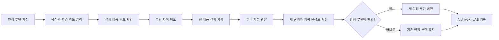
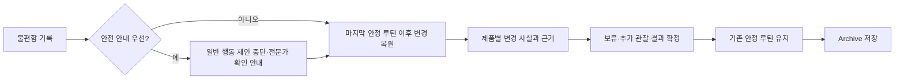
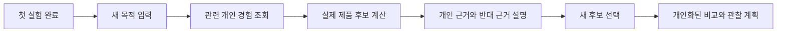

# 핵심 사용자 흐름

## 읽는 방법

이 문서는 화면 모양이 아니라 사용자의 결정과 시스템의 반응을 확정한다. 정확한 화면 수, 배치와 문구는 디자인 단계에서 정할 수 있지만, 아래 단계의 입력·결과·상태 변화는 임의로 생략하지 않는다.

AI와 일반 코드의 경계는 [제품 규칙](./product-rules.md#ai일반-코드사용자-책임)에서 한 번만 정의한다.

## 흐름 1. 첫 실험을 문제없이 완료한다

| 단계 | 사용자 행동 | 서비스 결과 | 처리 주체 | 생성·변경되는 데이터 | 다음 이동 |
| --- | --- | --- | --- | --- | --- |
| 1. 기준 만들기 | 현재 문제없이 쓰는 아침·저녁 제품·순서·빈도, 사용 기간·최근 변경·현재 불편 여부를 확인한다. | 사용자가 확인한 조합과 기준 정보의 완성도를 안정 루틴으로 저장한다. | 사용자 확정 + 일반 코드 검증 | `routine_version`, `routine_item` | 목적 입력 |
| 2. 목적 정하기 | 이번 목적과 제품을 추가할지 교체할지 고른다. 교체라면 대상을 정한다. | 추천에 필요한 조건과 정보 부족을 확인한다. | 사용자 결정, 자연어 목적만 AI가 분류 후보 제시 | `recommendation_request` | 제품 후보 확인 |
| 3. 후보 고르기 | 최대 3개의 추천 제품을 보거나 제품명·브랜드로 관심 제품을 직접 찾는다. | 서버 결정표로 계산한 하나의 다음 실험 우선순위와 목적 관련성·주요 중복을 보여준다. AI는 목적 구조화와 설명만 담당한다. | 일반 코드 계산 + AI 설명 | `recommendation_candidate`, 선택 시 `experiment_candidate` | 비교 |
| 4. 차이 확인 | 후보 하나를 현재 루틴에 추가·교체했을 때의 변화를 본다. | 추가·유지·제거 제품과 새 기능·중복·정보 부족을 보여준다. | 일반 코드 | `candidate_comparison` | 순서와 계획 |
| 5. 계획 확정 | 먼저 시험할 한 제품, 확인된 사용 안내, 시간대·순서와 일정을 확인한다. | 현재 안정 루틴으로 최신 비교안을 고정하고 필수 관찰을 만든다. | 일반 코드, 설명만 AI | `experiment(PLANNED)`, `observation_quest` | 첫 사용 |
| 6. 관찰하기 | 첫 사용·중간·종료에 상태, 실제 사용과 실험 제품 외의 화장품 변경 여부를 남긴다. | 실제 첫 사용을 기준으로 일정을 계산하고 다른 변경은 사건과 기록 완성도에 반영한다. | 사용자 기록 + 일반 코드 | `experiment(ACTIVE)`, `observation`, `experiment_event` | 다음 관찰 또는 결과 |
| 7. 결과 확정 | 불편 여부·목적 체감·다음 사용 결정을 각각 고른다. | 실제 기간·횟수·관찰·다른 변경으로 기록 완성도를 계산하고 결과를 저장한다. | 사용자 확정 + 일반 코드 | `experiment_result`, `experiment(COMPLETED)` | 루틴 반영 또는 Archive |
| 8. 기준 갱신 | 불편 없음과 안정 루틴 추가를 선택한 경우 실제 새 루틴을 확인한다. | 동의하면 새 안정 루틴 버전을 만들고, 아니면 기존 기준을 유지한다. | 사용자 결정 + 일반 코드 | 선택 시 새 `routine_version` | Archive·LAB |
| 9. 경험 남기기 | 완료 기록을 확인한다. | 당시 루틴·제품·관찰·결과가 Archive에서 연결되고 LAB 연구 기록이 하나 쌓인다. | 일반 코드 | `lab_record`; Archive는 원본 이력 조회 | 다음 추천 |

연결 Story: [#7](https://github.com/sksksksksksss/service/issues/7), [#8](https://github.com/sksksksksksss/service/issues/8), [#9](https://github.com/sksksksksksss/service/issues/9), [#13](https://github.com/sksksksksksss/service/issues/13), [#14](https://github.com/sksksksksksss/service/issues/14), [#15](https://github.com/sksksksksksss/service/issues/15), [#17](https://github.com/sksksksksksss/service/issues/17), [#19](https://github.com/sksksksksksss/service/issues/19), [#20](https://github.com/sksksksksksss/service/issues/20), [#25](https://github.com/sksksksksksss/service/issues/25), [#47](https://github.com/sksksksksksss/service/issues/47)

## 흐름 2. 불편함을 기록하고 Rescue로 이동한다

| 단계 | 사용자 행동 | 서비스 결과 | 처리 주체 | 생성·변경되는 데이터 | 다음 이동 |
| --- | --- | --- | --- | --- | --- |
| 1. 불편 기록 | 예정 퀘스트나 즉시 기록에서 불편 유형·정도·시점을 남긴다. 평소와 크게 달랐던 일은 이때만 선택한다. | 불편 관찰을 저장하고 Rescue를 시작한다. | 사용자 기록 + 일반 코드 | `observation`, `discomfort_detail`, `rescue_case` | 안전 확인 |
| 2. 안전 경계 | 심함, 악화·확산 또는 도움 필요 여부를 답한다. | 해당하면 일반 제품별 행동 제안을 중단하고 사용 중단·전문가 확인 안내를 먼저 보여준다. | 일반 코드 | `rescue_case.safety_priority` | 안내 확인 후 변경 이력 |
| 3. 변경점 복원 | 누락된 계획 외 변경이 있으면 필요한 항목만 보충한다. | 당시 안정 루틴, 실험 제품, 함께 바뀐 제품과 시점을 구분한다. | 일반 코드 | `experiment_event`, Rescue 근거 스냅샷 | 분류 확인 |
| 4. 확인 범위 보기 | 제품별 사실과 근거·반대 근거·부족한 정보를 읽는다. | `최근 추가·교체`, `함께 변경`, `변경 기록 없음`, `정보 부족`을 보여준다. 안전 우선이면 판단 문구 없이 변경 이력만 보여준다. | 일반 코드가 분류, AI가 설명 | `rescue_item`, 선택적으로 설명 `ai_job` | 행동 선택 |
| 5. 다음 행동 | 사용 보류, 추가 변경 없는 관찰 또는 결과 기록을 고른다. | 선택과 이유를 상태 이력에 남기되 사실 분류를 안전·원인 판정으로 바꾸지 않는다. | 사용자 결정 + 일반 코드 | `experiment_transition`, `experiment_event` | 결과 확정 또는 관찰 |
| 6. 결과 확정 | 불편 있음, 목적 체감과 중단·보류·재시험 중 자신의 결정을 각각 선택한다. | 세 결과와 기록 완성도를 저장하고 기존 안정 루틴은 그대로 둔다. | 사용자 확정 | `experiment_result`, `experiment(COMPLETED)` | Archive |
| 7. 경험 남기기 | 당시 판단을 나중에 다시 확인한다. | 변경점, Rescue, 결과가 원본 기록과 함께 Archive에 남는다. | 일반 코드 | 별도 Archive 복제 없음 | 다음 추천 또는 재시험 |

Rescue는 제품의 원인을 확정하지 않는다. `변경 기록 없음`도 안전·유지 권고가 아니며, 안전 우선 조건에서는 일반 제품별 행동 제안을 중단한다.

연결 Story: [#22](https://github.com/sksksksksksss/service/issues/22), [#23](https://github.com/sksksksksksss/service/issues/23), [#24](https://github.com/sksksksksksss/service/issues/24), [#25](https://github.com/sksksksksksss/service/issues/25), [#28](https://github.com/sksksksksksss/service/issues/28), [#47](https://github.com/sksksksksksss/service/issues/47)

## 흐름 3. 첫 결과를 다음 추천에 다시 쓴다

| 단계 | 사용자 행동 | 서비스 결과 | 처리 주체 | 생성·변경되는 데이터 | 다음 이동 |
| --- | --- | --- | --- | --- | --- |
| 1. 새 실험 준비 | 새 사용 목적과 추가·교체 의도를 입력한다. | 현재 안정 루틴을 기준으로 새 추천 요청을 만든다. | 사용자 결정 + 일반 코드 | 새 `recommendation_request` | 개인 이력 조회 |
| 2. 관련 경험 찾기 | 별도 입력 없이 추천을 기다린다. | 동일 제품의 불편·목적 체감·다음 결정, 실제 기간·횟수·관찰 완성도·다른 변경과 반대 사례를 찾는다. | 일반 코드 | 조회 결과; 원본 실험 ID 유지 | 후보 계산 |
| 3. 다음 후보 받기 | 실제 제품 후보와 하나의 우선순위를 확인한다. | 개인 경험의 관련성과 기록 완성도를 서버 결정표에 반영하되 자동 제외나 적합 보장은 하지 않는다. | 일반 코드가 후보·순위를 계산하고 AI가 설명 | `recommendation_candidate.evidence_snapshot` | 근거 확인 |
| 4. 근거 이해 | 개인 근거를 열어 당시 실험을 확인한다. | 지지·반대·부족한 정보와 어떤 과거 실험을 썼는지 설명한다. | AI 설명 + 서버 검증 | 설명 `ai_job`; 과거 실험 참조 | 후보 선택 |
| 5. 다음 계획 | 후보를 저장하고 비교·계획을 확인한다. | 과거 불편이나 반복 관찰과 관련된 항목을 이번 관찰 초점에 반영한다. | 일반 코드, 설명만 AI | `experiment_candidate`, `candidate_comparison`, 새 `experiment` | 두 번째 실험 |

한 번의 기록을 반복 관찰이나 원인으로 부르지 않는다. 결과가 서로 다르면 최신 결과 하나만 정답처럼 쓰지 않고 당시 루틴, 사용 기간·횟수·관찰 완성도와 다른 변경을 함께 보여준다.

연결 Story: [#8](https://github.com/sksksksksksss/service/issues/8), [#16](https://github.com/sksksksksksss/service/issues/16), [#26](https://github.com/sksksksksksss/service/issues/26), [#27](https://github.com/sksksksksksss/service/issues/27)

## 핵심 예외

| 상황 | 사용자가 보는 결과 | 이어갈 방법 |
| --- | --- | --- |
| 안정 루틴이 없음 | 추천·비교의 기준이 없다고 설명한다. | 안정 루틴을 먼저 확정한다. |
| 적격 추천 제품이 없음 | 수를 채우기 위한 임의 제품을 만들지 않고 이유를 보여준다. | 카탈로그 검색이나 직접 등록으로 이동한다. |
| 제품 정보가 부족함 | 없는 정보로 단정하지 않고 확인 상태와 부족한 항목을 표시한다. | 확인된 정보만으로 비교하거나 직접 정보를 보완한다. |
| 진행 중인 실험이 있음 | 새 실험 시작을 막고 현재 실험을 보여준다. | 현재 실험을 완료하거나 취소한 뒤 시작한다. |
| 퀘스트를 놓침 | 늦은 입력 시각과 실제 관찰 시각을 구분한다. 기억나지 않으면 건너뛸 수 있다. | 기록하거나 건너뛴 뒤 다음 퀘스트를 계속한다. |
| 실험 외 제품도 바꿈 | 실험은 유지하되 다른 변수가 있는 기록으로 표시한다. | 제품과 변경 시점을 남기고 기록 완성도를 낮춘다. |
| 완료 후 불편을 인지함 | 원래 결과를 바꾸지 않고 후속 관찰과 안전 안내를 연결한다. | 완료 실험 상세에서 후속 변화를 기록한다. |
| AI 처리 실패·시간 초과 | AI가 만든 빈 결과로 흐름을 끝내지 않는다. | 고정 설명, 직접 입력 또는 재시도를 제공한다. |
| 네트워크 실패 | 작성 중인 값을 지우지 않고 실패 원인을 알린다. | 같은 입력으로 다시 시도한다. |
| 심한 불편·악화·도움 필요 | 제품별 추정보다 선택적 사용 중단과 전문가 확인 안내를 먼저 보여준다. | 사용자가 안전 안내를 확인한 뒤 기록을 마친다. |

더 세부적인 상태와 분류 기준은 [제품 규칙](./product-rules.md)을 따른다.
